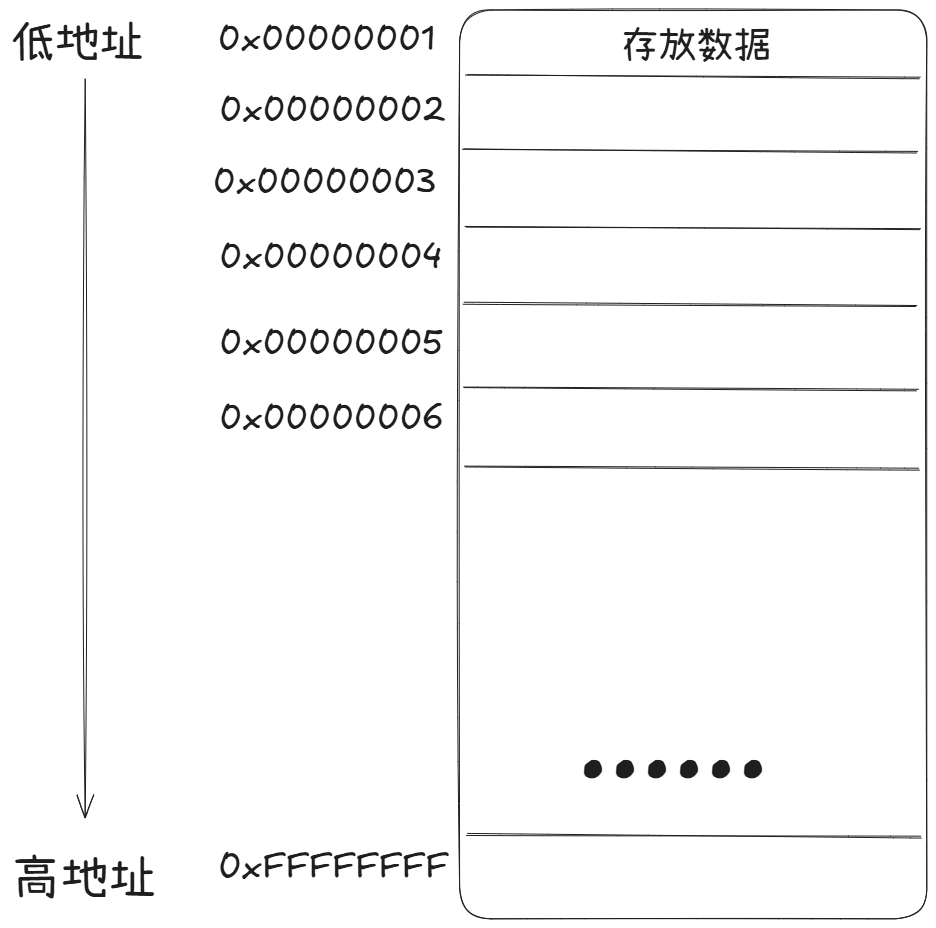
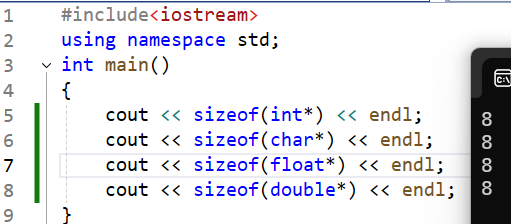
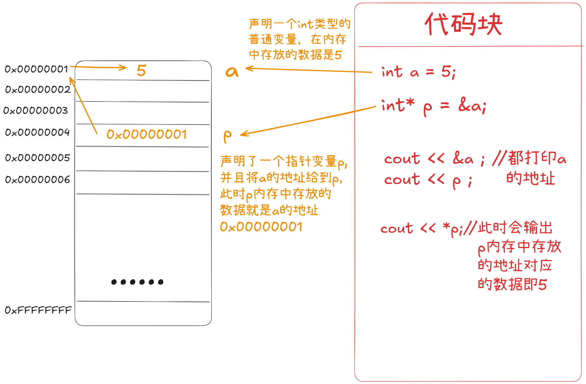
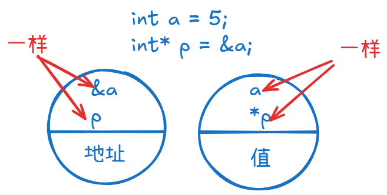
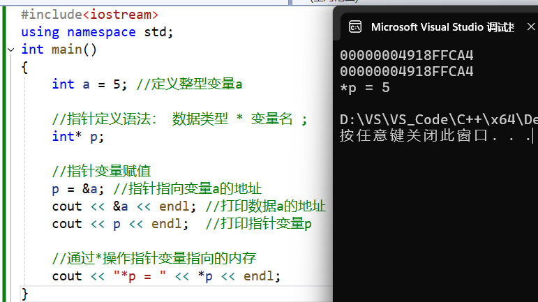

# C++基础语法

> 此笔记只包含了C++基础语法知识，属于公共语法知识，大多数和其他语言相通。适合小白提前熟悉C++。


## 数据类型

​	C++规定在创建一个变量或者常量时，必须要指定出相应的数据类型，否则无法给变量分配内存

### 整形

​	C++中能够表示整型的类型有以下几种方式，**区别在于所占内存空间不同**：

| 数据类型              | 占用内存                         | 取值范围         |
| --------------------- | -------------------------------- | ---------------- |
| short（短整型）       | 2字节                            | (-2^15 ~ 2^15-1) |
| int（整形）           | 4字节                            | (-2^31 ~ 2^31-1) |
| long（长整型）        | Windows为四字节，Linux为4、8字节 | (-2^31 ~ 2^31-1) |
| long long（长长整形） | 8字节                            | (-2^63 ~ 2^63-1) |


### 浮点型

| 数据类型         | 占用内存 | 取值范围         |
| ---------------- | -------- | ---------------- |
| float（单精度）  | 4字节    | 7位有效数字      |
| double（双精度） | 8字节    | 15～16位有效数字 |


### 字符型

​	**语法：**`char ch='A';`

​	**注意：**

- 使用**单引号**显示

- 单引号内只能有一个字符
- 字符变量只占一个字节
- 字符型变量并不是把字符本身放到内存中存储，而是**将对应的ASCII编码放入到存储单元**


### 字符串型

​	两种风格：

1. C风格：`char str[] = "hello,world!"`（PS：字符串是双引号）
2. C++风格：`string str = "hello,world!"`


### bool类型

​	**注意：**

- bool类型只有两个值
  - true（其本质是1）
  - false（其本质是0）
- 在输出过程中只会输出0/1，**而不是false或true**

- 输入过程中也可以用0/1来代表false或true

- bool类型只占一个字节大小

​	**示例：**

```cpp
cout << "size of bool = " << sizeof(bool) << endl; //1
```


### 转义字符

​	**作用：**用于表示一些不能显示出来的ASCII字符

| 转义字符 | 含义                                    | ASCII码值（十进制） |
| -------- | --------------------------------------- | ------------------- |
| \a       | 警报                                    | 007                 |
| \b       | 退格(BS) ，将当前位置移到前一列         | 008                 |
| \f       | 换页(FF)，将当前位置移到下页开头        | 012                 |
| **\n**   | **换行(LF) ，将当前位置移到下一行开头** | **010**             |
| \r       | 回车(CR) ，将当前位置移到本行开头       | 013                 |
| **\t**   | **水平制表(HT) （跳到下一个TAB位置）**  | **009**             |
| \v       | 垂直制表(VT)                            | 011                 |
| **\\**   | **代表一个反斜线字符""**                | **092**             |
| ’        | 代表一个单引号（撇号）字符              | 039                 |
| "        | 代表一个双引号字符                      | 034                 |
| ?        | 代表一个问号                            | 063                 |
| \0       | 数字0                                   | 000                 |
| \ddd     | 8进制转义字符，d范围0~7                 | 3位8进制            |
| \xhh     | 16进制转义字符，h范围0~9，a~f，A~F      | 3位16进制           |


###  sizeof关键字

​	**作用：**利用sizeof关键字可以统计数据类型**所占内存大小**

​	**语法：**`sizeof (数据类型/变量)`

​	**示例：**

```cpp
	cout << "short 类型所占内存空间为： " << sizeof(short) << endl;

	cout << "int 类型所占内存空间为： " << sizeof(int) << endl;

	cout << "long 类型所占内存空间为： " << sizeof(long) << endl;

	cout << "long long 类型所占内存空间为： " << sizeof(long long) << endl;
```


### 数据类型间的转换

#### 自动类型转换

​	精度由低到高：

```cpp
char -> short -> int -> long -> long long  
```

```cpp
float -> double -> long double
```


​	**转换规则：**

- 表达式中存在混合运算，低精度自动转向高精度
- 表达式中存在浮点型，所有操作数都转换成浮点型
- 赋值运算过程右值类型会自动提升/降低为左类型，**右值可能会被截断**


#### 强制类型转换

1. C风格强制类型转换

   ```cpp
   int a = 10;
   double b = (double)a;   // 或者 double b = double(a);
   ```

   > 简单但不安全


2. C++风格类型转换

   | 类型               | 用法                                               | 说明                                                         |
   | ------------------ | -------------------------------------------------- | ------------------------------------------------------------ |
   | `static_cast`      | `double b = static_cast<double>(a);`               | 编译时类型检查，可用于：**基本类型转换**、指针上行/下行（有风险） |
   | `const_cast`       | `const int* p = &a; int* q = const_cast<int*>(p);` | **去掉或加上 `const`/`volatile` 修饰**                       |
   | `reinterpret_cast` | `long p = reinterpret_cast<long>(&a);`             | 低级二进制转换                                               |
   | `dynamic_cast`     | `Derived* pd = dynamic_cast<Derived*>(pb);`        | 运行时类型检查，主要用于 **多态类** 的安全向下转换，需要有虚函数（C++核心编程中有详解） |

   

   ​	**示例：**

   ```cpp
   int a = 10;
   double b = static_cast<double>(a); // int -> double
   
   const int a = 100;
   int* p = const_cast<int*>(&a);  // 去掉 const
   *p = 200; // ⚠️ 如果原变量本身是 const，修改可能未定义
   
   int a = 0x12345678;
   char* p = reinterpret_cast<char*>(&a);  // 将 int* 当成 char* 用
   
   class Base { virtual void foo() {} };
   class Derived : public Base {};
   Base* pb = new Derived;
   Derived* pd = dynamic_cast<Derived*>(pb); // 安全向下转型
   if (pd) { /* 转换成功 */ }
   ```

   

### 数据类型的别名

​	**作用：** 

- 为复杂类型创建别名，方便记忆和书写
- 创建平台无关数据类型，提高程序兼容


​	**语法：** **`typedef 原数据类名 别名`**

​	**C++11新增语法：** **`using 别名 = 原数据类型名`**

```cpp
typedef short int16_t;
using int16_t = short;
```


## 运算符

| **运算符类型** | **作用**                               |
| :------------- | :------------------------------------- |
| 算术运算符     | 用于处理四则运算                       |
| 赋值运算符     | 用于将表达式的值赋给变量               |
| 比较运算符     | 用于表达式的比较，并返回一个真值或假值 |
| 逻辑运算符     | 用于根据表达式的值返回真值或假值       |


### 算术运算符

| **运算符** | **术语**   | **示例**    | **结果**  |
| ---------- | ---------- | ----------- | --------- |
| +          | 正号       | +3          | 3         |
| -          | 负号       | -3          | -3        |
| +          | 加         | 10 + 5      | 15        |
| -          | 减         | 10 - 5      | 5         |
| *          | 乘         | 10 * 5      | 50        |
| /          | 除         | 10 / 5      | 2         |
| %          | 取模(取余) | 10 % 3      | 1         |
| ++         | 前置递增   | a=2; b=++a; | a=3; b=3; |
| ++         | 后置递增   | a=2; b=a++; | a=3; b=2; |
| –-         | 前置递减   | a=2; b=–-a; | a=1; b=1; |
| –-         | 后置递减   | a=2; b=a–-; | a=1; b=2; |

> 只有整形变量可以进行取余操作


### 赋值运算符

| **运算符** | **术语** | **示例**   | **结果**  |
| ---------- | -------- | ---------- | --------- |
| =          | 赋值     | a=2; b=3;  | a=2; b=3; |
| +=         | 加等于   | a=0; a+=2; | a=2;      |
| -=         | 减等于   | a=5; a-=3; | a=2;      |
| *=         | 乘等于   | a=2; a*=2; | a=4;      |
| /=         | 除等于   | a=4; a/=2; | a=2;      |
| %=         | 模等于   | a=3; a%2;  | a=1;      |

> 浮点数

### 比较运算符

| **运算符** | **术语** | **示例** | **结果** |
| ---------- | -------- | -------- | -------- |
| ==         | 相等于   | 4 == 3   | 0        |
| !=         | 不等于   | 4 != 3   | 1        |
| <          | 小于     | 4 < 3    | 0        |
| >          | 大于     | 4 > 3    | 1        |
| <=         | 小于等于 | 4 <= 3   | 0        |
| >=         | 大于等于 | 4 >= 1   | 1        |

> 比较运算符返回的都是0/1


### 逻辑运算符

| **运算符** | **术语** | **示例** | **结果**          |
| ---------- | -------- | -------- | ----------------- |
| !          | 非       | !a       | 真值取反          |
| &&         | 与       | a && b   | 同真为真,其余为假 |
| \|\|       | 或       | a \|\| b | 有真为真          |


## 程序流程结构

​	C/C++支持最基本的三种程序运行结构：**顺序结构、选择结构、循环结构**

- 顺序结构：程序按顺序执行，不发生跳转 **(不做详细讲解)**
- 选择结构：依据条件是否满足，有选择的执行相应功能
- 循环结构：依据条件是否满足，循环多次执行某段代码


### 选择结构

#### if语句

#### switch语句

​	**作用:**多条件分支语句

​	**示例:**

```cpp
int main() {

	//请给电影评分 
	//10 ~ 9   经典   
	// 8 ~ 7   非常好
	// 6 ~ 5   一般
	// 5分以下 烂片

	int score = 0;
	cout << "请给电影打分" << endl;
	cin >> score;

	switch (score)
	{
	case 10:
	case 9:
		cout << "经典" << endl;
		break;
	case 8:
		cout << "非常好" << endl;
		break;
	case 7:
	case 6:
		cout << "一般" << endl;
		break;
	default:
		cout << "烂片" << endl;
		break;
	}

	system("pause");

	return 0;
}
```

> - switch语句中表达式类型只能是整型或者字符型，或者结果如此的表达式，不能为变量。
>
> - case里如果没有break，那么程序会一直向下执行 **(注意!)**
> - 与if语句比，对于多条件判断时，switch的结构清晰，执行效率高，缺点就是switch不可以判断区间


#### 三目运算符

​	**语法:**`表达式1 ? 表达式2 ：表达式3`

​	**作用:** 1为真,执行并返回2

​			  1为假,执行并返回3


### 循环结构

#### while循环

​	**语法:**`while(循环条件){ 循环语句 }`

​	**注意:**必须留出跳出循环出口,否则会死循环


#### do...while循环

​	**语法:**`do{ 循环语句 } while(循环条件)`

​	**注意:**至少会执行一次循环语句


#### for循环

​	**语法:**`for(起始表达式;条件表达式;末尾循环体) { 循环语句; }`

​	**补充:** for(;;) 等同于while(true)


### 补充(跳转语句)

#### break语句

​	**作用:** **跳出整个循环**,不再留恋

​	**使用:**

- 出现在switch条件语句中，作用是终止case并跳出switch
- 出现在循环语句中，作用是跳出当前的循环语句
- 出现在嵌套循环中，跳出**最近的内层循环语句**


#### continue语句

​	**作用:** **只跳过某一次循环语句**,继续执行之后的循环


#### goto语句

​	**语法:** 

```cpp
A:
...

goto A;
```

> 个人认为好用但是不推荐大规模使用。


## 变量作用域

### 定义

​	**定义：** 指程序中变量生效的区域，超出这个区域变量就**不能再被访问**。

​	**分类：** 

- 全局变量：整个程序都可以访问。
- 局部变量：只能在函数或语句内部访问。


​	**定义区域：** 

1. 全局变量：定义在全部函数外部或头文件内部

2. 局部变量：函数和语句块内部定义或函数参数是该函数或语句块的局部变量；

   ​				   函数内部使用 `static` 修饰的是**静态局部变量**。


### 生命周期

​	**生命周期：**

1. 全局变量：整个程序生命周期，在主程序退出时由系统回收。
2. 局部变量：在函数返回或代码块结束时由系统回收。
3. **静态局部变量：从程序第一次执行到其定义所在函数或代码块开始，直到全部程序结束才被回收。**

> 静态局部变量的作用域和局部变量相同，但**其生命周期是整个程序。**

> 在实际使用过程中非常便利，如在某个函数中定义 `static int sum = 0; sum++;` 在下次再次调用此函数时， `sum`  **不会再初始化**为0，而是**继续自增**。使用全局变量前优先考虑静态局部变量。


### 注意事项

- 全局变量和静态局部变量会自动初始化为0。
- **局部变量不会自动初始化。**

- 全局变量和局部变量名称可以相同，在调用过程中优先使用局部变量。若想使用全局变量可以在变量名前加上 `::` 


## 数组

​	**定义:** 一个存放了**相同类型数据元素**的集合,由**连续的内存位置**构成


### 一维数组

​	三种定义方式:

```cpp
int arr[10];  //数据类型 数组名[元素个数]

int arr[] = {100,90,80,70,60,50,40,30,20,10}

int score2[10] = {100,90,80,70,60,50,40,30,20}; //数据类型 数组名[元素个数] =  {值1，值2 ，值3 ...};
												 //不足10个数据会使用0补齐
```


​	**一维数组使用示例：**

```cpp
//1、可以获取整个数组占用内存空间大小
	int arr[10] = { 1,2,3,4,5,6,7,8,9,10 };

	cout << "整个数组所占内存空间为： " << sizeof(arr) << endl;
	cout << "每个元素所占内存空间为： " << sizeof(arr[0]) << endl;
	cout << "数组的元素个数为： " << sizeof(arr) / sizeof(arr[0]) << endl;

//2、可以通过数组名获取到数组首地址
	cout << "数组首地址为： " << (int)arr << endl;
	cout << "数组中第一个元素地址为： " << (int)&arr[0] << endl;
	cout << "数组中第二个元素地址为： " << (int)&arr[1] << endl;
```

> - 直接打印变量名获取首地址      


### 二维数组

​	四种定义方式：

```cpp
	//方式1  
	//数组类型 数组名 [行数][列数]
	int arr[2][3];
	arr[0][0] = 1;
	arr[0][1] = 2;
	arr[0][2] = 3;
	arr[1][0] = 4;
	arr[1][1] = 5;
	arr[1][2] = 6;

	//方式2 
	//数据类型 数组名[行数][列数] = { {数据1，数据2 } ，{数据3，数据4 } };
	int arr2[2][3] ={{1,2,3},{4,5,6}};

	//方式3
	//数据类型 数组名[行数][列数] = { 数据1，数据2 ,数据3，数据4  };
	int arr3[2][3] = { 1,2,3,4,5,6 }; 

	//方式4 
	//数据类型 数组名[][列数] = { 数据1，数据2 ,数据3，数据4  };
	int arr4[][3] = { 1,2,3,4,5,6 };
```

> 二维数组可以缺省行数


​	**二维数组使用示例：**

```cpp
	cout << "二维数组大小： " << sizeof(arr) << endl;
	cout << "二维数组一行大小： " << sizeof(arr[0]) << endl;
	cout << "二维数组元素大小： " << sizeof(arr[0][0]) << endl;

	cout << "二维数组行数： " << sizeof(arr) / sizeof(arr[0]) << endl;
	cout << "二维数组列数： " << sizeof(arr[0]) / sizeof(arr[0][0]) << endl;

	//地址
	cout << "二维数组首地址：" << arr << endl;
	cout << "二维数组第一行地址：" << arr[0] << endl;
	cout << "二维数组第二行地址：" << arr[1] << endl;

	cout << "二维数组第一个元素地址：" << &arr[0][0] << endl;
	cout << "二维数组第二个元素地址：" << &arr[0][1] << endl;
```


## 指针基础

### 变量的地址

​	**作用：**程序可以通过指针**间接**访问内存

​	计算机寄存器中的内存被分为很多块，有各自的编号，内存编号都是从0开始。在C++中，每定义一个变量，系统就会为其分配一块内存，而每个内存都有其编号，即地址。



> C++使用取地址符 `&` 来**获取变量在地址中的起始地址。**

​	**语法：** **`&变量名`**


### 指针变量

> 指针变量简称为指针

#### 基本知识

​	**语法：** **`数据类型* 变量名`** 

​	**定义：** 相对于普通变量的定义如 `int a` ,**指针变量的定义为类如 `int* p` **。

​				 指针变量是一种特殊的变量，**专门用于存放变量在内存中的起始地址**，指针变量**简称为指针**。


​	**注意：** 

- **指针变量是 `p`**（而不是*p）
- 型如`int*` 可以记忆为指针变量专属的数据类型
- 数据类型必须是合法的C++数据类型（如int、char、double或其他自定义数据类型）

- 指针类型要和变量类型相匹配，如整形指针存放整形变量的地址


​	**占用内存大小：**

​	由定义可知，指针变量也有其数据类型，自然也有其占用内存空间大小

​	**示例：**

```cpp
	cout << sizeof(int*) << endl;
	cout << sizeof(char*) << endl;
	cout << sizeof(float*) << endl;
	cout << sizeof(double*) << endl;
```



> 所有指针类型在32位操作系统下是4字节
>
> ​						   64位操作系统下是8字节


#### 简单使用指针

​	**指针变量和普通变量的区别：**

- 普通变量内存放的是相应的数据。

- **指针变量内存放的是地址**，即`p` 对应的是地址

- 而`*p` 对应的是 `p` 内存放的地址所对应的数据。此过程称为解引用。

  > 可以理解为普通变量内存直接存放数据，而指针变量 `p` 内存放的是某个数据的地址，使用 `*p` 通过访问地址来**间接**访问数据。


​	**示例：**

1. 图例






2. 代码示例

   ```cpp
   int a = 5; //定义整型变量a
   
   //指针定义语法： 数据类型 * 变量名 ;
   int* p;
   
   //指针变量赋值
   p = &a; //指针指向变量a的地址
   cout << &a << endl; //打印数据a的地址
   cout << p << endl;  //打印指针变量p,也是a的地址
   
   //通过*操作指针变量存放的地址指向的内存，即a的数据
   cout << "*p = " << *p << endl;
   ```

   


#### 空指针

> 初始化指针变量，使其其指向空，即没有任何地址。

​	**用法：** 在C++中，0、NULL和 **nullptr** 都可以表示空指针，**为避免产生歧义，建议使用nullptr**

​	**语法：** `int* p = 0` 或 `int* p = NULL` 

​	**注意：** 不能对空指针进行解引用，即不能访问其指向的内存


#### 野指针

> 指针不能指向一个合法/有效的地址，就是野指针

**规避方法：** 

- 一定要初始化，没有值就初始化成 `nullptr`

- 动态分配的内存被释放之后就将其重置成 `nullptr` 
- 函数不要返回局部变量的地址


## 指针和函数

### 指针作为参数

> 将函数的形参声明为指针，调用时将实参的地址传入，形参中存放实参的地址，在函数中通过解引用的方式直接操作形参中地址对应的数据。


​	**意义：** 

- 普通变量作为函数参数时，函数内部的修改只作用于形参，而不会影响实参的值。

  **而指针作为参数时，可以通过指针修改实参的值。**

- 减少内存拷贝，提升性能


​	**示例：**

```cpp
#include<iostream>
using namespace std;

//使用普通变量作为参数
void swap1(int x, int y)
{
	int tmp = x;
	x = y;
	y = tmp;
}

//使用指针变量作为参数
void swap2(int* x, int* y)
{
	int tmp = *x;
	*x = *y;
	*y = tmp;
}

int main()
{
	int a = 10, b = 20;//定义实参a和b

	swap1(a,b);
	cout << "使用普通变量作为参数交换后a=" << a << "  b=" << b<<endl;

	swap2(&a, &b);
	cout << "使用指针变量作为参数交换后a=" << a << "  b=" << b << endl;

	return 0;
}
```

​	**输出:**

```cpp
使用普通变量作为参数交换后a=10  b=20
使用指针变量作为参数交换后a=20  b=10
```

> 想改实参就用值传递,不想改实参就用地址传递


**还有一种形式是以 `void*` 作为参数的类型：**

​	**作用:** 形参使用 `void*` 表示接受任意数据类型的指针

​	**注意:** 

- 不能直接对 `void*` 指针进行解引用  (需要先转换成其他类型的指针)
- 把 `void*` 指针赋值给其他类型的指针需要转化
- 把其他类型的指针赋值给 `void*` 指针不需要转化


### 函数指针

> 函数以二进制代码存放在代码段中。函数的地址就是其在内存当中的首地址。
>
> 函数指针是**指向函数的指针变量**，它可以保存一个函数的地址，从而可以通过该指针调用相应的函数。这是 C 和 C++ 中非常强大且常用的一种机制，常用于回调函数、事件驱动编程和实现函数表等。


**1. 函数指针的声明**

​	函数指针的声明需要**指明返回类型和参数类型**，假设有以下函数：

```cpp
int add(int a, int b) {
    return a + b;
}
```

​	此时声明一个指向该函数的指针，格式如下：

```cpp
int (*func_ptr)(int, int);
```

> 其中： **`func_ptr`** 是指针，**必须加上括号** ，否则就是返回值为指针的函数。返回类型为 `int` ,两个参数类型为 `int` 。


**2. 函数指针的赋值**

类似于数组名就是数组的地址，**函数名就是函数的地址。**

```cpp
func_ptr = add;  // 或者 func_ptr = &add;
```


**3. 函数指针的调用**

在赋值之后，就可以通过该指针调用原函数：

```cpp
int result = func_ptr(3, 4);  // 相当于调用 add(3, 4)
std::cout << result << std::endl;  // 输出 7
```


## 指针和const

| 类型       | 指针（p）能否改变 | 指向（*p）能否改变 | 语法示例           |
| ---------- | ----------------- | ------------------ | ------------------ |
| 常量指针   | 能                | 不能               | const int* p       |
| 指针常量   | 不能              | 能                 | int* const p       |
| 常指针常量 | 不能              | 不能               | const int* const p |


### 常量指针 (先常量后指针)

​	**语法:** **`const 数据类型* 变量名`**

​	**要求:** **指针的指向可以修改,但是指向的值不能修改** (即可以修改 `p` ,但是不能修改 `*p` )

​	**示例:** 

```cpp
	const int * p1 = &a; 
	p1 = &b; //指向可以修改,即可以修改指针内存放的地址
	//*p1 = 100; //指向的值不能修改
```


### 指针常量 (先指针后常量)

​	**语法:** **`数据类型* const 变量名`**

​	**要求:** **指针的指向不能修改,但是指向的值可以修改** (即不能修改 `p` ,但是可以修改 `*p` )

​	**示例:** 

```cpp
	int * const p2 = &a;
	//p2 = &b; //指向不能修改
	*p2 = 100; //指向的值可以修改
```

> 在C++中指针常量就是 **引用** 

> 记忆技巧:**指针在前就不允许修改指针**,如指针常量就不允许修改 `p` 


### 常指针常量

​	**语法:** **`const 数据类型* const 变量名`**

​	**要求:** 都不可以修改


## 指针和数组

> 指针变量+1，**增加的量是其指向的数据类型的字节数。** 
>
> 例如：数组中第n个元素的地址是 `数组首地址+n` 


### 数组的本质

> 在C++内部，用指针来处理数组

- 数组在内存中是连续的
- C++将数组名解释为数组第0个元素的地址（**即 `arr` 大多数情况下等价于 `&arr[0]`**）
- C++编译器将 `数组名[下标]` 解释为 `*（数组首地址+下标）` 
- C++编译器将 `地址[下标]` 解释为 `*（地址+下标）` 

> 注意：并不是所有情况下数组名都解释为数组首地址，例如 `sizeof（数组名）` 会返回数组占用内存空间的字节数。


**示例:** 

```cpp
int arr[] = { 1,2,3,4,5,6,7,8,9,10 };

	int * p = arr;  //指向数组首地址

	for (int i = 0; i < 10; i++)
	{
		//利用指针遍历数组
		cout << *p << endl;
		p++;
	}
```


### 一维数组用于函数参数

​	**注意：** 一维数组用于函数参数时，只能传入数组的地址。**并且必须传入数组长度。** 

​	**书写方法：** 

```cpp
//1. 使用数组指针 
void func(int* arr,int len);//传入长度


//2. 使用数组引用
void func(int arr[],int len);//传入长度

void func(int (&arr)[5]);//固定长度
```

> 注意：当且仅当用于函数头或函数原型中， **`int* arr`** 和 **`int arr[]`** 才可以算等价。


​	

### new动态创建一维数组

> 普通数组在栈上分配内存，栈很小，因此可以在堆上分配更多内存。


​	**语法：** **`数据类型* 指针 = new 数据类型[数组长度]`** 

​			     **`delete[] 指针`**

```cpp
int* p = new int[5];//分配5个大小为 sizeof(int) 的内存块

delete[] p;//注意是delete[]
```

 	

​	**注意：** 

- 动态创建的数组没有数组名

- `delete[]` 只能释放一块内存一次，释放多次相当于野指针
- 释放内存时 `delete[]` 不用指明大小，因为系统会自动跟踪分配


​	**示例：** 

```cpp
int* arr = new int[5];
for (int i = 0; i < 5; i++)
{
	arr[i] = i + 1;
	cout << "arr[" << i << "]=" << *(arr + i)<<endl;
}
delete[] arr;
```

> `*(arr+i)` 等价于 `arr[i]`

​	**输出：**

```cpp
arr[0]=1
arr[1]=2
arr[2]=3
arr[3]=4
arr[4]=5
```


## 结构体

### 定义和使用

​	**定义：** 结构体就是用户自己定义的数据类型，允许用户存储不同的数据类型

​	**定义方式：** 

 1. 不直接定义结构体变量名

    **`struct 结构体名 {结构体成员列表};`**

2. 直接定义结构体变量名

   **`struct 结构体名 {结构体成员列表} 结构体变量名1,结构体变量名2,...;`**

3. 匿名结构体

​		**`struct  {结构体成员列表} 结构体变量名1,结构体变量名2,...;`**


​	**结构体变量名实例化方式：**

1. **`struct 结构体名 结构体变量名`**

2. **`struct 结构体名 结构体变量名 = {成员1值，成员2值，...}`**

3. 在定义时已经被创建


​	**示例：**

```cpp
#include<iostream>
using namespace std;

struct A 
{
	string name;
	int age;
};

struct B
{
	string name;
	int age;
} b;

struct 
{
	string name = "ccc";
	int age = 13;
} c1,c2;
//只会初始化c1

int main()
{
	struct A a;//struct可以省略
	a.name = "aaa";
	a.age = 10;

	b.name = "bbb";
	b.age = 11;

	cout << "A的姓名：" << a.name << " A的年龄：" << a.age << endl;
	cout << "B的姓名：" << b.name << " B的年龄：" << b.age << endl;

	cout << "C1的姓名：" << c1.name << " C1的年龄：" << c1.age << endl;

	c2 = { "CCC",14 };
	cout << "C修改后的姓名：" << c2.name << " C修改后的年龄：" << c2.age << endl;
}
```

​	**输出：**

```cpp
A的姓名：aaa A的年龄：10
B的姓名：bbb B的年龄：11
C1的姓名：ccc C1的年龄：13
C2的姓名：CCC C2的年龄：14
```

> **注意：** 定义时给多个结构体变量名，**只会初始化第一个**。


### 结构体数组

​	**语法：** **`struct 结构体名 数组名[元素个数] = {{}，{}，...{}}`** 

​	**示例：** 

```cpp
struct student
{
	string name;  //姓名
	int age;      //年龄
	int score;    //分数
}

int main() 
{
	//结构体数组
	struct student arr[3]=
	{
		{"张三",18,80 },
		{"李四",19,60 },
		{"王五",20,70 }
	};

	for (int i = 0; i < 3; i++)
	{
		cout << "姓名：" << arr[i].name << " 年龄：" << arr[i].age << " 分数：" << arr[i].score << endl;
	}
	return 0;
}
```

 

### 结构体指针

> 和之前的指针定义逻辑一样，设定一个类型为结构体的指针，将结构体的地址给到指针即可通过指针访问结构体内数据。


​	**语法：** 

1. 声明变量
2. 声明结构体指针，将结构体变量的地址给到指针
3. 访问方法有两种

- **`（*指针名）.成员变量名`** 例如 **`（*p）.name`** ，其实 `*p` 就等价于结构体变量名

- **`指针名 -> 成员变量名`** 例如 **`p -> name`** ，**推荐这种方式** 

> 与数组不同，结构体变量名并不能解释为首地址，因此要用取地址符号。


​	**示例：** 

```cpp
struct student
{
	string name;  //姓名
	int age;      //年龄
	int score;    //分数
};

int main() 
{
	struct student stu = { "张三",18,100, };//声明结构体变量，即实例化
	
	struct student * p = &stu;//将地址给到指针
	
	p->score = 80; //指针通过 -> 操作符可以访问成员

	cout << "姓名：" << p->name << " 年龄：" << p->age << " 分数：" << p->score << endl;
	
	system("pause");

	return 0;
}
```


### 结构体用于函数参数

> 和其他类型作为函数参数一样，分为：
>
> 1. 普通结构体作为函数参数，值传递（不改变形参）
> 2. 结构体指针作为函数参数，地址传递（改变形参）


​	**示例：** 

```cpp
struct student
{
	string name;  //姓名
	int age;      //年龄
	int score;    //分数
};

//值传递
void printStudent(student stu)//普通结构体作为函数参数
{
	stu.age = 28;
	cout << "子函数中 姓名：" << stu.name << " 年龄： " << stu.age << " 分数：" << stu.score << endl;
}

//地址传递
void printStudent2(student* stu)//结构体指针为参数
{
	stu->age = 28;
	cout << "子函数中 姓名：" << stu->name << " 年龄： " << stu->age << " 分数：" << stu->score << endl;
}

int main()
{
	student stu = { "张三",18,100 };

	//值传递
	cout << "值传递" << endl;
	printStudent(stu);
	cout << "主函数中 姓名：" << stu.name << " 年龄： " << stu.age << " 分数：" << stu.score << endl << endl;

	//地址传递
	cout << "地址传递" << endl;
	printStudent2(&stu);
	cout << "主函数中 姓名：" << stu.name << " 年龄： " << stu.age << " 分数：" << stu.score << endl;

	return 0;
}
```


​	**输出：**

```cpp
值传递
子函数中 姓名：张三 年龄： 28 分数：100
主函数中 姓名：张三 年龄： 18 分数：100

地址传递
子函数中 姓名：张三 年龄： 28 分数：100
主函数中 姓名：张三 年龄： 28 分数：100
```

> 想修改主函数中的值用地址传递，不想修改用值传递


**也可以加上 `const` 约束防止发生误修改。**

​	**示例：** 

```cpp
void printStudent(const student *stu) //加const防止函数体中的误操作
{
	//stu->age = 100; //操作失败，因为加了const修饰
}
```


### 动态分配内存

> 和之前指针动态分配逻辑相同

​	**示例：**

```cpp
struct student
{
	string name;  //姓名
	int age;      //年龄
} stu;

int main()
{
	student* p = new student{ "aaa",10 };
	cout << "姓名：" << p->name << " 年龄:" << p->age;
	delete p;
}
```

​	**输出：**

```cpp
姓名：aaa 年龄:10
```


### 结构体嵌套

> 结构体成员可以是一个结构体

​	**示例：** 

```cpp
struct student
{
	string name;  //姓名
	int age;      //年龄
	int score;    //分数
};

struct teacher
{
	int id; //编号
	string name;  //姓名
	int age;   //年龄
	struct student stu; //子结构体 学生
};

int main() 
{
	struct teacher t1;
	t1.id = 10000;
	t1.name = "老王";
	t1.age = 40;

    //子结构体赋值方式
	t1.stu.name = "张三";
	t1.stu.age = 18;
	t1.stu.score = 100;
}
```


### 简单链表

> 在C++中，STL中链表的源码即由结构体构成。
>
> 结构体中含有本结构体的指针，它就是一个链表，在后续STL源码剖析中详细解释。


​	**示例：** 

```cpp
struct my_list
{
    int num;
    string name;
    struct my_list* next;
}
```


## 共同体

​	**定义：** 

- 共同体所有成员共享同一段内存，所以**在任意时刻只能使用其中的一个成员**，不能同时使用。

- 共同体占用空间等于最大成员的大小（可能包括一些对其填充字符）。


​	**示例：** 

```cpp
#include <iostream>
using namespace std;

union Data 
{
    int i;
    float f;
    char c;
};

int main()
{
    Data d;
    
    d.i = 10;
    cout << "d.i = " << d.i << endl;

    d.f = 3.14f;  // 覆盖掉 i
    cout << "d.f = " << d.f << endl;
    cout << "d.i = " << d.i << " (可能被破坏)" << endl;

    return 0;
}
```

​	**输出：**

```cpp
d.i = 10
d.f = 3.14
d.i = 1078523331 (可能被破坏)//已经被覆盖，值混乱
```


​	**对比：**

| 特性           | `struct`（结构体）   | `union`（共同体）      |
| -------------- | -------------------- | ---------------------- |
| 内存分配       | 每个成员独占一段内存 | 所有成员共享同一段内存 |
| 可同时访问成员 | 可以                 | 只能安全访问一个成员   |
| 常用场景       | 组织多个字段         | 内存复用、底层数据转换 |


## 枚举

### 定义和使用

> 枚举（`enum`）是 C/C++ 中用于表示**有限数量的常量集合**的类型，通常用于代码更可读、更可维护。

​	**语法：** 

```cpp
enum Color {
    RED,    // 枚举量,默认值：0
    GREEN,  // 1
    BLUE    // 2
};
```

> Color就是一个新的枚举类型名称，枚举量的默认值为0、1、2、3、...


**可以显性的设置枚举量的值，必须整数**

```cpp
enum Color {RED=1,GREEN=1,BLUE}
```

> 可以指定对象设置枚举值，可以设置成相同的值


### C++11强枚举

> 传统枚举不同枚举类型之间可以混用，类型不安全。所以引进强枚举 `enum class` 

​	**语法：**

```cpp
enum class Direction
{
    North,
    East,
    South,
    West
};
```

​	**使用时需要加上作用域前缀** `::` 

```cpp
Direction d = Direction::North;
```


**示例：**

```cpp
enum class Color { Red, Green };
enum class Fruit { Apple, Banana };

Color c = Color::Red;
// c = Apple;  // ❌ 错误，不兼容类型
```


### 搭配switch和结构体

> 枚举一般搭配这两种使用

​	**示例：**

```cpp
#include <iostream>
#include <string>
using namespace std;

enum class Role 
{
    Student,
    Teacher,
    Admin
};

struct User 
{
    string name;
    Role role;
};

void printRole(const User& user)
{
    cout << user.name << " 的身份是：";
    switch (user.role) 
    {
        case Role::Student:
            cout << "学生" << endl;
            break;
        case Role::Teacher:
            cout << "教师" << endl;
            break;
        case Role::Admin:
            cout << "管理员" << endl;
            break;
    }
}

int main()
{
    User u1 = {"Alice", Role::Student};
    User u2 = {"Bob", Role::Admin};
    printRole(u1);
    printRole(u2);
    return 0;
}
```

​	**输出：**

```cpp
Alice 的身份是：学生
Bob 的身份是：管理员
```


## 编译预处理

> C++程序编译过程：预处理 -> 编译(优化，汇编) -> 链接。预处理指令都是以 `#` 开头

​	**预处理流程：**

- 包含头文件
- 宏定义
- 条件编译
- 防止头文件包含


### 包含头文件

```cpp
#include <iostream>   // 系统头文件，标准库，需要std命名空间
#include "myheader.h" // 用户自定义头文件
```


​	**注意：**

1. 作用是把头文件的内容 **原封不动地拷贝** 到当前文件。
2. `<...>`：告诉编译器去标准库目录里找。
3. `"..."`：先从当前目录找，再去标准库目录找。


### 宏定义

1. 无参宏

   ```cpp
   #define 宏名 宏内容
   ```

2. 有参宏

   ```cpp
   #define MAX(x,y) ((x)>(y)?(x):(y))
   ```


​	**注意：**

1. 在预处理阶段，编译器会做 **文本替换**。
2. **宏没有类型检查，所以现代 C++ 更推荐用 `const`、`constexpr`、`inline` 函数。**


### 条件编译

​	**示例：**

```cpp
// 如果宏名存在执行1，不存在执行2
#ifdef 宏名
	程序段1
#else
    程序段2
#endif
        
        
// 如果宏名不存在执行程序1，存在执行程序2
#ifndef 宏名
	程序段1
#else
    程序段2
#endif   
```

> 常用于跨平台编译，调试开关


### 防止头文件重复包含

1. 

   ```cpp
   #ifndef_GIRL_
   	#define_GIRL_
   	//代码内容
   #edif
   ```

2. 

   ```cpp
   //直接放开头
   #pragma once
   ```

   

3. 比较

   第一种不受编译器限制，第二种可能受限

   第一种可仅针对部分代码，更灵活；第二种针对整个文件，更方便。


## 命名空间

> 较大项目中可能会出现名字冲突的情况，命名空间会分割全局空间，给 **给标识符（变量名、函数名、类名等）加一个作用域前缀**，避免冲突。


​	**示例：**

```cpp
#include <iostream>
using namespace std;

namespace A 
{
    int value = 10;
    void show() 
    {
        cout << "A::value = " << value << endl;
    }
}

namespace B 
{
    int value = 20;
    void show() 
    {
        cout << "B::value = " << value << endl;
    }
}

int main() 
{
    A::show();  // 调用 A 命名空间里的函数
    B::show();  // 调用 B 命名空间里的函数
}
```


### using 关键字

1. 引入整个命名空间

```cpp
using namespace std;
cout << "Hello";   // 不用 std::cout
```

>  缺点：可能带来名字冲突（所以头文件里一般不用）。


2. 引入单个成员

```cpp
using std::cout;
using std::endl;

cout << "Hello" << endl; //使用using之后，可以直接使用名字不用加作用域，但是该区域内不能有相同的名字
```

> 更推荐这种方式，避免污染全局作用域。


### 匿名命名空间

```cpp
namespace 
{
    int hidden = 42;
    void func() { }
}
```

> 没有名字，**作用域仅限于当前文件。**

> 类似于 static 全局变量/函数。声明周期是整个文件


### 命名空间的嵌套

```cpp
namespace Company {
    namespace Project {
        void run();
    }
}

Company::Project::run();
```

C++17 起可以简写：

```cpp
namespace Company::Project {
    void run();
}
```


### 命名空间的拆分

一个命名空间可以分散在多个文件/多个地方定义，编译时会合并。

```cpp
namespace MyLib
{
    void foo();
}
namespace MyLib 
{
    void bar();
}
```

> 最终 `MyLib` 里既有 `foo` 也有 `bar`。


### 命名空间别名

```cpp
namespace VeryLongName 
{
    void test();
}
namespace VLN = VeryLongName;
VLN::test();
```


