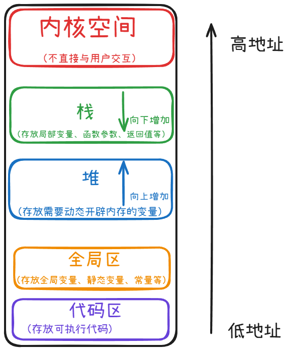
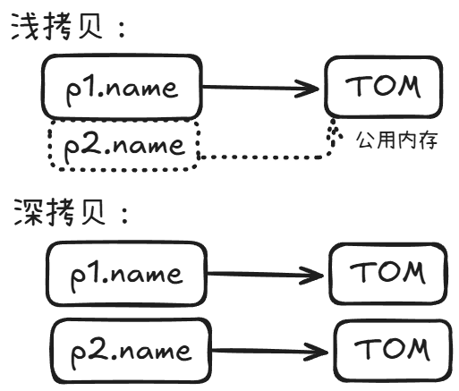
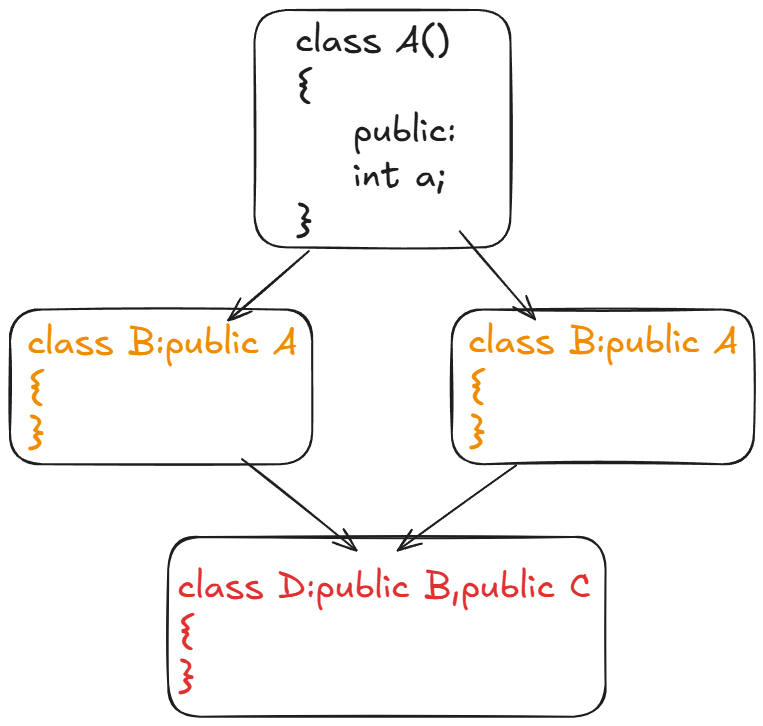

# C++核心编程

> 此部分包括C++特性：写出高效、类型安全、模块化的代码
>
> 面向对象核心：类与对象、构造/析构，理解 C++ 的结构化思想


## C++内存分区模型

### 分区

> 在C++中,程序在运行时,内存主要分为四个区,分别为 **栈、堆、全局区和代码区** 。



- 代码区：存放函数体的二进制代码，由操作系统进行管理的。（代码区共享、只读）
- 全局区：存放全局变量和静态变量以及常量。（常量区中存放const修饰的全局变量和字符串变量）
- 栈区：由编译器自动分配释放, 存放函数的参数值,局部变量等
- 堆区：由程序员分配和释放,若程序员不释放,程序结束时由操作系统回收


### 栈和堆的区别

1. **管理方式不同：**

- 栈由系统自动管理，出作用域时自动释放
- 堆需要手动释放，否则在程序结束后由操作系统自动回收


2. **空间大小不同：**

- 栈很小，一般只有8M
- 堆利用new自动开辟内存大小


3. **分配效率不同**

- 栈底层有系统提供的数据结构，有专门指令，效率很高
- 堆是由C++函数库提供


### new和delete 动态分配内存

> 上面提到C++使用new操作符在堆区开辟内存空间

​	**步骤：**

1. 声明一个指针
2. 使用 `new` 操作符向系统申请一块内存，让指针指向这片内存
3. 通过解引用的方法，像使用变量一样使用这块内存
4. 使用 `delete` 运算符释放内存 


​	**语法：** **`new 数据类型`**  /  **`delete 地址`**

​	**示例：** 

```cpp
int main()
{
	int* p = new int(5);//C++11新特性，申请了一个类型为int的内存空间，初始化为5
	cout <<"*p=" << *p << endl;

	*p = 8;
	cout << "*p=" << *p << endl;//像使用变量一样使用这片内存


	delete p;//利用delete释放堆区数据
	//cout << "*p=" << *p << endl; //错误，释放的空间不可访问

	return 0;
}
```

​	**输出：**

```
*p=5
*p=8
```

> **注意：** `int* p = new int(5);` 只是申请初始化数据为5的int型变量


​	**注意区分：**

| 表达式                  | 类型       | 分配的内存 | 初始化                     | 用法          | 释放方式      |
| ----------------------- | ---------- | ---------- | -------------------------- | ------------- | ------------- |
| `int* p = new int(5)`   | 单个 `int` | 1 个 `int` | 初始化为 5                 | `*p`          | `delete p;`   |
| `int* p = new int[5]`   | `int` 数组 | 5 个 `int` | 未初始化（原始类型）       | `p[0] ~ p[4]` | `delete[] p;` |
| `int* p = new int[5]()` | `int`数组  | 5`个int`   | 初始化为0，且只能初始化为0 |               | `delete[] p;` |

> `int* p = new int[5]()` 在 `()` 内不能写入其他任何数据。


## 引用

### 基本知识

> 引用变量是C++新增加的复合类型。

​	**语法：**

​	**`数据类型 &引用名 = 原变量名`**


​	**作用：**

- 引用是为已定义的变量**起的别名**

- 可以在**不复制数据的情况下访问和修改变量的值**

  > 即：引用是**某个已有变量的别名**，它**不是一个新变量**，而是对原变量的另一种访问方式。


​	**特性注意：** 

| 特性               | 说明                                     |
| ------------------ | ---------------------------------------- |
| 必须初始化         | 定义引用时**必须立即绑定变量**           |
| 一旦绑定，不能更改 | 引用一经绑定，不能再指向别的变量         |
| **处境相同**       | **修改其中任意一个，另一个也一样被修改** |
| 不是指针           | 没有地址操作，也不能为 `nullptr`         |
| 作用类似指针       | 但更安全、更直观，不需要 `*` 解引用      |


​	**示例：**

```cpp
int main()
{
	int a = 3;
	int b = 4;

	int& c = a;	//必须在声明的时候初始化
	//int& c = b;	//错误，绑定后不能再修改指向

	cout << "a=" << a << endl;
	cout << "c=" << c << endl;

	c = b;//赋值操作，不是改变指向，没有错误
	cout << "a=" << a << endl;//修改c,a也一样发生改变
	cout << "c=" << c << endl;
}
```


​	**输出：**

```cpp
a=3
c=3
a=4
c=4
```


### 引用的本质

> 引用的本质是 **指针常量** 
>
> 引用的底层机制就是指针，只是为了语法方便由编译器帮我们完成了指针部分的操作，因此引用操作并没有节省空间。

> 指针常量的指向不可以修改，也说明了为什么常量不能修改指向

​	**示例：**

```cpp
void func(int& tmp)
{
	tmp = 100; // tmp是引用，转换为*tmp = 100
}
int main()
{
	int a = 10;

	//编译器发现是引用，转换为 int* const tmp = &a;
	int& tmp = a;
	tmp = 20; //内部发现tmp是引用，自动帮我们转换为 *tmp = 20;

	cout << "a:" << a << endl;
	cout << "tmp:" << tmp << endl;

	func(a);
	cout << "a:" << a << endl;
	cout << "tmp:" << tmp << endl;
	return 0;
}
```


​	**输出：**

```cpp
a:20
tmp:20
a:100
tmp:100
```


### 引用作为函数参数

​	**作用：** 和指针作为函数参数逻辑相同，**使用引用在形参时也会修改实参，且相对于指针更加简单便利，代码也更容易理解**

​	**示例：** 

```cpp
//地址传递
void Swap1(int* a, int* b)
{
	int temp = *a;
	*a = *b;
	*b = temp;
}

//引用传递
void Swap2(int& a, int& b)
{
	int temp = a;
	a = b;
	b = temp;
}

int main() 
{
	int a = 10;
	int b = 20;

	Swap1(&a, &b);
	cout << "a:" << a << " b:" << b << endl;

	Swap2(a, b);
	cout << "a:" << a << " b:" << b << endl;
    
	return 0;
}
```


### 引用作为函数返回值

​	**好处：** 

1. 传统返回需要拷贝一份返回值预备调用，**而引用返回避免了不必要的拷贝。** 适合返回大型对象时使用

2. 可以在返回调用时**作为左值直接修改原对象**  (避免出现"表达式必须是可修改的左值“的错误提示)

 

​	**注意：** 

- **不能返回临时变量、局部变量（因为其在返回后就被销毁，出现野指针情况）**

  > 局部变量可以尝试转换成静态变量如 `static int x` 再返回即可


​	**示例:** 

```cpp
int& getX(int& x)
{
    return x;
}

int main()
{
    int a = 10;
    getX(a)=20; //作为左值直接修改a为20
    cout<<a;
}
```

​	**输出:**

```cpp
20
```


### 引用返回和const结合

> 可以理解为更高效的值返回。

​	**好处：** 此好处是于普通返回进行对比，即保留了引用返回**不用拷贝具有高效性**，又因为有 `const` **保证了安全性（不能修改）。**


​	**对比：**

| 特性/比较点          | 值返回（T）                  | 引用返回（T&）               | const 引用返回（const T&）   |
| -------------------- | ---------------------------- | ---------------------------- | ---------------------------- |
| **是否拷贝对象**     | ✅ 会拷贝对象（调用拷贝构造） | ❌ 不拷贝，仅返回别名         | ❌ 不拷贝，仅返回别名         |
| **效率（大对象）**   | ❌ 慢（尤其大对象）           | ✅ 高效                       | ✅ 高效                       |
| **是否可修改原对象** | ❌ 只能修改副本               | ✅ 可以（直接改原对象）       | ❌ 只读                       |
| **是否安全**         | ✅ 安全（副本，不影响原数据） | ❌ 有风险（可能野指针）       | ✅ 只读访问，较安全           |
| **生命周期问题**     | ✅ 无生命周期问题             | ❌ 有风险（不能返回局部变量） | ❌ 有风险（不能返回局部变量） |
| **常用场景**         | 小对象、需要返回值           | 想要直接修改原始对象         | 只想读原始对象、提升性能     |


## 函数

### 函数默认参数

​	**定义：** 在函数声明时为某些参数**指定默认值**，在函数调用时就可以省略这些参数。当然也可以在调用时重新赋值。


​	**注意：** 

1. **默认参数自右向左默认**，设定了一个默认参数，则其右边都需要设置。

   ```cpp
   void func(int a = 10, int b = 20, int c = 30);  // ✅ 正确
   void func(int a, int b = 20 int c = 30);       // ✅ 正确
   
   // void func(int a = 10, int b, int c = 30);    // ❌ 错误：a 默认了但 b 没有
   ```


2. **默认参数只书写一次**，即一般在声明处书写后，定义处就不再书写。

   ```cpp
   // 头文件或函数声明
   void showMessage(string msg = "Hello");
   
   // 函数定义（不能重复写默认值！）
   void showMessage(string msg) 
   {
      cout << msg << "\n";
   }
   ```

   

3. 默认参数**可以是常量、宏、表达式**（但不能是运行时变量）

   ```cpp
   const int defaultAge = 20;
   void info(int age = defaultAge);  // ✅ OK
   
   int x = 30;
   // void info(int age = x);        // ❌ 错：x 不是编译时常量
   ```

   

4. 在调用过程中，如果重新指定了某个参数的值，那么该参数左边的所有参数都必须重新指定。

   > 这个很好理解，指定过程肯定是从左到右。


### 函数占位参数

> C++ 中的**函数占位参数（placeholder parameter）**，是指：**在函数参数列表中存在但未命名的参数**，也可以是**保留位置但不打算使用的参数**。

​	**作用：** **占位置**，为了满足函数签名要求，或兼容某些函数原型（如重载、继承、回调等），但不实际使用这些参数。

​	**示例：** 

```cpp
//函数占位参数 ，占位参数也可以有默认参数
void func(int a, int) {
	cout << "aaa" << endl;
}

int main() 
{
	func(10,10); //调用时占位参数必须填补
	return 0;
}
```


### 函数重载

> 在**同一个作用域中**，可以定义**多个函数名相同**但**参数列表不同**（参数个数或类型不同或顺序不同）的函数。
>
> 编译器会根据调用时传入的参数来**自动选择匹配的函数版本**。

| 允许的差异                 | 示例                                 |
| -------------------------- | ------------------------------------ |
| 参数个数不同               | `f(int)` vs `f(int, int)`            |
| 参数类型不同               | `f(int)` vs `f(double)`              |
| 参数顺序不同（类型也不同） | `f(int, double)` vs `f(double, int)` |
| 引用/指针/const 版本       | `f(int&)` vs `f(const int&)`         |


​	**注意：**

1. **仅返回值有差异不能区分重载（即必须参数列表存在差异）**

   ```cpp
   int func(int a);
   double func(int a);  // ❌ 错误！只返回类型不同，不能重载
   ```

   

2. **结合默认参数时会有二义性问题**

   ```cpp
   void show(int a, int b = 10);  // 有默认参数
   void show(int a);              // ⚠️二义性：调用 show(5) 时不明确
   ```

   > 避免产生歧义，要么用重载，要么用默认参数，不要混用。


3. 与引用搭配，根据实参区分

   ```cpp
   void print(int& a)
   {
       std::cout << "非 const 引用\n";
   }
   
   void print(const int& a)
   {
       std::cout << "const 引用\n";
   }
   
   
   int x = 10;
   const int y = 20;
   print(x);  // 调用 非 const 引用
   print(y);  // 调用 const 引用
   ```


### 内联函数

> 是一种通过**消除函数调用开销**来提高程序性能的机制。
>
> **内联函数 = 高效、安全的函数调用优化手段**，适用于**小而频繁调用**的函数。
> 但它只是一个建议，最终是否内联由**编译器决定**。


​	**示例：**

```cpp
inline int square(int x) //函数声明前加上inline
{
    return x * x;
}

int a = square(5);  // 编译器尝试展开为：int a = 5 * 5;
```

> 内联函数直接在函数调用点尝试将其替换成函数体代码，省去函数调用开销。


​	**补充：**

1. **递归函数不能内联**。
2. 类内定义的成员函数是**默认内联**的。


## 类和对象基础

> C++面向对象三大特性：封装、继承、多态。


### 类的定义

```cpp
class 类名 {
访问权限说明符:
    // 成员变量（属性）
    // 成员函数（方法、行为）
};
```

> - 类的成员可以是变量，也可以是函数
> - 成员变量也可以叫属性、成员函数也可以叫方法或行为
> - 用类定义一个类的变量**叫实例化一个对象**
> - 对象的所有成员变量、成员函数的作用域和生命周期与对象的作用域和生命周期相同


### 类的实例化

> 就是创建对象的过程

使用 **`对象名.成员名`** 的方式来访问成员变量或成员函数。

```cpp
class Car
{
public:
    string brand;
    void drive()
    {
        cout << brand << " is driving." << endl;
    }
};

int main() 
{
    Car myCar;               // 实例化对象
    myCar.brand = "Toyota";  // 设置属性
    myCar.drive();           // 调用方法
}
```


### 访问权限

| **访问者/访问位置**          | **访问目标成员权限** | **访问权限** | **说明**                      |
| ---------------------------- | -------------------- | ------------ | ----------------------------- |
| **类内成员函数中**           | `private`            | ✅ 允许       | 自己当然能访问自己的私有成员  |
|                              | `protected`          | ✅ 允许       | 可访问受保护成员              |
|                              | `public`             | ✅ 允许       | 可访问公共成员                |
| **类外（main 函数/其他类）** | `private`            | ❌ 禁止       | 除非通过友元或公有接口        |
|                              | `protected`          | ❌ 禁止       | 不能访问，除非在子类中        |
|                              | `public`             | ✅ 允许       | 可自由访问                    |
| **子类中（public继承）**     | `private`            | ❌ 禁止       | 子类无法访问父类 private 成员 |
|                              | `protected`          | ✅ 允许       | 子类可访问受保护成员          |
|                              | `public`             | ✅ 允许       | 子类可访问公共成员            |
| **子类中（protected继承）**  | `private`            | ❌ 禁止       | 同上                          |
|                              | `protected`          | ✅ 允许       | 在子类中仍是 protected        |
|                              | `public`             | ✅ 允许       | 变为 protected                |
| **子类中（private继承）**    | `private`            | ❌ 禁止       | 同上                          |
|                              | `protected`          | ✅ 允许       | 在子类中变为 private          |
|                              | `public`             | ✅ 允许       | 在子类中变为 private          |
| **外部通过对象访问成员**     | `private`            | ❌ 禁止       | 对象不能访问 private 成员     |
|                              | `protected`          | ❌ 禁止       | 同上                          |
|                              | `public`             | ✅ 允许       | 可访问 public 成员            |
| **友元函数/类访问**          | `private`            | ✅ 允许       | 可访问一切成员                |
|                              | `protected`          | ✅ 允许       | 可访问一切成员                |
|                              | `public`             | ✅ 允许       | 可访问一切成员                |

> 以更严格的方式进行继承，继承后的访问权限也会严格一个等级。


## 构造函数和析构函数

> 由编译器自动调用，完成对象的初始化和清理工作

### 基本知识

1. **对比**

| 项目             | 构造函数                             | 析构函数                             |
| ---------------- | ------------------------------------ | ------------------------------------ |
| 访问权限         | 必须 `public`                        | 必须 `public`                        |
| 名称格式         | **`类名() {...}`**                   | **`~类名() {...}`**                  |
| 是否返回值       | 没有返回值                           | 没有返回值                           |
| 参数             | 可以有参数，支持重载                 | 不允许有参数，不支持重载             |
| 调用时机         | **对象创建时自动调用**               | **对象销毁时自动调用**               |
| 调用次数         | 每个对象创建时调用一次，不可手工调用 | 每个对象销毁时调用一次，可以手工调用 |
| 是否必须显式写出 | 非必须（编译器可生成默认构造）       | 非必须（编译器可生成默认析构）       |
| 是否可以继承     | 不可以被继承                         | 不可以被继承                         |
| 常见用途         | 初始化成员、分配资源                 | 清理资源、释放内存                   |
| 使用初始化列表   | 推荐用构造函数初始化列表             | 析构函数中不使用初始化列表           |


2. **调用顺序**

| 情况           | 构造顺序       | 析构顺序       |
| -------------- | -------------- | -------------- |
| 成员变量       | 成员 → 本类    | 本类 → 成员    |
| 继承结构       | 父类 → 子类    | 子类 → 父类    |
| 多成员、多继承 | 按声明顺序构造 | 反声明顺序析构 |


### 构造函数分类及定义

| 类型         | 说明                           | 示例                       |
| ------------ | ------------------------------ | -------------------------- |
| 默认构造函数 | 无参数                         | `Person();`                |
| 有参构造函数 | 接受参数用于初始化             | `Person(string n);`        |
| 拷贝构造函数 | 用于用一个对象初始化另一个对象 | `Person(const Person &p);` |

​	**示例：**

```cpp
class Person 
{
public:
    // 无参/默认构造函数
    Person() 
    {
        cout << "默认构造函数!" << endl;
    }

    // 有参构造函数
    Person(int a)
    {
        age = a;
        cout << "有参构造函数!" << endl;
    }

    // 拷贝构造函数
    Person(const Person& p)
    {
        age = p.age;
        cout << "拷贝构造函数!" << endl;
    }
    
private:
    int age;
};

int main() 
{
    Person p1;			// 调用默认构造
    //person p1();		//注意！此时是函数声明，不是构造。
    
    Person p2(20);      // 调用有参构造
    
    Person p3 = p2;     // 调用拷贝构造，两种方式
    person p3(p2);
}
```


​	**注意：** 

在默认构造函数对象的创建中：

```cpp
class A
{
    A(){};
}

A a;	//此时是创建一个对象

A a();	//此时是声明一个返回类型为A，无参数的函数a。类似于 int a();
```

> 常见书写错误，推荐使用 **`A a{};`** 的方法来使用默认构造函数创建对象。


若构造函数使用默认参数，如：

```cpp
class A
{
    A(int a = 10){cout<<a;}
};

A a();
```

> 注意：此时仍然是一个函数声明，什么也不会输出。即即使有默认参数，也不会改变 `A a()` 的解析方式。


### 拷贝构造函数

> 拷贝构造函数是一个**特殊的构造函数** ，用于**用一个已经创建完毕的对象来初始化一个新对象。** 

​	**语法 ：**

1. 定义：**`类名（const 类名& 对象名）{...}`** 

2. 创建： **`类名 新对象名（已有对象名）`** 或

   ​        	**`类名 新对象名 = 已有对象名`**

   ```cpp
   class A
   {
       A(){};
       A(const A& p){};
   ...
   }
   
   A a;		//声明已有对象名
   A b1 = a;	
   A b2(a);
   ```


​	**调用时刻：**

1. **用一个已经创建完毕的对象来初始化一个新对象。**

2. **值传递的方式给函数参数传值。**

3. **值传递的方式返回局部对象。**

   ```cpp
   class Person 
   {
   public:
   	Person()
       {
   		cout << "无参构造函数!" << endl;
   		age = 0;
   	}
   	Person(int age) 
       {
   		cout << "有参构造函数!" << endl;
   		age = age;
   	}
   	Person(const Person& p) 
       {
   		cout << "拷贝构造函数!" << endl;
   		age = p.age;
   	}
   	//析构函数在释放内存之前调用
   	~Person() 
       {
   		cout << "析构函数!" << endl;
   	}
   public:
   	int age;
   };
   
   //1.用一个已经创建完毕的对象来初始化一个新对象。
   void test1() 
   {
   	Person man(100);    	//调用有参构造
   	Person newman(man); 	//调用拷贝构造函数
   	Person newman2 = man; 	//另一种方法调用拷贝构造函数
   
   	//Person newman3;
   	//newman3 = man; 		//这种方式不是调用拷贝构造函数，是赋值操作
   }
   
   //2.值传递的方式给函数参数传值。
   //相当于Person p1 = p;
   void doWork(Person p1) {}
   void test2() 
   {
   	Person p; //无参构造函数
   	doWork(p);
   }
   
   //3.值传递的方式返回局部对象。
   Person doWork2()
   {
   	Person p1;
   	cout << (int *)&p1 << endl;
   	return p1;
   }
   
   void test3()
   {
   	Person p = doWork2();
   	cout << (int *)&p << endl;
   }
   ```

   > 不难看出，其本质都是用已经创建的对象来初始化另一个对象。


​	**注意：**

1. 拷贝函数可以重载，也可以有默认参数

2. 不定义拷贝构造函数，编译器也会**提供默认拷贝构造函数**

3. 用户定义了有参构造函数后，编译器不再提供默认构造，但还会提供默认拷贝；**但定义了拷贝构造后，编译器不再提供任何构造函数**


### 浅拷贝和深拷贝

> 浅拷贝是默认拷贝构造函数，深拷贝是自定义拷贝构造函数。

| 类型   | 说明                                   | 内存情况                 | 是否需要自定义拷贝构造 |
| ------ | -------------------------------------- | ------------------------ | ---------------------- |
| 浅拷贝 | 拷贝指针地址，两个对象共用同一块内存   | 指针成员**指向同一地址** | ❌（编译器默认实现）    |
| 深拷贝 | 拷贝指针所指内容，两个对象各有一块内存 | 指针成员**指向不同地址** | ✅（必须自己写）        |




#### 浅拷贝

```cpp
class Person 
{
public:
    char* name;

    Person(const char* str)
    {
        name = new char[strlen(str) + 1];
        strcpy(name, str);
    }
    // 没有自定义拷贝构造 ⇒ 编译器提供默认的“浅拷贝”
    ~Person() 
    {
        delete[] name;
    }
};

int main() {
    Person p1("Tom");
    Person p2 = p1;  // ❌ 浅拷贝，两者name指向同一地址

    // 当 p1 和 p2 被析构时，都会 delete name，导致程序崩溃
}
```

> 很容易出现的问题，浅拷贝指针指向同一地址，会delete同一地址两遍，程序崩溃。


2. **深拷贝**

每个对象都有自己的堆内存，不会互相影响，释放也很安全。


#### 注意

如果**类中包含指针或资源管理（如动态分配内存 `new`）**，**一定要手动写：**

- 拷贝构造函数
- 拷贝赋值运算符（`operator=`）
- 析构函数

这叫做：**“三法则”（Rule of Three）**


### 初始化列表

> 构造函数除了参数列表和函数体之外，还可以有初始化列表。 **初始化列表** 是一种在构造函数中**初始化成员变量**的语法。


​	**语法：** **`类名（形参列表）: 成员变量1（值1），成员变量2（值2）... {...}`** 

```cpp
class Person 
{
    int age;
    string name;

public:
    // 构造函数使用初始化列表
    Person(int a, string n) : age(a), name(n) 
    {
        // 构造函数体（可以留空）
    }
};
```

​	

​	**注意：**

1. 成员变量**可以不全出现**在初始化列表中；若已出现，就不能再次赋值。
2. 初始化列表中的 "值1"、“值2”等，可以是形参，可以是具体的值，也可以是表达式。
3. 初始化列表和赋值完全不同。


​	**为什么使用初始化列表：**

| 目的                       | 原因                                                         |
| -------------------------- | ------------------------------------------------------------ |
| **初始化 const 成员变量**  | **const 只能初始化，不能赋值**                               |
| **初始化引用成员变量**     | **引用必须在初始化时绑定**                                   |
| 没有默认构造函数的成员对象 | 必须使用初始化列表                                           |
| 避免重复初始化             | 成员在进入构造函数体前已经初始化，初始化列表更高效           |
| 提高性能                   | 对于类成员（如 string/vector），直接构造比先默认构造再赋值**更高效** |

> 推荐全部使用初始化成员列表。


**示例：**

```cpp
class Demo 
{
    const int id;
    int& ref;
public:
    Demo(int i, int& r) : id(i), ref(r) {}  // ✅ 唯一合法方式
};
```


## 类的成员

> 介绍重要的成员变量和成员函数


### 对象成员

> **当一个类将另一个类的对象作为成员变量** ，那么这个成员变量就是 **“对象成员”** 

​	**示例：**

```cpp
class Engine 
{
public:
    Engine() { std::cout << "Engine 构造" << std::endl; }
};

class Car
{
    Engine e;  // ✅ Engine 是 Car 的成员
public:
    Car() { std::cout << "Car 构造" << std::endl; }
};
```

> e就是对象成员


​	**构造顺序：** 按在类中声明的顺序。

​	**析构顺序：** 相反。


### static静态成员

> C++ 中的 **静态成员（static members）** 是类作用域内的特殊成员，**属于整个类**而不是某个对象。它分为 **静态成员变量** 和 **静态成员函数**，具有独特的存储、访问和生命周期特性。


#### 静态成员变量

​	**语法：**

```cpp
class MyClass 
{
public:
    static int count; // 静态成员变量声明
};
int MyClass::count = 0; // 必须在类外定义和初始化（除非是 constexpr）
```


​	**注意：**

| 特性                     | 描述                                                         |
| ------------------------ | ------------------------------------------------------------ |
| 属于类（**不属于对象**） | 所有对象**共享一份存储空间**，整个程序共享                   |
| 不依赖对象               | 可以**通过 `类名::成员变量名` 直接访问** (也可以通过对象正常访问) |
| 类内声明，类外初始化     | 必须在**程序全局区单独初始化**                               |
| 生命周期                 | 从程序开始到结束（全局存储区）                               |


​	**示例：** 

```cpp
class A
{
    //类中声明
    static int sum;
}

//全局区初始化
int A :: sum = 0;

int main()
{
    cout << A::sum << endl;
    
    A a;
    cout << a.sum <<endl;//也可以通过类名访问
}
```


#### 静态成员函数

​	**语法：**

```cpp
class MyClass 
{
public:
    static void printCount();
};
```


​	**注意：**

| 特性                     | 描述                                                      |
| ------------------------ | --------------------------------------------------------- |
| 属于类（**不属于对象**） | 所有对象**共享一份存储空间**，整个程序共享                |
| 只能访问静态成员         | 因为没有 this 指针，**不能访问对象的非静态变量或函数**    |
| 不依赖对象               | **通过 `类名::函数名()` 直接调用** （也可以通过类名调用） |
| 不含 this 指针           | 不能通过 this 操作成员，**适用于与对象无关的类操作**      |


​	**示例：**

```cpp
class A 
{
public:
    static int count;
    static void show() 
    {
        cout << "Total count = " << count << endl;
        // cout << value << endl; ❌ 错误，不能访问非静态成员
    }
    
private:
    int value; // 非静态成员变量
};

int Counter::count = 5;

int main() 
{
    Counter::show(); // 输出 Total count = 5
    
    A a;
    a.show();//也可以通过类名访问
}
```


### const修饰成员

> 在 C++ 中，`const` 可以修饰类中的**成员变量**和**成员函数参数/返回值**，其主要作用是**限制修改权限**，提升代码安全性和可读性。


#### const成员变量

​	**语法：**

```cpp
class MyClass 
{
public:
    const int count; // 静态成员变量声明
    
    MyClass(int c):count(c) {}
};
```


​	**注意：**

| 特性                 | 说明                                               |
| -------------------- | -------------------------------------------------- |
| 必须初始化列表       | const 成员变量**必须在构造函数初始化列表中初始化** |
| 依赖对象             | 不是 static，不是共享的                            |
| 一旦初始化后不可修改 | 是只读的，构造后就不能再改变了                     |


#### const静态成员变量

> static静态成员变量通常搭配const一起使用


​	**语法：**

```cpp
class A {
public:
    static const int value = 42; // ✅ 可以类内直接初始化
};
```

> 只有**整型常量**（如 int、char）才允许类内初始化，其他类型仍需类外初始化。


#### const修饰成员函数

​	**语法：**

```cpp
class MyClass 
{
public:
	int getValue() const; // const 成员函数声明
};
```

> 注意： `const` 放在函数参数列表 **后面**，表示这是一个“常量成员函数”。


​	**注意：**

1. **修饰后不能改变成员变量** 

```cpp
class Person 
{
private:
    string name;
public:
    Person(string n) : name(n) {}
    string getName() const 
    {
        // name = "Bob"; ❌ 错误：不能修改成员变量
        return name;
    }
};
```

> 因为如果一个成员函数被标记为 `const`，那么 `this` 指针将变为指向常量对象的指针，即 **`const MyClass*`**，表示函数内部不能修改对象的成员变量（除非它是 `mutable`）。


2. **const对象只能调用const函数** （常对象只能调用常函数）

```cpp
void print(const Person& p) 
{
    cout << p.getName(); // 如果 getName 不是 const，会报错
}
```

> 当我们以 `const Person&` 调用函数时，只能调用 `const` 成员函数。

> 没有加 `const` 会造成 **const 对象无法调用该成员函数**。


#### 搭配 mutable成员函数

> 如果确实需要在 `const` 成员函数中**可以修改某个成员变量**，可以将它声明为 `mutable`：

​	**示例：**

```cpp
class Timer 
{
    mutable int accessCount = 0;
public:
    int getTime() const 
    {
        accessCount++; // ✅ 允许修改
        return 123;
    }
};
```


## 简单对象模型

### 数据与函数关系

> 在C++中，类的成员变量和成员函数是分开存储的。


**C++中有两种数据成员，三种函数成员：**

| 数据成员 | 函数成员 |
| -------- | -------- |
| Nostatic | Nostatic |
| static   | static   |
|          | virtual  |


**对象空间存储**

| 类别                      | 是否占对象内存                                |
| ------------------------- | --------------------------------------------- |
| 所有非静态数据成员大小    | ✅                                             |
| 为内存对齐补充大小        | ✅                                             |
| 为支持virtual成员额外开销 | ✅                                             |
| 静态成员变量              | ❌（属于类，不属于对象）                       |
| 成员函数                  | ❌（分开存储，无论对象是否存在都占用存储空间） |

> 对象的地址是第一个非静态成员变量的地址，类中没有非静态成员变量的话，编译器会隐含的增加一个字节的占位空间。


### this 指针

> **this指针指向调用非静态成员函数的 当前对象**


​	**语法：**

```cpp
class MyClass 
{
public:
    void print() 
    {
        cout << "This pointer is: " << this << endl;  // 输出当前对象的地址
    }
};
```

> `this` 指针的类型是 `MyClass*` ，即指向当前对象的指针


​	**作用：**

1. **访问当前对象的成员**

```cpp
class MyClass
{
private:
    int value;
public:
    MyClass(int value) 
    {
        this->value = value;  // 用 this 区分成员变量和形参
    }
};
```

> **`this->value`** 用于访问当前对象的成员变量 `value`。

> 如果没有 `this`，会默认认为 `value` 是构造函数的参数。


2. **返回当前对象的引用**

```cpp
class MyClass 
{
private:
    int value;
public:
    MyClass& setValue(int value) 
    {
        this->value = value;
        return *this;  // 返回对象本身
    }
};
```

> `*this` 表示当前对象。


### 空指针访问成员函数

> 空指针可以调用到没有用到 `this` 指针的**非静态成员函数。**


**只要成员函数内部没有访问成员变量，就可以用空指针访问成员函数。**

​	**示例：**

```cpp
class Test 
{
public:
    void sayHello() 
    {
        std::cout << "Hello" << std::endl;
    }

    void showValue() 
    {
        std::cout << value << std::endl;
    }

private:
    int value = 42;
};

int main() {
    Test* p = nullptr;
    p->sayHello();     // ✅ 可能运行正常
    p->showValue();    // ❌ 可能崩溃（访问了成员变量）
    return 0;
}
```

> 仅展示，不建议使用。


## 友元

> **友元（friend）**允许一个非成员函数或者其他类的成员**访问某个类的私有成员和保护成员。**友元函数可以是普通函数，也可以是其他类的成员函数，甚至是整个类。

​	**分类：** 友元有三种

1. 友元全局函数
2. 友元类
3. 友元成员函数


### 友元全局函数

> 一个普通函数声明为一个类的友元函数后，**这个函数就可以访问该类的所有成员。**

​	**示例：**

```cpp
class MyClass 
{
private:
    int value;

public:
    MyClass(int val) : value(val) {}

    // 声明友元函数
    friend void display(MyClass& obj);
};

// 友元函数
void display(MyClass& obj) 
{
    cout << "Value: " << obj.value << endl;  // 可以访问私有成员
}

int main() 
{
    MyClass obj(10);
    display(obj);  // 友元函数调用
    return 0;
}
```


​	**注意：** 

1. **友元函数必须在类内声明**。可以在类内定义，推荐在类外定义。
2. 友元全局函数和成员函数很像，但是他只是外部函数，不是类的成员，也没有 `this` 指针。


### 友元类

> 一个类声明为另一个类的友元类之后，**这个类就可以访问另一个类的所有成员。**

​	**示例：**

```cpp
//先声明类
class AnotherClass;

class MyClass 
{
private:
    int value;

public:
    MyClass(int val) : value(val) {}

    // 声明为友元类
    friend class AnotherClass;
};

//定义类
class AnotherClass 
{
public:
    void showValue(MyClass& obj) 
    {
        cout << "Value: " << obj.value << endl;  // 可以访问私有成员
    }
};

int main() 
{
    MyClass obj(20);
    AnotherClass another;
    another.showValue(obj);  // 友元类访问 MyClass 的私有成员
    return 0;
}
```

> 相同的，必须在类内声明。


### 友元成员函数

> 某个类的成员函数声明为友元之后，**这个成员函数可以访问其他类的所有成员。**

​	**示例：**

```cpp
class AnotherClass; 

class MyClass 
{
private:
    int value;

public:
    MyClass(int val) : value(val) {}

    // 声明友元成员函数
    friend void AnotherClass::modifyValue(MyClass& obj);
};

class AnotherClass 
{
public:
    // 定义友元成员函数
    void modifyValue(MyClass& obj) 
    {
        obj.value = 100;  // 友元成员函数可以修改 MyClass 的私有成员
    }
};

int main() 
{
    MyClass obj(50);
    AnotherClass another;
    another.modifyValue(obj);  // 修改 MyClass 的私有成员
    std::cout << "Modified value: " << obj.value << std::endl;
    return 0;
}
```

> 声明定义方式有点复杂，需要记忆。


## 运算符重载

> 对已有的运算符进行重定义，赋予其另一种功能，以适应不同的数据类型。


### 分类

#### 按定义方式分类

| 类型             | 语法                                      |
| ---------------- | ----------------------------------------- |
| **成员函数重载** | `返回类型 operator符号(参数列表);`        |
| **全局函数重载** | `返回类型 operator符号(参数列表);`        |
| **友元函数重载** | `friend 返回类型 operator符号(参数列表);` |

 	

​	**示例：**

1. 成员函数重载

```cpp
class ClassName 
{
public:
    Point operator + (const Point& other)
    {
        return ...
    }
};
```


2. 全局函数重载

```cpp
void operator + (const Point& other)
```


3. 友元函数重载

```cpp
class ClassName 
{
    friend operator + (const Point& other)
};
```


#### 按功能分类

| 功能类型 | 运算符例子                     | 要求           |
| -------- | ------------------------------ | -------------- |
| 算术运算 | `+ - * / %`                    | 成员或全局     |
| 关系运算 | `== != < <= > >=`              | 成员或全局     |
| 赋值运算 | `=`、`+=`、`-=` 等             | **仅成员函数** |
| 逻辑运算 | `&&`                           |                |
| 自增自减 | `++`、`--`（有前置和后置区别） | 成员或全局     |
| 下标运算 | `[]`                           | **仅成员函数** |
| 函数调用 | `()`                           | **仅成员函数** |
| 指针运算 | `->`、`*`、`->*                | **仅成员函数** |
| 输入输出 | `<<`、`>>`                     | 全局           |

3

#### 不能重载的符号

| 运算符   | 含义         |
| -------- | ------------ |
| `::`     | 作用域运算符 |
| `.`      | 成员访问     |
| `.*`     | 指向成员指针 |
| `sizeof` | 求大小       |
| `typeid` | 类型识别     |
| `? :`    | 条件运算符   |


### 算数运算符重载(+)

> **`+ - * / %`** ，常用于输出 **类对象**之和、之差等

​	**示例：**

```cpp
class Vector2D 
{
public:
    double x, y;
    Vector2D(double x = 0, double y = 0) : x(x), y(y) {}

    // 成员函数重载 +
    Vector2D operator+(const Vector2D& other) const
    {
        return Vector2D(x + other.x, y + other.y);
    }

    // 全局友元函数重载 -
    friend Vector2D operator-(const Vector2D& a, const Vector2D& b) 
    {
        return Vector2D(a.x - b.x, a.y - b.y);
    }
}
```

​	**注意：**

1. 输出对象之和等如 `obj_a + obj_b` ,推荐成员函数

2. 如果希望支持 `2 + obj` 这种数字+对象的形式，**必须使用全局函数**


### 关系运算符重载(!=)

> `== != < > <= >=` ，比较两个自定义数据类型间的关系。

​	**示例：**

```cpp
class Rectangle
{
    int width, height;
public:
    Rectangle(int w, int h) : width(w), height(h) {}

    friend bool operator==(const Rectangle& a, const Rectangle& b) 
    {
        return a.width == b.width && a.height == b.height;
    }

    friend bool operator<(const Rectangle& a, const Rectangle& b) 
    {
        return a.width * a.height < b.width * b.height;
    }
};
```


### 赋值运算符重载(=)

> `=`、`+=`、`-=` 等 ， `=` 较为特殊，分开介绍。


#### 复合赋值

​	**示例：**

```cpp
class Vector2D 
{
public:
    double x, y;
    Vector2D& operator+=(const Vector2D& other) 
    {
        x += other.x; y += other.y;
        return *this;
    }
};
```

> 返回 `*this` 支持链式调用。


#### 单 = 赋值

​	**意义：**

​	C++会为一个类添加四个默认函数（若没有自定义）：

| 成员函数     | 说明                     |
| ------------ | ------------------------ |
| 默认构造     | 空实现                   |
| 默认析构     | 空实现                   |
| 默认拷贝构造 | **对成员变量进行浅拷贝** |
| 默认赋值     | **对成员变量进行浅拷贝** |


若没有自定义赋值函数，系统会**提供默认赋值运算符，其做的是浅拷贝**

```cpp
MyClass a, b;
a = b;  // 默认逐个成员赋值
```

若这个类**中包含指针或资源管理（如动态分配内存）** ，默认浅拷贝行为会导致程序错误（详见[5.4](###浅拷贝和深拷贝)）

此时就必须重载 `operator =` 以实现深拷贝。


​	**示例：**

```cpp
class MyString 
{
private:
    char* str;

public:
    MyString(const char* s = "") 
    {
        str = new char[strlen(s) + 1];
        strcpy(str, s);
    }

    // 拷贝构造函数（配合赋值）
    MyString(const MyString& other) 
    {
        str = new char[strlen(other.str) + 1];
        strcpy(str, other.str);
    }

    // 析构函数
    ~MyString() 
    {
        delete[] str;
    }

    // 赋值运算符重载
    MyString& operator=(const MyString& other) 
    {
        if (this == &other) return *this;  // 自赋值检查

        delete[] str;  // 清理旧资源

        str = new char[strlen(other.str) + 1];  // 分配新资源
        strcpy(str, other.str);

        return *this;  // 支持 a = b = c;
    }

    void print() const 
    {
        std::cout << str << '\n';
    }
};

int main()
{
    MyString a("Hello");
    MyString b("World");

    a = b;
    a.print();  // 输出：World

    a = a;      // 自赋值，不出错
}
```

> 必须进行自赋值检查。


### 自增自减重载(++)

​	**支持样式：**

| 类型   | 写法  | 调用函数                | 特点               |
| ------ | ----- | ----------------------- | ------------------ |
| 前置增 | `++x` | `operator ++ ()`        | 效率高（返回引用） |
| 后置增 | `x++` | **`operator ++ (int)`** | 参数是 dummy `int` |
| 前置减 | `--x` | `operator -- ()`        | 同上               |
| 后置减 | `x--` | **`operator -- (int)`** | 同上               |

> **即前置返回引用，后置返回值。**

> 仅在需要返回旧值时才实现后置，非必要不重载后置。


​	**示例：**

```cpp
class Counter 
{
private:
    int value;

public:
    Counter(int val = 0) : value(val) {}

    // 前置 ++x
    Counter& operator++() 
    {
        ++value;
        return *this;
    }

    // 后置 x++
    Counter operator++(int) 
    {
        Counter temp = *this;  // 保存旧值
        ++value;
        return temp;           // 返回旧值
    }

    // 前置 --x
    Counter& operator--() 
    {
        --value;
        return *this;
    }

    // 后置 x--
    Counter operator--(int) 
    {
        Counter temp = *this;
        --value;
        return temp;
    }

    void show() const 
    {
        std::cout << "Value: " << value << '\n';
    }
};

int main() 
{
    Counter c(10);

    ++c;        // 前置
    c.show();   // 11

    c++;        // 后置
    c.show();   // 12

    --c;        // 前置
    c.show();   // 11

    c--;        // 后置
    c.show();   // 10
}
```


### 下标运算符重载([])

> 重载 `[]` 之后，允许对象像数组一样访问下标。


​	**注意：**

1. 应该返回 **引用** 以支持赋值操作。（类似数组的操作需要对实参也进行修改）
2. 分为两个版本：
   - `const` 成员函数：只读
   - 非 `const` 成员函数：支持读写

​	**示例：**

```cpp
class IntArray 
{
private:
    int* data;
    size_t size;

public:
    IntArray(size_t n) : size(n) 
    {
        data = new int[size]{};
    }

    ~IntArray() 
    {
        delete[] data;
    }

    // 非 const 版本：支持写入
    int& operator[](size_t index) 
    {
        return data[index];
    }

    // const 版本：只读
    const int& operator[](size_t index) const 
    {
        return data[index];
    }

    size_t length() const
    {
        return size;
    }
};

IntArray arr(5);
arr[0] = 42;       // 写操作
cout << arr[0];    // 读操作

const IntArray& carr = arr;
cout << carr[1];   // 使用 const 版本
```


### 函数调用重载(())

> `operator()` 重载之后，就可以将对象当作函数来使用。
>
> ```cpp
> MyFunctor f;
> f(1, 2);  // 看起来像函数，其实是对象调用重载的 operator()
> 
> ```

这种对象通常称为 **函数对象（function object）** 或 **仿函数（functor）**。


​	**示例：**

```cpp
class Multiplier 
{
private:
    int factor;
public:
    Multiplier(int f) : factor(f) {}

    int operator()(int x) const 
    {
        return x * factor;
    }
};

Multiplier times2(2), times5(5);

cout << times2(10);  // 20
cout << times5(10);  // 50
```


### 指针运算重载

典型用例：重载 `*` 和 `->` 以模拟智能指针：

```cpp
template <typename T>
class SmartPtr 
{
private:
    T* ptr;

public:
    SmartPtr(T* p = nullptr) : ptr(p) {}
    ~SmartPtr() { delete ptr; }

    // 解引用 *
    T& operator*() const 
    {
        return *ptr;
    }

    // 成员访问 ->
    T* operator->() const 
    {
        return ptr;
    }

    // 禁止复制，模拟 unique_ptr 行为
    SmartPtr(const SmartPtr&) = delete;
    SmartPtr& operator=(const SmartPtr&) = delete;
};

struct Person 
{
    void say() const 
    {
        std::cout << "Hi!\n";
    }
};

int main() 
{
    SmartPtr<Person> p(new Person);
    (*p).say();    // 解引用调用
    p->say();      // 通过 -> 访问成员
}
```


### 输入输出运算符重载

> 通过 `cin` 和 `cout` 输出自定义类型。

​	**示例：**

```cpp
class Person 
{
private:
    string name;
    int age;

public:
    Person() : name(""), age(0) {}

    // 声明友元函数重载运算符
    friend ostream& operator<<(ostream& out, const Person& p);
    friend istream& operator>>(istream& in, Person& p);
};

ostream& operator << (ostream& out, const Person& p) 
{
    out << "Name: " << p.name << ", Age: " << p.age;
    return out;
}

istream& operator >> (istream& in, Person& p) 
{
    cout << "Enter name: ";
    in >> p.name;
    cout << "Enter age: ";
    in >> p.age;
    return in;
}

int main()
{
    Person p;
    cin >> p;
    cout << p << endl;
    return 0;
}
```


​	**注意：**

1. 返回类型是引用
2. 输出 `<<` 对象建议加 `const` ,输入 `>>` 对象不加 `const` 。


## 继承

> 用于实现代码复用、类之间的层次结构与扩展性。

### 基本语法

```cpp
class 派生类名 : 继承方式 基类名 
{
    // 派生类成员
};
```

​	**示例：**

```cpp
class Animal 
{
public:
    void speak()
    {
        cout << "Animal sound" << endl;
    }
};

class Dog : public Animal 
{
public:
    void bark() 
    {
        cout << "Woof!" << endl;
    }
};
```


### 继承方式

> 继承方式决定了**派生类对象对基类成员的访问权限**，以及**在多态和类型转换时的行为**。C++提供了三种继承方式。


#### 三种继承方式

| 继承方式     | 语法                    | 对基类成员的访问控制影响（默认）                             |
| ------------ | ----------------------- | ------------------------------------------------------------ |
| **公有继承** | `class A : public B`    | 基类访问权限不变； `private` 无法访问                        |
| **保护继承** | `class A : protected B` | 降低基类访问权限：`(public`、`protected)` ➡ `protected` ；`private` 无法访问 |
| **私有继承** | `class A : private B`   | 全部变为 `private`：`(public`、`protected)` ➡ `private` ； `private` 无法访问 |

> 理解为在更严格继承之后，访问等级也变得更严格。


​	**示例：**

```cpp
class Base
{
public:
    int pub;
protected:
    int pro;
private:
    int pri;
};

// 1. 公有继承
class Derived1 : public Base 
{
    void func() 
    {
        pub = 1;   // ✅ 可访问   还是public
        pro = 2;   // ✅ 可访问   还是protected
        // pri = 3; // ❌ 无法访问
    }
};

// 2. 保护继承
class Derived2 : protected Base 
{
    void func() 
    {
        pub = 1;   // ✅ 可访问   但变为protected
        pro = 2;   // ✅ 可访问   还是protected
        // pri = 3; // ❌ 无法访问
    }
};

// 3. 私有继承
class Derived3 : private Base
{
    void func()
    {
        pub = 1;   // ✅ 可访问   但变为private
        pro = 2;   // ✅ 可访问   但变为private
        // pri = 3; // ❌ 无法访问
    }
};
```


#### using改变访问权限

> 使用 `using` 关键字可以改变派生类中对父类成员的访问权限。

​	**注意：**

1. **`using` 在派生类的代码段属于什么访问权限，就将继承的成员改变成什么权限**
2. **任何有关 `private` 权限都不能使用 `using`**

| 基类原权限  | 继承方式     | `using` 所在访问区 | 最终权限（派生类） | 合法性 |
| ----------- | ------------ | ------------------ | ------------------ | ------ |
| `public`    | public       | `public:`          | public             | ✅      |
| `public`    | public       | `protected:`       | protected          | ✅      |
| `protected` | public       | `private:`         | private            | ✅      |
| `protected` | public       | `public:`          | public             | ✅      |
| `private`   | 任何继承方式 | 任意访问区         | ❌ 无法访问         | ❌      |

> 只和 `using` 所在代码段的访问权限有关


​	**示例：**

```cpp
class A 
{
public:
    int pub = 10;
protected:
    int pro = 20;
};

class B : public A
{
public:
    using A::pub;   // public → public
protected:
    using A::pro;   // protected → protected（保持）
};

class C : public A
{
protected:
    using A::pub;   // public → protected（降权）
};

class D : public A 
{
private:
    using A::pub;   // public → private（降权）
};
```


### 继承中特殊关系

#### 构造和析构顺序

| 函数     | 顺序          |
| -------- | ------------- |
| 构造函数 | 父类 - > 子类 |
| 析构函数 | 子类 - > 父类 |

> 即使手动调用派生类的析构函数，也会先调用父类的析构函数。


#### 派生类对象

​	**注意：**

1. 可以直接**将派生类对象赋值给基类对象**，同时舍弃非基类成员。
2. **基类指针**可以不显式的指向派生类对象，**基类引用**可以不显式的引用派生类对象。**（但是不能调用方法）**
3. **如果函数形参是基类，其实参可以使用派生类。**
4. 创建派生类对象时，先调用基类构造函数初始化基类对象，再初始化派生类对象（没有声明就调用默认构造函数）


### 名字遮蔽

> 在C++中，**名字遮蔽**（Name Hiding）是指在派生类中定义了与基类同名的成员（变量、函数等），导致**基类的成员**在派生类中被“遮蔽”或“隐藏”。


​	**注意：**

1. 派生类和基类成员重名，会遮蔽基类成员，**优先调用派生类成员。**

2. 不会构成重载情况
3. 可以通过**作用域解析符间接**调用基类对象成员。
4. 尽管静态成员变量与普通成员变量不同，它们是与类而不是对象关联的，但遮蔽的规则相同。
5. **调用方式有两种：**
   - **通过对象**
   - **通过类名**


​	**示例：**

```cpp
class Base
{
public:
	static void func()
	{
		cout << "Base - static void func()" << endl;
	}
	static void func(int a)
	{
		cout << "Base - static void func(int a)" << endl;
	}

	static int m_A;
};

int Base::m_A = 100;

class Son : public Base 
{
public:
	static void func()
	{
		cout << "Son - static void func()" << endl;
	}
	static int m_A;
};

int Son::m_A = 200;

//同名成员属性
void test01()
{
	//通过对象访问
	cout << "通过对象访问： " << endl;
	Son s;
	cout << "Son  下 m_A = " << s.m_A << endl;
	cout << "Base 下 m_A = " << s.Base::m_A << endl;

	//通过类名访问
	cout << "通过类名访问： " << endl;
	cout << "Son  下 m_A = " << Son::m_A << endl;
	cout << "Base 下 m_A = " << Son::Base::m_A << endl;
}

//同名成员函数
void test02()
{
	//通过对象访问
	cout << "通过对象访问： " << endl;
	Son s;
	s.func();
	s.Base::func();

	cout << "通过类名访问： " << endl;
	Son::func();
	Son::Base::func();
	//出现同名，子类会隐藏掉父类中所有同名成员函数，需要加作作用域访问
	Son::Base::func(100);
}
```


### 多继承

> 多继承是指一个类可以继承多个父类的特性。在 C++ 中，子类可以同时从多个基类继承成员，从而使得子类能够同时拥有多个父类的功能。


​	**注意：** 

1. 有了多继承就会发生菱形继承问题，因此引出虚拟继承来解决菱形继承问题
2. **多继承能不用就不用**


​	**示例：**

```cpp
class ClassA 
{
public:
    void funcA() 
    {
        cout << "Function A" << endl;
    }
};

class ClassB
{
public:
    void funcB()
    {
        cout << "Function B" << endl;
    }
};

class ClassC : public ClassA, public ClassB 
{
    // ClassC继承了ClassA和ClassB
};
```


#### 菱形继承

> 当两个父类共同的祖先时，子类就有可能继承到相同的成员。如下例，D会重复继承a :




#### 虚拟继承

> 为了解决菱形继承问题，**搬出了虚拟继承以防止继承相同成员：**

​	**示例：**

```cpp
class A
{
public:
    void func() { std::cout << "A's func" << std::endl; }
};

class B : virtual public A 
{
public:
    void funcB() { std::cout << "B's func" << std::endl; }
};

class C : virtual public A 
{
public:
    void funcC() { std::cout << "C's func" << std::endl; }
};

class D : public B, public C 
{
    // 通过虚拟继承，D不会重复继承A的成员
};
```


## 多态

> **多态**指的是同一操作作用于不同的对象时，能够表现出不同的行为。


### 分类

| 类别           | 举例                       |
| -------------- | -------------------------- |
| 编译时多态     | 函数重载、运算符重载       |
| **运行时多态** | 派生类和虚函数实现（重写） |

> 运行时多态是在程序运行时根据对象的实际类型决定调用哪一个函数。这是通过 **虚函数** 和 **继承** 实现的，是 C++ 中面向对象编程的关键特性。


**重载和重写的区分：**

| 重载                     | 重写                                            |
| ------------------------ | ----------------------------------------------- |
| 见上文详解，仅同名函数。 | 函数返回值类型 函数名 参数列表 完全一致称为重写 |


### 虚函数

> 父类指针只能调用父类的成员函数，不能调用派生类的成员函数。可若将基类的成员函数声明成虚函数，父类指针就可以调用派生类中的同名成员函数。 此方法即为运行时**多态**。


​	**语法：**

​	使用 **`virtual`** 关键字在基类中声明虚函数，在派生类中使用 **`override`** 关键字**重写**：

```cpp
class Base 
{
public:
    virtual void show() 
    {  //声明虚函数
        cout << "Base show" << endl;
    }
};

class Derived : public Base 
{
public:
    void show() override 
    {  //重写基类中的虚函数
        cout << "Derived show" << endl;
    }
};

int main()
{
    Base::show();
}
```


​	**注意：** 

1. 重写虚函数要注意函数特征完全相同，注意 **`virtual`** 和 **`override`** 关键字。
2. 派生类没有重写虚函数就会调用基类的虚函数；派生类重写了虚函数则可以使用 **类名 + 域解析符** 来访问基类虚函数。


### 纯虚函数和抽象类

> 一个函数如果在基类中声明为纯虚函数，表示该函数没有实现，需要在派生类中提供具体的实现。含有纯虚函数的类被称为**抽象类**，**这种类不能直接实例化。**


​	**语法：**

```cpp
virtual void show() = 0;
```

> 纯虚函数没有函数体，只能由派生类去具体实现。


​	**注意：**

1. 有纯虚函数的类就是抽象类，**抽象类不能实例化对象** ，但是可以派生。

2. 派生类必须实现纯虚函数，否则派生类也还是一个抽象类**（即不可实例化对象**，但是可以声明指针和引用**）**。


​	**示例：**

```cpp
// 抽象类
class Shape 
{
public:
    // 纯虚函数，派生类必须重写
    virtual void draw() = 0;
    virtual double area() = 0;

    // 虚析构函数，确保派生类的析构函数被正确调用
    virtual ~Shape() = default;
};

// 派生类
class Circle : public Shape 
{
public:
    Circle(double r) : radius(r) {}

    void draw() override 
    {  // 重写纯虚函数
        cout << "Drawing a circle with radius " << radius << endl;
    }

    double area() override
    {  // 重写纯虚函数
        return 3.14 * radius * radius;
    }

private:
    double radius;
};

// 派生类
class Rectangle : public Shape 
{
public:
    Rectangle(double w, double h) : width(w), height(h) {}

    void draw() override
    {  // 重写纯虚函数
        cout << "Drawing a rectangle with width " << width << " and height " << height << endl;
    }

    double area() override 
    {  // 重写纯虚函数
        return width * height;
    }

private:
    double width, height;
};

int main() 
{
    // Shape s;  // 错误，不能实例化抽象类
    
    Shape* shape1 = new Circle(5);
    shape1->draw();  // Drawing a circle with radius 5
    cout << "Area: " << shape1->area() << endl;  // Area: 78.5

    Shape* shape2 = new Rectangle(4, 6);
    shape2->draw();  // Drawing a rectangle with width 4 and height 6
    cout << "Area: " << shape2->area() << endl;  // Area: 24

    delete shape1;
    delete shape2;

    return 0;
}


// 输出：
Drawing a circle with radius 5
Area: 78.5
Drawing a rectangle with width 4 and height 6
Area: 24
```


### 虚析构和纯虚析构

> 和虚函数定义意义相同：**多态在使用时，如果子类中有属性开辟到堆区，那么父类指针在释放时无法调用到子类的析构代码。**此时将父类中的析构函数改为虚析构函数或纯虚析构函数即可。


​	**语法：**

```cpp
// 虚析构
virtual ~类名(){}


// 纯虚析构
virtual ~类名() = 0;

类名::~类名(){} // 纯虚析构必须给出一个定义
```

> 纯虚析构函数通常用于需要抽象基类的情况，即不希望基类被实例化，但仍然希望派生类实现自己的析构函数。即使析构函数是纯虚的，它仍然需要有一个定义，因为当基类指针删除派生类对象时，析构函数必须被调用。


​	**注意：**

1. 虚析构函数和纯虚析构函数都是为了解决多态情况中父类释放子类对象的问题。**若子类中没有堆区数据可以不用。**

2. 纯虚析构函数所在类也是抽象类，**与虚函数区别仅其不能实例化对象。并且必须给出定义。**


​	**示例：**

```cpp
class Base 
{
public:
    virtual ~Base()  //虚析构
    {
        cout << "Base destructor" << endl;
    }
};

class Derived : public Base 
{
public:
    
    ~Derived() override
    {
        cout << "Derived destructor" <<endl;
    }
};

int main()
{
    Base* basePtr = new Derived();
    delete basePtr;  // 会调用Derived的析构函数，然后调用Base的析构函数
    return 0;
}
```


```cpp
class Base 
{
public:
    virtual ~Base() = 0;  // 纯虚析构函数
};

Base::~Base() 
{  // 必须提供定义
    cout << "Base pure virtual destructor" << endl;
}

class Derived : public Base
{
public:
    ~Derived() override //子类进行重写
    {
        cout << "Derived destructor" << endl;
    }
};

int main()
{
    Base* basePtr = new Derived();
    delete basePtr;  // 会调用Derived的析构函数，然后调用Base的纯虚析构函数
    return 0;
}
```


### 向上向下转型

#### 向上转型

​	**定义：** 子类对象的 **指针/引用** 转换为父类的 **指针/引用** 


​	**注意：** 

1.  **隐式转化即可、且安全** ，因为子类大于等于父类，转换成父类没有任何缺失。
2.  **访问受限** ，向上转换后就只能访问父类部分，不能访问子类独有部分。


​	**示例：**

```cpp
class Base 
{
public:
    virtual void show() { cout << "Base show" << endl; }
};

class Derived : public Base 
{
public:
    void show() override { cout << "Derived show" << endl; }
    void extra() { cout << "Extra in Derived" << endl; }
};

int main() 
{
    Derived d;
    Base* pBase = &d;  // 向上转型（隐式）
    pBase->show();     // 输出 "Derived show"，派生类重写了虚函数，先调用重写的

    // pBase->extra(); // ❌ 编译错误，父类指针看不到子类独有的成员
}
```


#### 向下转型

​	**定义：** 父类对象的 **指针/引用** 转换为子类的 **指针/引用** 


**注意：** 

1.  **需要显式转换，且不安全** ，因为父类对象不一定真的是那个子类。
2.  推荐使用 **`dynamic_cast`** 进行运行时检查。


#### 运行阶段类型识别 dynamic_cast

> `dynamic_cast` 是一种运行时类型识别（RTTI）机制，它会在**运行时检查**转型是否合法。


​	**条件：**

1. **基类必须是虚函数**，`dynamic_cast` 是专门用于解决虚函数问题的
2. 若转换失败：
   - 对指针，返回 `nullptr` 
   - 对引用，抛出 `std::bad_cast` 异常


​	**语法：**

```cpp
dynamic_cast<目标类型>(表达式)
```


​	**示例：**

> 安全的向下转型

```cpp
class Base
{
public:
    virtual ~Base() {} // 必须有虚函数才能用 dynamic_cast
};

class Derived : public Base
{
public:
    void hello() { cout << "Hello from Derived!\n"; }
};

int main() 
{
    Base* b1 = new Derived();   // 实际类型是 Derived
    Base* b2 = new Base();      // 实际类型是 Base

    // 成功：b1 实际上指向 Derived
    if (Derived* d1 = dynamic_cast<Derived*>(b1)) 
    {
        d1->hello();  // 输出: Hello from Derived!
    }

    // 失败：b2 不是 Derived
    if (Derived* d2 = dynamic_cast<Derived*>(b2))
    {
        d2->hello();
    }
    else 
    {
        cout << "Cast failed!\n"; // 输出: Cast failed!
    }

    delete b1;
    delete b2;
}
```

​                                                                

  

