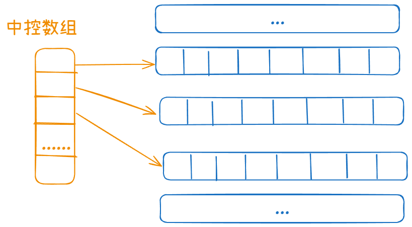
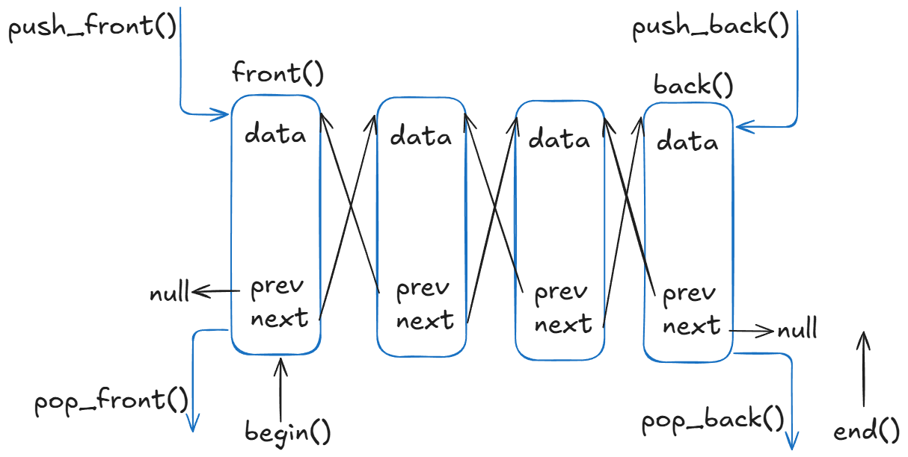
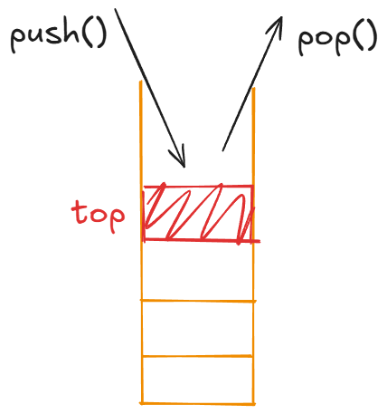
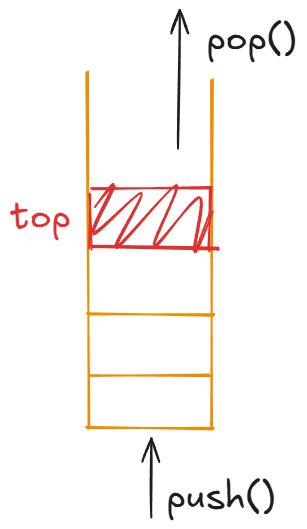
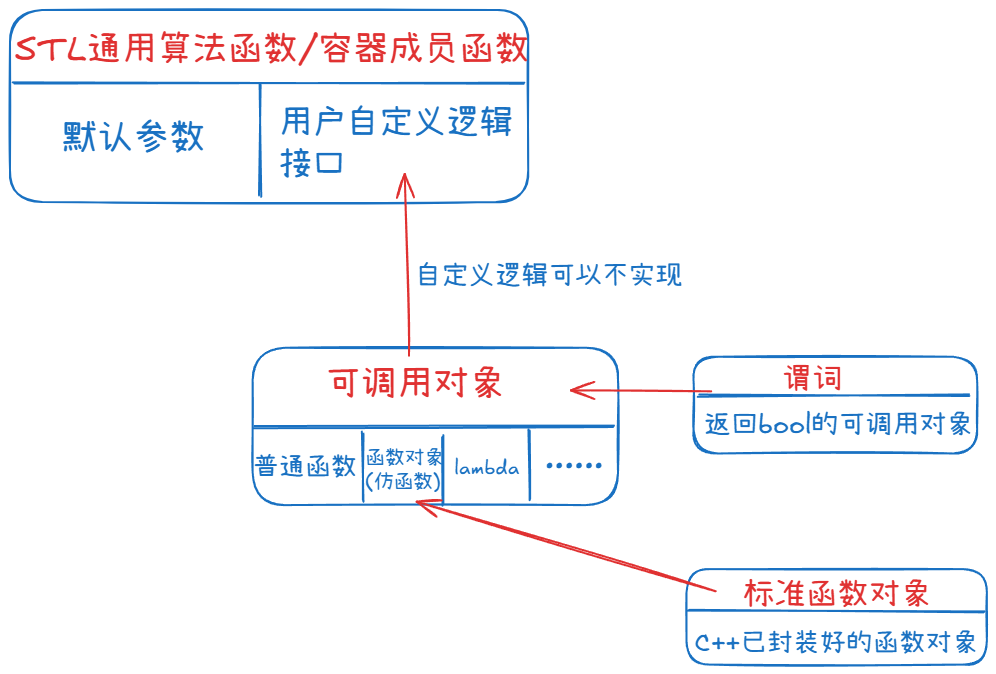

# STL基础语法

> 此部分专注于研究C++ STL标准库，并尝试自己重构各大常用容器


## STL基本概念

> STL(Standard Template Library,**标准模板库**) 广义上分为三大模块 ：**容器(container) 算法(algorithm) 迭代器(iterator)** 
>
> 也可细分为六大组件：

### 分类

| 组件                                         | 作用                                        | 典型例子                                                     |
| -------------------------------------------- | ------------------------------------------- | ------------------------------------------------------------ |
| **1. 容器（Container）**                     | 存储数据的集合                              | `vector`, `list`, `deque`, `set`, `map`                      |
| **2. 算法（Algorithm）**                     | 对容器元素进行操作                          | `sort`, `find`, `accumulate`, `for_each`                     |
| **3. 迭代器（Iterator）**                    | 容器和算法之间的桥梁                        | `begin()`, `end()`, `++it`, `*it`                            |
| **4. 函数对象（Function Object / Functor）** | 类似函数的对象，协助算法策略                | `plus<int>`, `greater<int>`, 自定义 `struct MyFunctor{...}`  |
| **5. 适配器（Adapter）**                     | 改变接口或行为，让容器/算法更灵活           | **容器适配器**：`stack`, `queue`, `priority_queue`   **迭代器适配器**：`reverse_iterator`, `istream_iterator`   **函数适配器**：`bind1st`, `bind2nd`（C++11后多用 `std::bind`） |
| **6. 分配器（Allocator）**                   | 内存管理机制，用于控制容器如何分配/释放内存 | 默认是 `std::allocator<T>`，可以自定义内存池                 |

> STL 通过 **模板** 实现，支持任意数据类型（泛型编程）。容器和算法通过迭代器无缝链接。


### 容器&算法

> 容器分为四类

| 常用容器           | 容器类型           | 底层数据结构                      |
| ------------------ | ------------------ | --------------------------------- |
| array              | **顺序式容器**     | 静态数组（固定大小顺序表）        |
| vector             | **顺序式容器**     | 动态数组（连续内存，可扩容）      |
| deque              | **顺序式容器**     | 分段数组 + 中控器（多块连续空间） |
| list               | **顺序式容器**     | 双向链表                          |
| forward_list       | **顺序式容器**     | 单向链表                          |
| string             | **顺序式容器**     | 动态数组（类似 vector<char>）     |
| set                | 关联式容器（有序） | 红黑树                            |
| multiset           | 关联式容器（有序） | 红黑树                            |
| map                | 关联式容器（有序） | 红黑树（存储 pair<const Key, T>） |
| multimap           | 关联式容器（有序） | 红黑树                            |
| unordered_set      | **无序关联式容器** | 哈希表（桶 + 链表/链式节点）      |
| unordered_multiset | **无序关联式容器** | 哈希表                            |
| unordered_map      | **无序关联式容器** | 哈希表（存储 pair<const Key, T>） |
| unordered_multimap | **无序关联式容器** | 哈希表                            |
| stack              | 容器适配器         | 默认 deque（也可 vector / list）  |
| queue              | 容器适配器         | 默认 deque（也可 list）           |
| priority_queue     | 容器适配器         | vector + 堆算法                   |

***

| 算法       | 说明                                                         | 示例                                          |
| ---------- | ------------------------------------------------------------ | --------------------------------------------- |
| 质变算法   | 运算过程中会更改区间内的元素的内容。例如拷贝，替换，删除等等 | `copy`, `reverse`, `transform`                |
| 非质变算法 | 运算过程中不会更改区间内的元素内容，例如查找、计数、遍历、寻找极值等等 | `sort`, `stable_sort` `,find`,`binary_search` |

> 算法与容器无关，需通过迭代器访问元素


### 迭代器

> 迭代器是一个行为很像指针的对象，**可以使用统一的方式遍历容器中的元素** 而不关心容器本身。

> **算法(管理员)** 使用 **迭代器(钥匙)**拿取 **容器(仓库)**内数据。


#### 基本概念

​	**分类**

| 迭代器         | 说明                                                     | 示例                                                         |
| -------------- | -------------------------------------------------------- | ------------------------------------------------------------ |
| 输入迭代器     | 对数据的只读访问                                         |                                                              |
| 输出迭代器     | 对数据的只写访问                                         |                                                              |
| 前向迭代器     | 读写操作，并能向前推进迭代器                             | `unordered_set/unordered_multiset`、`unordered_map/unordered_multimap` 、`forward_list` |
| 双向迭代器     | 读写操作，并能向前和向后操作                             | `list`、`set/multiset ` 、 `map/multimap`                    |
| 随机访问迭代器 | 读写操作，可以以跳跃的方式访问任意数据，功能最强的迭代器 | `array`、`string`、`vector`、`deque`                         |

> 容器适配器都不提供迭代器


​	**示例：**

```cpp
int main() 
{
    vector<int> v = {10, 20, 30, 40};

    // 使用迭代器遍历
    for (vector<int>::iterator it = v.begin(); it != v.end(); ++it) 
    {
        cout << *it << " ";
    }
    cout << endl;

    // 简写（C++11 range-for）
    for (auto x : v) 
    {
        cout << x << " ";
    }
}
```


​	**常用函数：**

| 函数 / 方法                   | 作用                                                         | 示例                                                         |
| ----------------------------- | ------------------------------------------------------------ | ------------------------------------------------------------ |
| `begin()`                     | 返回指向容器第一个元素的迭代器                               | `vector<int> v{1, 2, 3};`<br />` auto it = v.begin(); cout << *it; // 1` |
| `end()`                       | 返回指向容器最后一个元素后一个位置的迭代器                   | `vector<int> v{1, 2, 3};`<br />`auto it = v.end(); --it; cout << *it; // 3` |
| `rbegin()`                    | **(C++11+)** 返回指向容器最后一个元素的逆向迭代器（从尾部开始遍历） | `vector<int> v{1, 2, 3};`<br />` auto it = v.rbegin(); cout << *it; // 3` |
| `rend()`                      | **(C++11+)** 返回指向容器第一个元素前一个位置的逆向迭代器（从头部逆向遍历） | `vector<int> v{1, 2, 3};`<br />` auto it = v.rend(); --it; cout << *it; // 1` |
| `cbegin()`                    | **(C++11+)** 返回常量迭代器，指向容器第一个元素，不能修改元素 | `vector<int> v{1, 2, 3};`<br />` auto it = v.cbegin(); cout << *it; // 1` |
| `cend()`                      | **(C++11+)** 返回常量迭代器，指向容器最后一个元素的下一个位置，不能修改元素 | `vector<int> v{1, 2, 3};`<br />` auto it = v.cend(); --it; cout << *it; // 3` |
| `advance(it, n)`              | 将迭代器 `it` 向前（或向后）移动 `n` 个位置                  | `vector<int> v{1, 2, 3};`<br />` auto it = v.begin(); advance(it, 2); cout << *it; // 3` |
| `distance(first, last)`       | 计算两个迭代器之间的距离（元素个数）                         | `vector<int> v{1, 2, 3};`<br />` auto it1 = v.begin(), it2 = v.end();`<br />` cout << distance(it1, it2); // 3` |
| `iter_swap(it1, it2)`         | 交换两个迭代器指向的元素                                     | `vector<int> v{1, 2, 3};`<br />` auto it1 = v.begin(), it2 = v.begin() + 2; iter_swap(it1, it2); cout << v[0] << " " << v[2]; // 3 1` |
| `for_each(first, last, func)` | 遍历区间 [first, last) 并对每个元素应用 `func`               | `vector<int> v{1, 2, 3};`<br />` for_each(v.begin(), v.end(), [](int &n){ n *= 2; }); for (int x : v) cout << x << " "; // 2 4 6` |


#### 迭代器失效

> 在实际工程中很常见的问题。


1. **不能在 范围for循环 中向 `vector` 对象中添加元素。**(因为 `vector` 会自动扩容)
2. 任何一种可能改变 `vector` 对象容量的操作都可能使迭代器失效。


​	**示例：**

```cpp
 vector<int> vec = {1, 2, 3};
  for (auto it = vec.begin(); it != vec.end(); ++it)
  {
    cout << *it << endl;
    vec.push_back(*it + 1);
  }
```


​	**问：如何去除数组中偶数并且正常输出，不会因为 `erase` 使其失效。**

​	**答：**

```cpp
vector<int> vec = {1, 2, 3, 4, 5, 6, 7};
  for (auto it = vec.begin(); it != vec.end();)
  {
    if (*it % 2 == 0)
    {
      it = vec.erase(it); // erase返回删除后的下一个元素的索引
      continue;
    }

    it++;
  }

  for (auto num : vec)
  {
    cout << num << endl;
  }
```


## vector容器

### 构造函数

| 构造函数                                                     | 作用                                                         | 示例                                                       |
| ------------------------------------------------------------ | ------------------------------------------------------------ | ---------------------------------------------------------- |
| `vector()`                                                   | 构造一个空的 vector，默认构造函数                            | `vector<int> v; // 空vector`                               |
| `vector(size_type n)`                                        | 构造一个包含 n 个元素的 vector，元素值为默认值               | `vector<int> v(5); // {0,0,0,0,0}`                         |
| `vector(size_type n, const T& value)`                        | 构造一个包含 n 个元素的 vector，所有元素初始化为 value       | `vector<int> v(5, 10); // {10,10,10,10,10}`                |
| `vector(const vector& other)`                                | **拷贝构造**函数，用 other 初始化 **(other不会清空)**        | `vector<int> v1 = {1,2,3}; vector<int> v2(v1); // {1,2,3}` |
| `vector(vector&& other)`                                     | **(C++11)** **移动构造**函数，将 other 的资源转移到新对象 **(other会清空)** | `vector<int> v1 = {1,2,3}; vector<int> v2(move(v1));`      |
| `vector(initializer_list<T> init)`                           | 用初始化列表构造 vector                                      | `vector<int> v{1,2,3,4}; // {1,2,3,4}`                     |
| `template <class InputIterator> vector(InputIterator first, InputIterator last)` | 用迭代器区间 `[first, last)` 构造 vector                     | `vector(v.begin(),v.end())`                                |

> `~vector()` 析构释放内存 


### 数组赋值

| 成员函数                                          | 作用                                                         | 示例                                                         |
| ------------------------------------------------- | ------------------------------------------------------------ | ------------------------------------------------------------ |
| `operator=(const vector& other)`                  | **拷贝赋值**，将 `other` 的所有元素复制到当前容器 **(other不清空)** | `vector<int> v1{1,2,3};`<br />`vector<int> v2; v2 = v1; // v2 = {1,2,3} ` |
| `operator=(vector&& other)`                       | **(C++11)** **移动赋值**，将 `other` 的数据移动到当前容器 **(other清空)** | `vector<int> v1{1,2,3};`<br />`vector<int> v2; v2 = move(v1);`<br /> `// v2={1,2,3}, v1` |
| `operator=(initializer_list<T>)`                  | **(C++11)** 使用初始化列表赋值                               | `vector<int> v;`<br /> `v = {10,20,30}; // v={10,20,30} `    |
| `assign(size_type n, const T& val)`               | 将容器内容替换为 `n` 个值为 `val` 的元素                     | `vector<int> v; v.assign(5, 100);`<br /> `// v={100,100,100,100,100} ` |
| `assign(InputIterator first, InputIterator last)` | 用迭代器区间 `[first,last)` 的元素替换当前容器               | `vector<int> src{1,2,3,4};`<br />`vector<int> v; v.assign(src.begin()+1, src.end()); // v={2,3,4} ` |
| `assign(std::initializer_list<T>)`                | **(C++11)** 用初始化列表替换当前容器                         | `vector<int> v;`<br />`v.assign({7,8,9}); // v={7,8,9} `     |
| `swap(vector& other)`                             | 与 `other` 交换内容（复杂度 O(1)）                           | `vector<int> v1{1,2,3}, v2{4,5}; v1.swap(v2); // v1={4,5}, v2={1,2,3} ` |


### 插入与删除

| 成员函数                                                     | 作用                                                         | 示例                                                |
| ------------------------------------------------------------ | ------------------------------------------------------------ | --------------------------------------------------- |
| `push_back(const T& value)`                                  | 在尾部**拷贝插入**一个元素                                   | `v.push_back(10);`                                  |
| `push_back(T&& value)`                                       | **(C++11)** 在尾部**移动插入**一个元素                       | `v.push_back(move(x));`                             |
| `emplace_back(args...)`                                      | 传入指定参数直接在尾部调用构造函数生成对象，避免创建临时对象 | `v.emplace_back("Bob",20);`                         |
| `insert(iterator pos, const T& value)`                       | 在指定位置**拷贝插入**一个元素                               | `v.insert(v.begin()+1, 99);`                        |
| `insert(iterator pos, T&& value)`                            | **(C++11)** 在指定位置**移动插入**一个元素                   | `v.insert(v.begin(), move(x));`                     |
| `insert(iterator pos, size_type n, const T& value)`          | 在指定位置插入 n 个相同元素                                  | `v.insert(v.begin(), 3, 7); // 插入{7,7,7}`         |
| `insert(iterator pos, InputIterator first, InputIterator last)` | 在指定位置插入区间 `[first, last)` 的元素                    | `int arr[]={1,2,3}; v.insert(v.end(), arr, arr+3);` |
| `insert(iterator pos, initializer_list<T> ilist)`            | 插入一个初始化列表                                           | `v.insert(v.begin(), {4,5,6});`                     |
| `emplace(iterator pos, args...)`                             | 在指定位置原地构造一个元素                                   | `v.emplace(v.begin()+1, 42);`                       |


***

| 成员函数                               | 作用                                         | 示例                                  |
| -------------------------------------- | -------------------------------------------- | ------------------------------------- |
| `pop_back()`                           | 删除尾部的一个元素                           | `v.pop_back();`                       |
| `erase(iterator pos)`                  | 删除指定位置的一个元素，返回下一个元素的索引 | `auto next_it =  v.erase(v.begin());` |
| `erase(iterator first, iterator last)` | 删除区间 `[first, last)` 的元素              | `v.erase(v.begin(), v.begin()+3);`    |
| `clear()`                              | 删除所有元素，size变为0，但容量不变          | `v.clear();`                          |


### 容量和大小

| 函数 / 方法       | 作用                                                         | 示例                                                         |
| ----------------- | ------------------------------------------------------------ | ------------------------------------------------------------ |
| `size()`          | 返回当前容器中元素的个数                                     | `vector<int> v{1,2,3}; cout << v.size(); // 3 `              |
| `capacity()`      | 返回当前容器已分配的存储空间可容纳的元素个数（不一定等于 size） | `vector<int> v{1,2,3}; cout << v.capacity(); `               |
| `max_size()`      | 返回容器理论上能容纳的最大元素数量（取决于系统和实现）       | `vector<int> v; cout << v.max_size(); `                      |
| `empty()`         | 判断容器是否为空，空返回 `true`                              | `vector<int> v; cout << v.empty(); // true `                 |
| `resize(n)`       | 调整容器大小为 `n`，如果变大则插入默认值元素；如果变小则删除多余元素 | `vector<int> v{1,2,3}; v.resize(5);`<br /> `// v={1,2,3,0,0} ` |
| `resize(n, val)`  | 调整容器大小为 `n`，新元素用 `val` 填充                      | `vector<int> v{1,2,3}; v.resize(5, 9);`<br /> `// v={1,2,3,9,9} ` |
| `reserve(n)`      | 预留存储空间，使 capacity ≥ n，不改变 size                   | `vector<int> v; v.reserve(100);`<br />`cout << v.capacity(); // ≥100 ` |
| `shrink_to_fit()` | **(C++11)** 请求释放多余内存，使 capacity 接近 size（实现可选） | `vector<int> v{1,2,3}; v.reserve(100); v.shrink_to_fit(); // capacity 可能变为3 ` |


### 元素访问

| 函数 / 方法     | 作用                                                         | 示例                                                       |
| --------------- | ------------------------------------------------------------ | ---------------------------------------------------------- |
| `operator[](n)` | 访问下标为 `n` 的元素（不做越界检查）                        | `vector<int> v{1,2,3}; cout << v[1]; // 2`                 |
| `at(n)`         | 访问下标为 `n` 的元素（会做越界检查，越界抛出 `out_of_range` 异常） | `vector<int> v{1,2,3}; cout << v.at(2); // 3`              |
| `front()`       | 返回第一个元素的引用                                         | `vector<int> v{1,2,3}; cout << v.front(); // 1`            |
| `back()`        | 返回最后一个元素的引用                                       | `vector<int> v{1,2,3}; cout << v.back(); // 3`             |
| `data()`        | 返回指向底层数组的指针，可用于与 C 风格数组兼容              | `vector<int> v{1,2,3}; int* p = v.data();cout << *p; // 1` |

 

### vector嵌套

​	**示例：**

```cpp
int main()
{
    vector<vector<int>> vec;

    // 动态插入元素
    for (int i = 0; i < 3; ++i) 
    {
        vector<int> inner_vec;
        for (int j = 0; j < 4; ++j) 
        {
            inner_vec.push_back(i * 4 + j);
        }
        vec.push_back(inner_vec);
    }

    // 输出数据
    for (const auto& row : vec)
    {
        for (int value : row) 
        {
            cout << value << " ";
        }
        cout << endl;
    }

    return 0;
}
```


### array容器

> C++ 11引入，**静态数组**。在栈上分配内存，数组长度为常量，大小不可更改。


​	**vector特有:**

| 类别       | 特有示例                                    | 说明                         |
| ---------- | ------------------------------------------- | ---------------------------- |
| 构造与赋值 | `vector<int> v(5)` 、`vector<int> v(5,10)`  | `array` 不支持动态构造       |
| 容量       | `capacity()`、`reserve(n)、shrink_to_fit()` | `array` 不支持动态容量       |
| 插入与删除 |                                             | `array` 不支持所有插入与删除 |


​	**array特有:**

| 类别   | 特有示例           | 说明                                                         |
| ------ | ------------------ | ------------------------------------------------------------ |
| 初始化 | `array<int,5> arr` | `array` **需要指定大小**，且不可修改。其他初始化方式和 `vector `相同。 |
| 填充   | `arr.fill(10)`     | `array` 独有，填充容器。                                     |


## deque容器

> 双端数组，头尾都可以快速插入删除。


### 基本概念

1. 物理结构
   - `deque` 容器由**多端等长的连续空间**构成，但各段空间**不一定连续**。
   - `deque` 容器使用一个中控数组**存放各分段的首地址**。
   - 增加元素时，本质是申请新的连续空间，添加其首地址指针到中控数组。



2. 于 `vector` 比较

| 特点         | vector               | deque                  |
| ------------ | -------------------- | ---------------------- |
| 内存结构     | 一块连续空间         | 多块分段连续空间       |
| 随机访问     | O(1)                 | O(1) 但略低于 `vector` |
| 尾部插入删除 | 高效                 | 高效                   |
| 头部插入删除 | 低效（需要整体移动） | 高效（双端操作都快）   |
| 中间插入删除 | 低效                 | 更低效                 |
| 迭代器失效   | 可能失效             | 也可能失效，但规则不同 |


### 与vector对比

| 功能         | `vector`                                            | `deque`                             |
| ------------ | --------------------------------------------------- | ----------------------------------- |
| **容量管理** | `capacity()` ✅  `reserve(n)` ✅  `shrink_to_fit()` ✅ | ❌ 没有这些函数                      |
| **头部操作** | ❌ 没有 `push_front()` / `pop_front()`               | ✅ 有 `push_front()` / `pop_front()` |

> deque没有 `capacity()`/ `reserve()` 这些容量函数，**因为它不是单块内存** ，无法计算连续内存。


## string容器

> `stirng `本质是一个封装了指针 `char*` 的一个类，可以理解为专门为字符设计的vector


### 构造函数

| 构造函数形式                                             | 说明                                                | 示例                                         |
| -------------------------------------------------------- | --------------------------------------------------- | -------------------------------------------- |
| `string()`                                               | 默认构造函数，创建一个空字符串（长度为 0）          | **`string s;`**                              |
| `string(const char *s)`                                  | 用 C 风格字符串初始化（以 `'\0'` 结束）             | **`string s("hello");`**                     |
| `string(const string &str)`                              | 拷贝构造函数，用已有的 `string` 初始化              | **`string s2(s1);`**                         |
| `string(const char *s, size_t n)`                        | 用 `s` 开头的前 `n` 个字符初始化（可能包含 `'\0'`） | **`string s("hello world", 5); // "hello"`** |
| `string(const string &str, size_t pos, size_t n = npos)` | 从 `str` 的 `pos` 位置开始拷贝 `n` 个字符           | **`string s("abcdef", 2, 3);     // "cde"`** |
| `template <class T> string(T begin, T end)`              | 用迭代器区间 `[begin, end)` 初始化                  | **`string s(v.begin(), v.end());`**          |
| `string(size_t n, char c)`                               | 创建一个由 `n` 个字符 `c` 组成的字符串              | **`string s(5, 'x'); // "xxxxx"`**           |
| `string(string &&str) noexcept`                          | *(C++11)***移动构造**函数，用右值 `string` 初始化   | **`string s(move(s1));`**                    |
| `string(initializer_list<char> il)`                      | *(C++11)*用初始化列表初始化字符串                   | **`string s({'h','i'}); // "hi"`**           |

> `~string()` 是析构函数


### 字符串赋值

| 函数                                   | 作用                                                    | 示例                                                         |
| -------------------------------------- | ------------------------------------------------------- | ------------------------------------------------------------ |
| `string& operator=(const char* s)`     | 将 C 风格字符串 `s` 赋值给当前字符串对象                | `string str; str = "hello";`                                 |
| `string& operator=(const string &s)`   | 将另一个 `string` 对象 `s` 赋值给当前字符串对象         | `string str1, str2="world"; str1 = str2;`                    |
| `string& operator=(char c)`            | 将单个字符 `c` 赋值给当前字符串对象（原字符串被替换）   | `string str; str = 'A'; // str = "A"`                        |
| `string& assign(const char *s)`        | 将 C 风格字符串 `s` 赋值给当前字符串对象                | `string str; str.assign("hello");`                           |
| `string& assign(const char *s, int n)` | 将 C 风格字符串 `s` 的前 `n` 个字符赋值给当前字符串对象 | `string str; str.assign("hello world", 5); // str = "hello"` |
| `string& assign(const string &s)`      | 将另一个 `string` 对象 `s` 赋值给当前字符串对象         | `string str1, str2="test"; str1.assign(str2);`               |
| `string& assign(int n, char c)`        | 用 `n` 个字符 `c` 填充当前字符串对象                    | `string str; str.assign(3, 'x'); // str = "xxx"`             |
| `void swap(string& str)`               | 当前容器与str交换，数据少交换内容，数据多交换地址       | **`swap(str)`**                                              |


### 插入与删除

| 成员函数                                                     | 功能                                                         | 示例                        |
| ------------------------------------------------------------ | ------------------------------------------------------------ | --------------------------- |
| `string& insert(size_t pos, const string& str)`              | 在位置 `pos` 插入整个字符串 `str`                            | `s.insert(3, str);`         |
| `string& insert(size_t pos, const string& str, size_t subpos, size_t sublen=npos)` | 在 `pos` 位置插入 `str` 的子串（从 `subpos` 开始，长度为 `sublen`） | `s.insert(2, str, 1, 3);`   |
| `string& insert(size_t pos, const char* s)`                  | 在 `pos` 插入 C 字符串 `s`                                   | `s.insert(4, "abc");`       |
| `string& insert(size_t pos, const char* s, size_t n)`        | 在 `pos` 插入 C 字符串 `s` 的前 `n` 个字符                   | `s.insert(1, "abcdef", 3);` |
| `string& insert(size_t pos, size_t n, char c)`               | 在 `pos` 插入 `n` 个字符 `c`                                 | `s.insert(0, 5, '*');`      |


***

| 成员函数                                        | 功能                            | 示例                                 |
| ----------------------------------------------- | ------------------------------- | ------------------------------------ |
| `string& erase(size_t pos=0, size_t n=npos)`    | 删除从 `pos` 开始的 `n` 个字符  | `s.erase(2, 3);`                     |
| `iterator erase(iterator p)`                    | 删除迭代器 `p` 指向的字符       | `s.erase(s.begin()+1);`              |
| `iterator erase(iterator first, iterator last)` | 删除 `[first, last)` 区间的字符 | `s.erase(s.begin()+1, s.begin()+4);` |
| `void clear()`                                  | 清空内容，长度变为 0            | **`s.clear();`**                     |


### 查找与替换

| 成员函数                                           | 功能                                                         | 示例                        |
| -------------------------------------------------- | ------------------------------------------------------------ | --------------------------- |
| `int find(const string& str, int pos=0) const`     | 从 `pos` 开始，查找子串 `str` 第一次出现的位置               | `s.find(str, 2);`           |
| `int find(const char* s, int pos=0) const`         | 从 `pos` 开始，查找 C 字符串 `s` 第一次出现的位置            | `s.find("test");`           |
| `int find(const char* s, int pos, int n) const`    | 从 `pos` 开始，查找 C 字符串 `s` 的前 `n` 个字符第一次出现的位置 | `s.find("abcdef", 1, 3);`   |
| `int find(char c, int pos=0) const`                | 从 `pos` 开始，查找字符 `c` 第一次出现的位置                 | `s.find('x', 5);`           |
| `int rfind(const string& str, int pos=npos) const` | 从 `pos`（默认末尾）开始，查找子串 `str` 最后一次出现的位置  | `s.rfind("abc");`           |
| `int rfind(const char* s, int pos=npos) const`     | 从 `pos` 开始，查找 C 字符串 `s` 最后一次出现的位置          | `s.rfind("hello");`         |
| `int rfind(const char* s, int pos, int n) const`   | 从 `pos` 开始，查找 C 字符串 `s` 的前 `n` 个字符最后一次出现的位置 | `s.rfind("abcdef", 10, 2);` |
| `int rfind(char c, int pos=npos) const`            | 从 `pos`（默认末尾）开始，查找字符 `c` 最后一次出现的位置    | `s.rfind('x');`             |

> `find` 返回 **子串或字符第一次出现的位置**，找不到时返回 `string::npos`。
>
> `rfind` 则是从右往左找（即最后一次出现的位置）。


***

| 成员函数                                             | 功能                                            | 示例                      |
| ---------------------------------------------------- | ----------------------------------------------- | ------------------------- |
| `string& replace(int pos, int n, const string& str)` | 将从 `pos` 开始的 `n` 个字符替换为字符串 `str`  | `s.replace(2, 3, str);`   |
| `string& replace(int pos, int n, const char* s)`     | 将从 `pos` 开始的 `n` 个字符替换为 C 字符串 `s` | `s.replace(0, 4, "new");` |


### 容量和大小

| 成员函数                               | 作用                                                         | 示例                     |
| -------------------------------------- | ------------------------------------------------------------ | ------------------------ |
| `size_t capacity() const`              | 返回当前容量（可存储的最大字符数，不含 `'\0'`）              | **`s.capacity();`**      |
| `size_t length() const`                | 返回字符串实际长度（字符数，等价于 `size()`）                | **`s.length();`**        |
| `size_t size() const`                  | 返回字符串实际长度（容器语义，等价于 `length()`）            | **`s.size();`**          |
| `bool empty() const`                   | 判断字符串是否为空                                           | **`if(s.empty()) ...`**  |
| `void shrink_to_fit()`                 | 将容量缩小到与实际大小相同（可能需要重新分配内存）           | **`s.shrink_to_fit();`** |
| `void reserve(size_t size=0)`          | 预留至少 `size` 的容量，避免多次扩容                         | **`s.reserve(100);`**    |
| `void resize(size_t len, char c='\0')` | 改变字符串大小：若 `len < size()` 截断；若 `len > size()` 用字符 `c` 填充 | **`s.resize(10, 'x');`** |


### 元素访问

| 函数                       | 作用               | 示例                |
| -------------------------- | ------------------ | ------------------- |
| `char& operator[](int n);` | 通过[]方式取字符   | `cout << str [i]`   |
| `char& at(int n);`         | 通过at方法获取字符 | `cout << str.at(i)` |

> at() 函数提供检查范围，越界时抛出 `out_of_range` 异常


### 字符串比较

| 成员函数                              | 功能         | 示例                  |
| ------------------------------------- | ------------ | --------------------- |
| `int compare(const string &s) const;` | 比较 `str`   | `str1.compare(str2)`  |
| `int compare(const char *s) const;`   | 比较 c字符串 | `str1.compare("aaa")` |

​	**示例：**

```cpp
	string s1 = "hello";
	string s2 = "aello";
	int ret = s1.compare(s2);
	if (ret == 0) 
    {
		cout << "s1 等于 s2" << endl;
	}
	else if (ret > 0)
	{
		cout << "s1 大于 s2" << endl;
	}
	else
	{
		cout << "s1 小于 s2" << endl;
	}
```


### 字符串拼接

| 函数                                              | 作用                                     | 示例                                          |
| ------------------------------------------------- | ---------------------------------------- | --------------------------------------------- |
| `string& operator+=(const char* str)`             | 把 C 风格字符串拼接到末尾                | `"Hello" += " World"; // 结果: "Hello World"` |
| `string& operator+=(const char c)`                | 把单个字符拼接到末尾                     | `"Hello" += '!'; // 结果: "Hello!"`           |
| `string& operator+=(const string& str)`           | 把另一个 `std::string` 拼接到末尾        | `str1 += str2;`                               |
| `string& append(const char* s)`                   | 拼接一个 C 风格字符串到末尾              | `s.append("World");`                          |
| `string& append(const char* s, int n)`            | 拼接 C 字符串前 `n` 个字符到末尾         | `s.append("World", 3); // 拼接 "Wor"`         |
| `string& append(const string& s)`                 | 拼接另一个 `std::string`（和 `+=` 等价） | `str1.append(str2);`                          |
| `string& append(const string& s, int pos, int n)` | 拼接 `s` 中从 `pos` 开始的 `n` 个字符    | `s.append(t, 1, 3); // 拼接 t[1..3]`          |


### 取子串

| 函数                                              | 作用                                        | 示例                |
| ------------------------------------------------- | ------------------------------------------- | ------------------- |
| `string substr(int pos = 0, int n = npos) const;` | 返回由  `pos` 开始的 `n` 个字符组成的字符串 | `str.substr(1 , 3)` |


### 高级用法

#### 字符串流(stringstream)

> 头文件 <sstream> ,用于在内存中进行字符串的读写操作，类似于文件流。


​	**字符串流拼接：**

```cpp
#include<sstream>
int main()
{
    stringstream ss;
    ss << "value:" << 42 << "," << 3.14;
    
    string res = ss.str();
    cout << res << endl; // 输出：value：42,3。14
}
```

> **`str()`** 可以获取流内字符串，**也可以设置流内字符串如：`ss.str("hello")`。**

> 注意：只能清空流之后才能设置流。


​	**字符串流读取数据：**

```cpp
#include<sstream>
int main()
{
    string data = "123 45.67 hello";
    stringstream ss(data);
    
    int a;
    double b;
    string c;
    
    ss >> a >> b >> c;
    
    cout << a << b << c << endl; // 依次输出123 45.67 hello
}
```

> 读取时以空格为断点。


#### 字符串系列类型转换

​	**其他类型转string：**

```cpp
 int num = 1000;
  double pi = 3.14159;

  string str1 = to_string(num);
  string str2 = to_string(pi);

  cout << str1 << endl
       << str2;
```

> 使用 **`to_string`** 


​	**string转其他类型：**


- **使用字符串流：**

```cpp
  string str1 = "123";
  string str2 = "3.1415";

  int num;
  double pi;

  stringstream ss1(str1);
  ss1 >> num;

  stringstream ss2(str2);
  ss2 >> pi;

  cout << num << endl	// 输出123
       << pi;			// 	   3.1415				  
```


- **(C++ 11) 使用 `stoi()、stod()`等函数： **

```cpp
 string str1 = "123";
  string str2 = "3.1415";

  int num = stoi(str1);
  double pi = stod(str2);

  cout << num << endl
       << pi;
```


#### 字符串匹配正则表达式

> 正则表达式头文件 `<regex>` ,参考 [菜鸟教程文档](https://www.runoob.com/regexp/regexp-syntax.html)


## list容器

> **双链表**（list）是一种物理存储单元上**非连续**的存储结构，数据元素的逻辑顺序是通过链表中的指针链接实现的




### 基本概念

1. **底层实现**
   - 节点通过指针连接，每个节点包含 **数据** 和 **指向前一个节点的指针** 和 **指向后一个节点的指针**

2. **基本特征**
   - 动态大小且无需连续内存块
   - 支持双向遍历
   - 插入删除效率很高（O(1)），**但只能通过迭代器逐一访问，不支持下标随机访问**（O(n)） 
   - 

3. **比较**
   -  `list` 比 `deque` 插入删除更快
   -  `list` 插入删除不会造成原有迭代器失效， `vector` 可能会


### 构造函数

| 构造函数                                        | 作用                                                         | 示例                                                         |
| ----------------------------------------------- | ------------------------------------------------------------ | ------------------------------------------------------------ |
| `list()`                                        | 默认构造函数，创建一个空的 `std::list`                       | `list<int> l; // 创建一个空的 list`                          |
| `list(size_t n)`                                | 创建一个包含 `n` 个默认值元素的 `std::list`                  | `list<int> l(5); // 创建一个包含 5 个默认值 0 的 list`       |
| `list(size_t n, const T& value)`                | 创建一个包含 `n` 个相同值 `value` 的 `std::list`             | `list<int> l(5, 10); // 创建一个包含 5 个值为 10 的 list`    |
| `list(InputIterator first, InputIterator last)` | 创建一个由迭代器区间 `[first, last)` 中元素构成的 `std::list` | `vector<int> v{1, 2, 3}; `<br />`list<int> l(v.begin(), v.end());     // l = {1, 2, 3}` |
| `list(std::initializer_list<T> init)`           | **(C++11)** 使用初始化列表初始化 `std::list`                 | `list<int> l{1, 2, 3}; // l = {1, 2, 3}`                     |
| `list(const list& other)`                       | **拷贝构造**函数，创建一个 `std::list`，并将 `other` 中的所有元素拷贝到新列表 **(other不清空)** | `list<int> l1{1, 2, 3}; `<br />`list<int> l2(l1); // l2 = {1, 2, 3}` |
| `list(list&& other)`                            | **(C++11)** **移动构造**函数，将 `other` 中的元素移动到新列表中 **(other清空)** | `list<int> l1{1, 2, 3}; `<br />`list<int> l2(std::move(l1)); // l2 = {1, 2, 3}, l1 变为空` |

> 析构函数 `~list()` 


### 链表赋值

| 成员函数                                          | 说明                                                         | 示例                                                         |
| ------------------------------------------------- | ------------------------------------------------------------ | ------------------------------------------------------------ |
| `list& operator=(const list& other)`              | **拷贝赋值**操作，将一个链表的内容赋值给另一个链表           | `list<int> l1{1, 2, 3}; `<br />`list<int> l2; l2 = l1; // l2 = {1, 2, 3}` |
| `list& operator=(list&& other)`                   | **(C++11)** **移动赋值**操作，将一个链表的内容移动到另一个链表 | `list<int>l1{1,2,3}; list<int> l2; `<br />`l2 = move(l1); // l2 = {1, 2, 3}, l1 变为空` |
| `assign(size_t n, const T& value)`                | 用 `n` 个元素 `value` 来填充链表                             | `list<int> l; l.assign(3, 5); // l = {5, 5, 5}`              |
| `assign(InputIterator first, InputIterator last)` | 用迭代器区间 `[first, last)` 中的元素填充链表                | `vector<int> v{1, 2, 3}; list<int> l; l.assign(v.begin(), v.end()); // l = {1, 2, 3}` |
| `assign(std::initializer_list<T> init)`           | **(C++11)** 用初始化列表中的元素填充链表                     | `list<int> l; l.assign({1, 2, 3}); // l = {1, 2, 3}`         |
| `swap()`                                          | 交换                                                         | `l1.swap(l2)`                                                |


### 插入与删除

| 成员函数                                                     | 说明                                                     | 示例                                                         |
| ------------------------------------------------------------ | -------------------------------------------------------- | ------------------------------------------------------------ |
| `push_front(const T& value)`                                 | 在列表头部插入一个元素 `value`                           | `list<int> l{2, 3}; `<br />`l.push_front(1); // l = {1, 2, 3}` |
| `push_back(const T& value)`                                  | 在列表尾部插入一个元素 `value`                           | `list<int> l{1, 2}; `<br />`l.push_back(3); // l = {1, 2, 3}` |
| `insert(iterator pos, const T& value)`                       | 在迭代器 `pos` 指定位置插入一个元素 `value`              | `list<int> l{1, 2, 3}; `<br />`auto it = l.begin(); `<br />`l.insert(it, 0); // l = {0, 1, 2, 3}` |
| `insert(iterator pos, size_t n, const T& value)`             | 在 `pos` 位置插入 `n` 个相同的元素 `value`               | `list<int> l{1, 2}; `<br />`auto it = l.begin(); `<br />`l.insert(it, 3, 5); // l = {5, 5, 5, 1, 2}` |
| `insert(iterator pos, InputIterator first, InputIterator last)` | 在 `pos` 位置插入一个迭代器区间 `[first, last)` 中的元素 | `vector<int> v{4, 5};list<int>l{1,2,3};` `auto it = l.begin(); `<br />`l.insert(it, v.begin(), v.end()); // l = {4, 5, 1, 2, 3}` |
| `insert(iterator pos, std::initializer_list<T> init)`        | **(C++11)** 在 `pos` 位置插入初始化列表中的元素          | `list<int> l{1, 2}; `<br />`l.insert(l.begin(), {4, 5}); // l = {4, 5, 1, 2}` |
| `splice(iterator pos, list &x)`                              | 将整个链表 `x` 插入到 `pos` 位置；`x` 变空               | `lst.splice(lst.begin(), lst2);`                             |
| `merge(list&x)`                                              | 将两个有序列表合并成一个有序列表，并清空 `x`             | `lst1.merge(lst2);`                                          |


***

| 成员函数                               | 说明                                        | 示例                                                         |
| -------------------------------------- | ------------------------------------------- | ------------------------------------------------------------ |
| `pop_front()`                          | 删除列表头部元素                            | `list<int> l{1, 2, 3}; l.pop_front(); // l = {2, 3}`         |
| `pop_back()`                           | 删除列表尾部元素                            | `list<int> l{1, 2, 3}; l.pop_back(); // l = {1, 2}`          |
| `erase(iterator pos)`                  | 删除迭代器 `pos` 所指向的元素               | `list<int> l{1, 2, 3}; auto it = l.begin(); l.erase(it); // l = {2, 3}` |
| `erase(iterator first, iterator last)` | 删除迭代器区间 `[first, last)` 中的所有元素 | `list<int> l{1, 2, 3, 4, 5}; auto it1 = l.begin(), it2 = l.end(); l.erase(it1, it2); // l = {}` |
| `remove(const T& value)`               | 删除所有值为 `value` 的元素                 | `list<int> l{1, 2, 3, 2, 4}; l.remove(2); // l = {1, 3, 4}`  |
| `unique()`                             | 删除相邻重复元素                            | `lst.unique();`                                              |
| `remove_if(bool (*pred)(const T&))`    | 删除满足条件 `pred` 的所有元素              | `list<int> l{1, 2, 3, 4, 5}; `<br />`l.remove_if([](int x) { return x % 2 == 0; }); // l = {1, 3, 5}` |
| `clear()`                              | 删除列表中的所有元素                        | `list<int> l{1, 2, 3}; l.clear(); // l = {}`                 |

### 容量和大小

| 成员函数                               | 说明                                                         | 示例                |
| -------------------------------------- | ------------------------------------------------------------ | ------------------- |
| `size_t size() const`                  | 返回容器中元素个数                                           | `cout << l.size()`  |
| `void resize(size_t size)`             | 容器大小设置成 `size` ，变长则以默认值填充，变短删除末尾元素 | `l.resize(10)`      |
| `void resize(size_t size,size_t elem)` | 容器大小设置成 `size` ，变长则以 `elem` 填充，变短删除末尾元素 | `l.resize(5,5)`     |
| `bool empty() const`                   | 判断容器是否为空                                             | `cout << l.empty()` |
| `void clear()`                         | 清空容器                                                     | `l.clear()`         |


### 元素访问

| 操作                              | 说明                                         | 示例                                                         |
| --------------------------------- | -------------------------------------------- | ------------------------------------------------------------ |
| `front()`                         | 访问列表的第一个元素                         | `list<int> l{1, 2, 3}; cout << l.front(); // 输出: 1`        |
| `back()`                          | 访问列表的最后一个元素                       | `list<int> l{1, 2, 3}; cout << l.back(); // 输出: 3`         |
| `begin()`                         | 返回指向列表第一个元素的迭代器               | `list<int> l{1, 2, 3}; auto it = l.begin(); cout << *it; // 输出: 1` |
| `end()`                           | 返回指向列表最后一个元素后一个位置的迭代器   | `list<int> l{1, 2, 3}; auto it = l.end(); --it; cout << *it; // 输出: 3` |
| `rbegin()`                        | 返回指向列表最后一个元素的反向迭代器         | `list<int> l{1, 2, 3}; auto it = l.rbegin(); cout << *it; // 输出: 3` |
| `rend()`                          | 返回指向列表第一个元素前一个位置的反向迭代器 | `list<int> l{1, 2, 3}; auto it = l.rend(); ++it; cout << *it; // 输出: 1` |
| `advance(iterator& it, distance)` | 将迭代器 `it` 移动 `distance` 个位置         | `list<int> l{1, 2, 3}; auto it = l.begin(); advance(it, 1); cout << *it; // 输出: 2` |

 

### 反转和排序

| 成员函数    | 作用                                         | 示例                                                         |
| ----------- | -------------------------------------------- | ------------------------------------------------------------ |
| `reverse()` | 反转链表中元素顺序                           | `lst.reverse();`                                             |
| `sort()`    | 对链表元素进行升序排序（可传自定义比较函数） | `lst.sort();`  <br />自定义比较: `lst.sort([](int a,int b){ return a>b; });` |


### forward_list容器

> 单向链表，比 `list` 少一个 `prev` 指针。

​	

​	**与list相比：**

| 类别     | 成员函数                        | 说明                                                 |
| -------- | ------------------------------- | ---------------------------------------------------- |
| 容量     | `size()`                        | **不支持**，遍历才能得到长度。                       |
| 元素访问 | `back()`、`operator[]` 、`at()` | **不支持**，单链表无法快速访问尾部，也不支持随机访问 |
| 迭代器   | `rbegin()`、`rend()`            | **不支持**，单链表无法反向遍历                       |

> **其他操作与双链表 `list` 相同。**


## map系列容器

| 容器               | 底层            | key    | 元素序列 |
| ------------------ | --------------- | ------ | -------- |
| map                | 红黑树          | 唯一   | 有序     |
| multimap           | 红黑树          | 不唯一 | 有序     |
| unordered_map      | 哈希表 + 桶数组 | 唯一   | 无序     |
| unordered_multimap | 哈希表 + 桶数组 | 不唯一 | 无序     |


### map

> `map` 底层是红黑树，其元素是 `pair` 键值对。


#### pair对组

> 返回成对数据

​	**两种创建方式：**

```cpp
pair<type, type> p (value1, value2);

pair<type, type> p = make_pair(value1, value2);
```


​	**示例：**

```cpp
//对组创建
void test01()
{
	pair<string, int> p(string("Tom"), 20);
	cout << "姓名： " <<  p.first << " 年龄： " << p.second << endl;

	pair<string, int> p2 = make_pair("Jerry", 10);
	cout << "姓名： " << p2.first << " 年龄： " << p2.second << endl;
}
```


#### 基本概念

1. `map`所有元素都是 `pair`
2. `pair` 中第一个元素为 `key(键值)` ，第二个元素为 `value(实值)` 。
3. 入 `map` 内的所有元素**会根据 `key` 自动排序**，**`key` 值为索引。**

4. `map` VS `multimap` 
   - **`map` 不允许**有重复的 `key`
   - **`multimap` 允许**有重复的 `key`


#### 构造和赋值

| 构造函数                                                | 作用                                                | 示例                                                         |
| ------------------------------------------------------- | --------------------------------------------------- | ------------------------------------------------------------ |
| map<Key, T> m;                                          | 默认构造函数，生成一个空 `map`                      | `map<int, string> m;`                                        |
| map<Key, T> m(const map &mp);                           | **拷贝构造**函数，用一个已有 `map` 初始化           | `map<int, string> m1; m1[1] = "A";`<br /> `map<int, string> m2(m1);` |
| map<Key, T> m(map &&mp);                                | **(C++11)** **移动构造**函数，接管另一个 map 的资源 | `map<int, string> m1; m1[1] = "A"; `<br />`map<int, string> m2(move(m1));` |
| map<Key, T> m(InputIterator first, InputIterator last); | 用迭代器区间初始化 map                              | `vector<pair<int,string>> v = {{1,"A"},{2,"B"}}; map<int,string> m(v.begin(), v.end());` |
| map<Key, T> m(initializer_list<pair<const Key, T>> il); | **(C++11)** 用初始化列表初始化                      | `map<int,string> m{{1,"A"},{2,"B"},{3,"C"}};`                |


***

| 函数                            | 作用                  | 示例                               |
| ------------------------------- | --------------------- | ---------------------------------- |
| `operator=`                     | 一个 map 赋值给另一个 | `map<int,string> m1, m2; m1 = m2;` |
| `swap(m1, m2)` 或 `m1.swap(m2)` | 交换两个 map 的内容   | `m1.swap(m2);`                     |

> `map` 的赋值操作很少，没有 `assign` 这种填充赋值操作


#### 插入与删除

| 函数                                                         | 作用                                                   | 示例                                 |
| ------------------------------------------------------------ | ------------------------------------------------------ | ------------------------------------ |
| `pair<iterator,bool> insert(const value_type& val)`          | 插入元素，返回 pair（迭代器，是否插入成功）            | `m.insert({1, "a"});`                |
| `iterator insert(iterator pos, const value_type& val)`       | 在指定位置附近插入（提示作用，实际位置仍由红黑树决定） | `m.insert(m.begin(), {2, "b"});`     |
| `void insert(InputIterator first, InputIterator last)`       | 插入区间 `[first, last)` 的所有元素                    | `m.insert(v.begin(), v.end());`      |
| `template<class... Args> pair<iterator,bool> emplace(Args&&... args)` | 原地构造新元素，避免额外拷贝                           | `m.emplace(3, "c");`                 |
| `iterator emplace_hint(iterator pos, Args&&... args)`        | 提供位置提示的原地构造插入                             | `m.emplace_hint(m.begin(), 4, "d");` |
| `operator[](const key_type& k)`                              | 访问或插入 key 对应的 value，若不存在则插入默认值 “ ”  | `m[5] = "e";`                        |

> `map` 插入可能会失败； `multimap` 一定会成功。


***

| 函数                                        | 作用                                | 示例                             |
| ------------------------------------------- | ----------------------------------- | -------------------------------- |
| `void erase(iterator pos)`                  | 删除迭代器位置的元素                | `m.erase(m.find(2));`            |
| `size_type erase(const key_type& key)`      | 删除指定 key 的元素，返回删除数量   | `m.erase(1);`                    |
| `void erase(iterator first, iterator last)` | 删除区间 `[first, last)` 的所有元素 | `m.erase(m.begin(), m.find(3));` |
| `void clear()`                              | 删除所有元素                        | `m.clear();`                     |

> 使用 `multimap` 进行 `erase` 操作时，会删除所有的 `key` 值元素。即 `map.erase(key) 返回0或1` ，`multimap.erase(key) 返回可能大于1` 。


#### 查找和比较

| 函数                                                      | 作用                                                      | 示例                                                         |
| --------------------------------------------------------- | --------------------------------------------------------- | ------------------------------------------------------------ |
| `iterator find(const key_type& k)`                        | 返回 `key` 的**第一个位置**，找不到就返回 `end()`         | `auto it = m.find(2);`                                       |
| `size_type count(const key_type& k) const`                | 统计 `key` 的数量；                                       | `if (m.count(1)) cout << "存在";`                            |
| `iterator lower_bound(const key_type& k)`                 | 返回首个 **>= k** 的元素迭代器                            | `auto it = m.lower_bound(3);`                                |
| `iterator upper_bound(const key_type& k)`                 | 返回首个 **> k** 的元素迭代器                             | `auto it = m.upper_bound(3);`                                |
| `pair<iterator, iterator> equal_range(const key_type& k)` | `equal_range(key) = [lower_bound(key), upper_bound(key))` | `auto range = m.equal_range(3)`<br />`cout << range.first->first` |

> 在 `map` 中 `key` 唯一，结果只能是 0 或 1；`multimap` 可能大于1


***

| 函数           | 作用                                                         | 示例 |
| -------------- | ------------------------------------------------------------ | ---- |
| `key_comp()`   | 判断一个 `key` 是否小于 另一个 `key` 。**以 `key` 为参数**。 |      |
| `value_comp()` | 作用如上，但是参数是 `pair` ,内部比较还是用 `key` ,更加方便。 |      |

```cpp
int main()
{
    map<int, std::string> m = {{1,"a"}, {3,"c"}, {2,"b"}};
    
    auto comp1 = m.key_comp(); // 获取 key 比较函数
    auto comp2 = m.value_comp(); // 获取 pair 比较函数

    for(auto it = m.begin(); it != m.end(); ++it) 
    {
        comp1(it->first, 3); //<= 为 true
        comp2(*it, make_pair(3, "x")); // 内部还是比较key ,传参数更方便
    }
}
```


#### 容量和大小

| 函数         | 作用                                      | 返回值 / 说明          |
| ------------ | ----------------------------------------- | ---------------------- |
| `empty()`    | 判断 map 是否为空                         | 返回 `true` 或 `false` |
| `size()`     | 返回 map 中元素的个数                     | `size_type`            |
| `max_size()` | 返回 map 可以容纳的最大元素数（理论上限） | `size_type`            |

> `map ` 没有 `capacity()` 和 `reserve()` ,因为其基于红黑树，容量不固定。


#### 元素访问

| 方法                            | 作用                                                         | 示例                        |
| ------------------------------- | ------------------------------------------------------------ | --------------------------- |
| `operator[](const key_type& k)` | 访问 `key` 对应的 `value`，如果 `key` 不存在会插入默认值 " "。 | `m[1] = "a"; cout << m[1];` |
| `at(const key_type& k)`         | 访问 `key` 对应的 `value`，如果 `key` 不存在不会插入值，而是抛出异常。 | `cout << m.at(1);`          |

> `multimap` 不支持 `[]` 访问操作，因为相同值不知道返回哪一个。

 


### multimap

> `multimap` 容器与 `map ` 容器最大区别是**其 `key` 值不唯一。**

#### 对比map

| 区别分类      | `map`                  | `multimap`   | 说明                                                         |
| ------------- | ---------------------- | ------------ | ------------------------------------------------------------ |
| `insert` 行为 | `key` 存在，会插入失败 | 插入一定成功 | 前者 `key` 无序但唯一，后者无序且不唯一                      |
| `count` 行为  | 返回 `key` 数目，0或1  | 可能 ＞ 1    | 同上                                                         |
| 元素访问      | `[]`、`at()` 都可以    | 只能 `at()`  | `multimap` 的 `key` 可能相同，而 `[]` 带有插入属性，会失败。 |


### unordered_map

> 基于哈希表和桶数组，特点是 **`key` 无序。**


#### 对比map

​	**与map底层区别：**

| 特性         | `map`                               | `unordered_map`                            |
| ------------ | ----------------------------------- | ------------------------------------------ |
| 底层数据结构 | 平衡二叉搜索树（通常是 **红黑树**） | **哈希表**                                 |
| 元素存储顺序 | **按 key 排序**（升序）             | **无序**（与插入顺序无关，哈希值决定位置） |

> **底层原理是将 `key` 处理成哈希值，相同的哈希值存在一个桶数组里面。**


​	**map独有函数：**

| 成员                                      | `map`          | `unordered_map` |
| ----------------------------------------- | -------------- | --------------- |
| `key_comp()`                              | ✅ 返回排序规则 | ❌ 不支持        |
| `value_comp()`                            | ✅ 返回排序规则 | ❌ 不支持        |
| `lower_bound 、upper_bound 、equal_range` | ✅ 支持         | ❌ 不支持        |

> 这些函数用于 **按顺序查找或区间操作**，因为 `unordered_map` 无序，**不能使用**。


​	**`unordered_map`独有函数**

| 函数                 | 作用                                   | 示例                                                         |
| -------------------- | -------------------------------------- | ------------------------------------------------------------ |
| `bucket_count()`     | 返回哈希桶的数量                       | `unordered_map<int,string> um = {{1,"a"}, {2,"b"}}; cout<<um.bucket_count(); ` 输出：桶数量（如 8） |
| `max_bucket_count()` | 返回支持的最大桶数量                   | `cout << um.max_bucket_count(); ` 输出：平台最大桶数         |
| `bucket_size(n)`     | 返回第 n 个桶中元素个数                | `cout << um.bucket_size(0); ` 输出：桶 0 中元素数量          |
| `bucket(key)`        | 返回 key 所在桶编号                    | `cout << um.bucket(2); ` 输出：key=2 所在桶索引              |
| `load_factor()`      | 返回负载因子 = size() / bucket_count() | `cout << um.load_factor(); ` 输出：负载因子，如 0.25         |
| `max_load_factor()`  | 返回最大负载因子，可设置影响 rehash    | `cpp std::cout << um.max_load_factor(); um.max_load_factor(1.0); ` 设置最大负载因子为 1.0 |
| `rehash(n)`          | 设置桶数量 ≥ n，强制重新哈希           | `um.rehash(20); cout<<um.bucket_count(); ` 桶数量 ≥ 20       |
| `reserve(n)`         | 预分配空间，避免多次 rehash            | `um.reserve(50); cout<<um.bucket_count(); ` 为 50 个元素预分配桶 |


#### 对比unordered_multimap

> `unordered_map` 和 `unordered_multimap` 区别可以对照 `map` 和`multimap` 区别。

| 区别分类      | `unordered_map`       | `unordered_multimap` | 说明                                    |
| ------------- | --------------------- | -------------------- | --------------------------------------- |
| `insert` 行为 | `key` 存在，插入失败  | 插入一定成功         | 前者 `key` 无序但唯一，后者无序且不唯一 |
| `count` 行为  | 返回 `key` 数目，0或1 | 可能 ＞ 1            | 同上                                    |
| 元素访问      | `[]`、`at()` 都可以   | 只能 `at()`          | `[]` 带有插入属性，重复插入会失败。     |


## set系列容器

### set与map区别

​	**注意：**

**`set` 与 `map` 的最大区别就是 `set` 只有 `key` 无 `value`**


​	**区别：**

| 函数                  | 说明                                                         | 示例 |
| --------------------- | ------------------------------------------------------------ | ---- |
| `operator[]` 、`at()` | **`set` 不支持**,仅 `map` 支持，                             |      |
| `find(key)`           | `set` 返回指向 `key` 的迭代器，`map` 返回指向 `pair` 的迭代器 |      |

> 成员函数基本相同。


### set系列容器对比

| 容器                      | 底层数据结构                 | 是否允许重复元素 | 是否有序                           | 查找/插入/删除复杂度 | 典型场景                                   |
| ------------------------- | ---------------------------- | ---------------- | ---------------------------------- | -------------------- | ------------------------------------------ |
| `set<Key>`                | **红黑树**（平衡二叉搜索树） | ❌ 不允许重复     | ✅ 有序（默认升序，可自定义比较器） | O(log n)             | 需要有序且唯一的集合，如排名、字典         |
| `multiset<Key>`           | **红黑树**                   | ✅ 允许重复       | ✅ 有序                             | O(log n)             | 需要有序且允许重复的集合，如统计分数、词频 |
| `unordered_set<Key>`      | **哈希表 + 桶数组**          | ❌ 不允许重复     | ❌ 无序                             | 平均 O(1)，最坏 O(n) | 只关心唯一性，不关心顺序，如去重           |
| `unordered_multiset<Key>` | **哈希表 + 桶数组**          | ✅ 允许重复       | ❌ 无序                             | 平均 O(1)，最坏 O(n) | 允许重复元素但不关心顺序，如哈希计数表     |

> 系列成员函数差异可以参考map 系列容器，不再过多阐述。


## 容器适配器

> 三个容器适配器，都是对容器的二次封装。


### stack

> 栈。 **容器适配器**，底层默认是 `deque` 。



​	**特点：**

1. **后进先出（LIFO）**

2. 只能访问 **栈顶元素** ，**不支持随机访问或遍历。**
3. 提供有限操作：入栈、出栈、访问栈顶、判断空、获取大小


​	**常用初始化方法：**

| 成员函数                 | 说明                                            | 示例                                                         |
| ------------------------ | ----------------------------------------------- | ------------------------------------------------------------ |
| `stack<T> s;`            | 创建空栈，默认底层容器为 `deque`                | `stack<int> s;`                                              |
| `stack<T, Container> s;` | 使用指定容器（vector/list/deque）作为底层容器   | `stack<int, vector<int>> s;`                                 |
| `stack<T> s(c);`         | **拷贝构造** 使用已有容器 c 初始化栈            | `vector<int> v = {1,2,3}; `<br />`stack<int, vector<int>> s(v);` |
| `stack<T> s2(s1);`       | **拷贝构造** 已有栈 s1 的所有元素               | `stack<int> s2(s1);`                                         |
| `stack<T> s2(move(s1));` | **移动构造** 将已有栈 s1 的元素到 s2，s1 变为空 | `stack<int> s2(move(s1));`                                   |


​	**常用成员函数：**

| 成员函数             | 说明                         | 示例              |
| -------------------- | ---------------------------- | ----------------- |
| `empty()`            | 判断栈是否为空               | `s1.empty();`     |
| `size()`             | 返回栈中元素个数             | `s1.size();`      |
| `top()`              | 返回栈顶元素（引用，可修改） | `s1.top();`       |
| `push(const T& val)` | 入栈                         | `s1.push(10);`    |
| `emplace(args...)`   | 就地构造入栈（C++11）        | `s1.emplace(20);` |
| `pop()`              | 弹出栈顶元素                 | `s1.pop();`       |
| `swap(stack& other)` | 与另一栈交换内容             | `s1.swap(s2);`    |


### queue

> 队列。容器适配器，底层默认是 `deque` 。



​	**特点：**

1. **先进先出（FIFO）**

2. 只能访问 **队头和队尾** ，**不支持随机访问或遍历**
3. 提供有限操作：入对、出队、访问队头、尾、判断空、获取大小


​	**常用初始化方法：**

| 类别               | 构造方式 / 成员函数      | 说明                                                  | 示例                                     |
| ------------------ | ------------------------ | ----------------------------------------------------- | ---------------------------------------- |
| 默认构造           | `queue<T> q;`            | 创建空队列，默认底层容器为 `deque`                    | `queue<int> q;`                          |
| 指定底层容器       | `queue<T, Container> q;` | 使用指定容器（vector/list/deque）作为底层容器         | `queue<int, list<int>> q;`               |
| 使用已有容器初始化 | `queue<T> q(c);`         | **拷贝构造** 使用已有容器 c 初始化队列                | `deque<int> d={1,2,3}; queue<int> q(d);` |
| 拷贝构造           | `queue<T> q2(q1);`       | **拷贝构造** 已有队列 q1 的所有元素                   | `queue<int> q2(q1);`                     |
| 移动构造           | `queue<T> q2(move(q1));` | **移动构造** 将已有队列 q1 的元素移动到 q2，q1 变为空 | `queue<int> q2(move(q1));`               |


​	**常用成员函数：**

| 成员函数                                                | 说明                          | 示例                                 |
| ------------------------------------------------------- | ----------------------------- | ------------------------------------ |
| `bool empty() const;`                                   | 判断队列是否为空              | `if(q.empty()) cout << "空队列";`    |
| `size_type size() const;`                               | 返回队列中元素个数            | `cout << q.size();`                  |
| `reference front();``const_reference front() const;`    | 返回队头元素（可修改或只读）  | `cout << q.front(); q.front() = 10;` |
| `reference back();``const_reference back() const;`      | 返回队尾元素（可修改或只读）  | `cout << q.back(); q.back() = 20;`   |
| `void push(const value_type& val);`                     | 元素入队尾                    | `q.push(5);`                         |
| `void push(value_type&& val);`                          | （C++ 11) 元素**移动**入队尾  | `q.push(move(x));`                   |
| `template<class... Args> void emplace(Args&&... args);` | （C++11）就地构造元素加入队尾 | `q.emplace(15);`                     |
| `void pop();`                                           | 弹出队头元素                  | `q.pop();`                           |
| `void swap(queue& other) noexcept;`                     | 与另一队列交换内容            | `q.swap(q2);`                        |


### priority_queue

> 优先队列。**容器适配器**，底层默认是 `vector` 。 **使用堆**维护优先级。


​	**特点：**

1. **默认最大堆。** **元素按序排列，栈顶元素总是最大**，可自定义为最小。

2. 只能访问 **栈顶元素** ，**不支持随机访问或遍历。**
3. 提供有限操作：入对、出队、访问队头、尾、判断空、获取大小


​	**常用初始化方法：**

| 类别                   | 构造方式 / 成员函数                         | 说明                                                   | 示例                                                         |
| ---------------------- | ------------------------------------------- | ------------------------------------------------------ | ------------------------------------------------------------ |
| 默认构造               | `priority_queue<T> pq;`                     | 创建空优先队列，默认最大堆，底层容器 vector            | `priority_queue<int> pq;`                                    |
| 指定底层容器和比较函数 | `priority_queue<T, Container, Compare> pq;` | 指定底层容器（vector/list）和比较函数（最大堆/最小堆） | `priority_queue<int, vector<int>, greater<int>> pq;`         |
| 使用已有容器初始化     | `priority_queue<T> pq(c.begin(), c.end());` | 使用已有容器初始化堆，自动构建堆                       | `vector<int> v={1,3,2}; priority_queue<int> pq(v.begin(),v.end());` |
| 拷贝构造               | `priority_queue<T> pq2(pq1);`               | 拷贝已有优先队列 pq1 的所有元素                        | `priority_queue<int> pq2(pq1);`                              |
| 移动构造               | `priority_queue<T> pq2(move(pq1));`         | 将已有队列 pq1 的元素移动到 pq2                        | `priority_queue<int> pq2(move(pq1));`                        |


​	**常用成员函数：**

| 成员函数（STL 接口声明）                                | 说明                         | 示例                               |
| ------------------------------------------------------- | ---------------------------- | ---------------------------------- |
| `bool empty() const;`                                   | 判断队列是否为空             | `if(pq.empty()) cout << "空队列";` |
| `size_type size() const;`                               | 返回队列中元素个数           | `cout << pq.size();`               |
| `reference top();``const_reference top() const;`        | 返回堆顶元素（最大或最小）   | `cout << pq.top();`                |
| `void push(const value_type& val);`                     | 元素入队（加入堆并调整顺序） | `pq.push(5);`                      |
| `void push(value_type&& val);`                          | 元素移动入队（C++11）        | `pq.push(move(x));`                |
| `template<class... Args> void emplace(Args&&... args);` | 就地构造元素加入堆（C++11）  | `pq.emplace(15);`                  |
| `void pop();`                                           | 弹出堆顶元素                 | `pq.pop();`                        |
| `void swap(priority_queue& other) noexcept;`            | 与另一优先队列交换内容       | `pq.swap(pq2);`                    |


## STL通用算法

> C++ 标准库算法，一般会**预留出一个[可调用对象](./可调用对象.md#可调用对象)的接口**给用户实现自定义逻辑。




### 基本概念

​	**主要分为四大类：**

1. 非修改性算法

2. 修改性算法

3. 排序和相关操作

4. 通用数字运算

   > 前三者头文件在 `<algorithm>` ,第四个在 `<numeric>` 。


​	**注意：**

1. STL 通用算法**不依赖容器**本身，是基于迭代器实现，适用于 “区间” 内。
2. **优先使用容器成员函数**，其基于容器本身数据结构，大多数更高效。**容器没有成员函数再考虑 STL算法函数。**

​	**示例：**

```cpp
int main()
{
    vector<int> v = {1, 2, 3, 4, 2};

    // 算法 find：线性扫描 O(n)
    auto it1 = find(v.begin(), v.end(), 2);
    cout << "std::find 找到: " << *it1 << endl;

    map<int,string> m = {{1,"A"}, {2,"B"}, {3,"C"}};

    // 成员函数 find：红黑树 O(log n)
    auto it2 = m.find(2);
    cout << "map::find 找到: " << it2->second << endl;
}
```


3. STL通用算法会**预留出一个[可调用对象](./可调用对象.md#可调用对象)的接口**给用户实现自定义逻辑。

​	**示例：**

```cpp
class GreaterFive
{
	bool operator()(int val)
    {
		return val > 5;
	}
};

void test01() 
{
	vector<int> v;
	for (int i = 0; i < 10; i++)
	{
		v.push_back(i);
	}

    // 以仿函数作为自定义接口的示例
	vector<int>::iterator it = find_if(v.begin(), v.end(), GreaterFive());//查找大于5
	if (it == v.end()) 
    {
		cout << "没找到!" << endl;
	}
	else 
    {
		cout << "找到:" << *it << endl;
	}
}
```


### 常用算法速查表

| 算法       | 作用               | 示例                                                         | 复杂度      |
| ---------- | ------------------ | ------------------------------------------------------------ | ----------- |
| `for_each` | 遍历执行操作       | `for_each(v.begin(), v.end(), [](int x){ cout<<x<<" "; });`  | O(n)        |
| `find`     | 查找等于某值       | `find(v.begin(), v.end(), 3);`                               | O(n)        |
| `find_if`  | 查找满足谓词       | `find_if(v.begin(), v.end(), [](int x){ return x>2; });`     | O(n)        |
| `count`    | 统计等于某值个数   | `count(v.begin(), v.end(), 3);`                              | O(n)        |
| `count_if` | 统计满足谓词个数   | `count_if(v.begin(), v.end(), [](int x){ return x%2==0; });` | O(n)        |
| `equal`    | 判断两区间是否相等 | `equal(v1.begin(), v1.end(), v2.begin());`                   | O(n)        |
| `search`   | 子序列查找         | `search(v.begin(), v.end(), sub.begin(), sub.end());`        | O(n·m) 最坏 |


***

| 算法         | 作用                                                         | 示例                                                         | 复杂度 |
| ------------ | ------------------------------------------------------------ | ------------------------------------------------------------ | ------ |
| `copy`       | 拷贝区间                                                     | `copy(v.begin(), v.end(), back_inserter(v2));`               | O(n)   |
| `replace`    | 替换指定值                                                   | `replace(v.begin(), v.end(), 3, 99);`                        | O(n)   |
| `replace_if` | 替换满足条件的值                                             | `replace_if(v.begin(), v.end(), [](int x){return x<0;}, 0);` | O(n)   |
| `fill`       | 填充值                                                       | `fill(v.begin(), v.end(), 0);`                               | O(n)   |
| `generate`   | 用函数生成填充                                               | `generate(v.begin(), v.end(), [](){return rand()%10;});`     | O(n)   |
| `remove`     | 将**指定值**的元素移动到末尾，并返回一个指向新逻辑末尾的迭代器。元素还是需要手动删除。 | `remove(v.begin(), v.end(), 3);`                             | O(n)   |
| `remove_if`  | 将**满足条件**的元素移动到末尾，并返回一个指向新逻辑末尾的迭代器。元素还是需要手动删除。 | `remove_if(v.begin(), v.end(), [](int x){return x<0;});`     | O(n)   |
| `unique`     | 去相邻重复元素                                               | `unique(v.begin(), v.end());`                                | O(n)   |
| `reverse`    | 反转区间                                                     | `reverse(v.begin(), v.end());`                               | O(n)   |
| `rotate`     | 左/右旋转                                                    | `rotate(v.begin(), v.begin()+2, v.end());`                   | O(n)   |


***

| 算法               | 作用                 | 示例                                                         | 复杂度     |
| ------------------ | -------------------- | ------------------------------------------------------------ | ---------- |
| `sort`             | 快排（不稳定）       | `sort(v.begin(), v.end());`                                  | O(n·log n) |
| `stable_sort`      | 稳定排序（归并）     | `stable_sort(v.begin(), v.end());`                           | O(n·log²n) |
| `partial_sort`     | 前 k 个最小元素排序  | `partial_sort(v.begin(), v.begin()+k, v.end());`             | O(n·log k) |
| `nth_element`      | 找第 n 小元素        | `nth_element(v.begin(), v.begin()+n, v.end());`              | O(n) 平均  |
| `merge`            | 合并两个有序区间     | `merge(v1.begin(), v1.end(), v2.begin(), v2.end(), v3.begin());` | O(n1+n2)   |
| `inplace_merge`    | 合并相邻有序区间     | `inplace_merge(v.begin(), v.mid, v.end());`                  | O(n·log n) |
| `partition`        | 按谓词分区（不稳定） | `partition(v.begin(), v.end(), [](int x){return x%2==0;});`  | O(n)       |
| `stable_partition` | 稳定分区             | `stable_partition(v.begin(), v.end(), pred);`                | O(n·log n) |


***

| 算法                  | 作用     | 示例                                                   | 复杂度 |
| --------------------- | -------- | ------------------------------------------------------ | ------ |
| `accumulate`          | 累加     | `accumulate(v.begin(), v.end(), 0);`                   | O(n)   |
| `inner_product`       | 内积     | `inner_product(v1.begin(), v1.end(), v2.begin(), 0);`  | O(n)   |
| `partial_sum`         | 部分和   | `partial_sum(v.begin(), v.end(), v2.begin());`         | O(n)   |
| `adjacent_difference` | 相邻差分 | `adjacent_difference(v.begin(), v.end(), v2.begin());` | O(n)   |


### 谓词

> **谓词**就是一个 **判断条件** 的 **[可调用对象](./可调用对象.md#可调用对象)** ，谓词有很多种形式：普通函数、函数指针、函数对象、Lambda 表达式. . .
>
> 大致分两种类别：

| 类型                            | 定义                             | 示例                 |
| ------------------------------- | -------------------------------- | -------------------- |
| **一元谓词** (Unary Predicate)  | 只接收 **1 个参数**，返回 `bool` | 判断一个数是否为偶数 |
| **二元谓词** (Binary Predicate) | 接收 **2 个参数**，返回 `bool`   | 比较两个数大小       |


​	**注意：**

1. 不必太过纠结于谓词是什么，他就是一个**可调用对象的特例**。
1. 留出的自定义逻辑接口不一定必须是谓词，可以是所有的可调用对象。谓词常用于一些**比较、判断、排序功能**的通用算法处。


​	**以下示例以[函数对象(仿函数)](./可调用对象.md#仿函数(Functors))形式的谓词为例：**

```cpp
// 1.一元谓词查找偶数案例
class GreaterFive
{
	bool operator()(int val)
    {
		return val > 5;
	}
};

void test01() 
{
	vector<int> v;
	for (int i = 0; i < 10; i++)
	{
		v.push_back(i);
	}

	vector<int>::iterator it = find_if(v.begin(), v.end(), GreaterFive());//查找大于5
	if (it == v.end()) 
    {
		cout << "没找到!" << endl;
	}
	else 
    {
		cout << "找到:" << *it << endl;
	}
}
```


```cpp
// 2.二元谓词改sort为从大到小排序
class MyCompare
{
public:
	bool operator()(int num1, int num2)
	{
		return num1 > num2;
	}
};

void test01()
{
	vector<int> v;
	v.push_back(10);
	v.push_back(40);
	v.push_back(20);
	v.push_back(30);
	v.push_back(50);

	//默认从小到大
	sort(v.begin(), v.end());
	for (vector<int>::iterator it = v.begin(); it != v.end(); it++)
	{
		cout << *it << " ";
	}
	cout << endl;
	cout << "----------------------------" << endl;

	// 使用函数对象改变算法策略，排序从大到小
	sort(v.begin(), v.end(), MyCompare());
	for (vector<int>::iterator it = v.begin(); it != v.end(); it++)
	{
		cout << *it << " ";
	}
	cout << endl;
}
```


### 标准函数对象

> 标准函数对象就是C++**封装好的、自带的[函数对象(仿函数)](./可调用对象.md#仿函数(Functors))**


#### 基本概念

​	**注意：**

1. 是 STL 在**头文件 `<functional>`** 中**封装好的**函数对象类。
2. 可以直接像函数一样调用
3. 一般**配合 STL 通用算法**使用，相较于自定义函数对象，使用**标准函数对象更方便**。


#### 常用函数速查表

> 标准函数对象大多采用仿函数类模板形式。

1. **算数类**

| 函数对象        | 作用 | 示例                            |
| --------------- | ---- | ------------------------------- |
| `plus<T>`       | +    | `plus<int>()(3, 5) // 8`        |
| `minus<T>`      | -    | `minus<int>()(10, 3) // 7`      |
| `multiplies<T>` | *    | `multiplies<int>()(4, 6) // 24` |
| `divides<T>`    | /    | `divides<int>()(20, 4) // 5`    |
| `modulus<T>`    | 取模 | `modulus<int>()(10, 3) // 1`    |
| `negate<T>`     | 取负 | `negate<int>()(7) // -7`        |


2. **关系类**

| 函数对象           | 作用 | 示例                                 |
| ------------------ | ---- | ------------------------------------ |
| `equal_to<T>`      | =    | `equal_to<int>()(5, 5) // true`      |
| `not_equal_to<T>`  | ! =  | `not_equal_to<int>()(5, 3) // true`  |
| `greater<T>`       | >    | `greater<int>()(7, 4) // true`       |
| `less<T>`          | <    | `less<int>()(2, 9) // true`          |
| `greater_equal<T>` | > =  | `greater_equal<int>()(6, 6) // true` |
| `less_equal<T>`    | < =  | `less_equal<int>()(3, 7) // true`    |


3.**逻辑类**

| 函数对象         | 作用   | 示例                                        |
| ---------------- | ------ | ------------------------------------------- |
| `logical_and<T>` | 逻辑与 | `logical_and<bool>()(true, false) // false` |
| `logical_or<T>`  | 逻辑或 | `logical_or<bool>()(true, false) // true`   |
| `logical_not<T>` | 逻辑非 | `logical_not<bool>()(false) // true`        |

