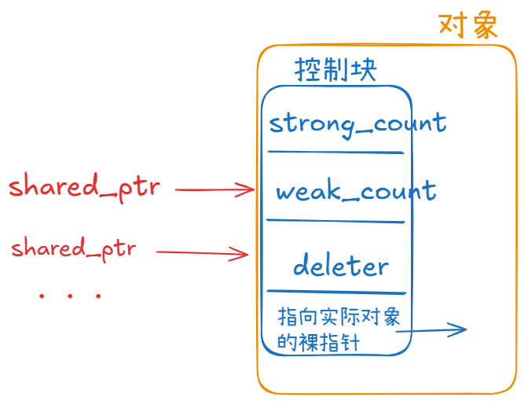

# 智能指针

> 智能指针属于 **C++ 内存管理（RAII）机制**，是现代 C++ 里推荐的 **自动化资源管理工具**，核心目标是 **防止内存泄漏和悬空指针**。

> 包含头文件 `<memory>`


## unique_ptr

> **独占所有权指针**，任何时刻**只能有一个** `unique_ptr` 实例拥有对某单个对象的所有权。

> `unique_ptr` **不能被拷贝和隐式转换，只能被移动。**

​	**主要特性：** 

1. **独占所有权：** 单个 `unique_ptr` 指向单个对象。
2. **不能拷贝：** 只能进行移动操作。
3. **轻量级：** 没有引用次数，开销小。


### 构造和赋值

| 方法             | 底层接口                                | 说明                                                         | 示例                                                         |
| ---------------- | --------------------------------------- | ------------------------------------------------------------ | ------------------------------------------------------------ |
| **默认构造**     | `constexpr unique_ptr() noexcept;`      | 创建空的 `unique_ptr`，不管理任何对象。                      | `unique_ptr<int> up;`                                        |
| **从裸指针构造** | `explicit unique_ptr(T* p) noexcept;`   | 接管裸指针的所有权。⚠️ **只能有一个** `unique_ptr` 管理同一指针。 | `int* p = new int(42);`<br />`unique_ptr<int> up1(p);`<br />`❌ unique_ptr<int> up2(p);`<br />`   //错误:两个 unique_ptr 管同一个指针` |
| **移动构造**     | `unique_ptr(unique_ptr&& u) noexcept;`  | 转移所有权；`u` 置空。被 `move` 的指针在当时只是置空，在程序结束后依然会析构回收。 | `unique_ptr<int> up1 = make_unique<int>(20);`<br />`unique_ptr<int> up2(move(up1));` |
| **带删除器构造** | `unique_ptr(T* p, Deleter d) noexcept;` | 自定义删除器（释放数组、文件句柄等）。                       | `unique_ptr<int, void(*)(int*)> up(new int[5], [](int* p){ delete[] p; });` |

> **(C++14)** 推荐使用 `make_unique` 方式进行构造。


***

| 方法         | 底层接口                                          | 说明                                          | 示例                                                         |
| ------------ | ------------------------------------------------- | --------------------------------------------- | ------------------------------------------------------------ |
| **移动赋值** | `unique_ptr& operator=(unique_ptr&& u) noexcept;` | 释放原有对象 → 接管 `u` 的所有权 → `u` 置空。 | `unique_ptr<int> up1(new int(20));unique_ptr<int> up2;up2 = move(up1);` |

> **不支持任何形式的拷贝操作！！！**


​	**示例：**

```cpp
  unique_ptr<int> up1; // 默认构造

  unique_ptr<int> up2(new int(42)); // 从裸指针接管

  unique_ptr<int> up3(up2);       // 错误，不能任何形式的拷贝
  unique_ptr<int> up3(move(up2)); // 移动构造
  unique_ptr<int> up4 = make_unique<int>(40); // 右值移动构造，右值会在语句结束后立即释放，因此是移动构造
```

> 注意**右值是移动构造**。


### 其他操作

> **以下操作为三个智能指针共有操作。**

| 成员函数           | 功能                         | 示例                                                         |
| ------------------ | ---------------------------- | ------------------------------------------------------------ |
| `get()`            | 获取原始指针（不转移所有权） | `unique_ptr<int> up(new int(42));`<br />`int* p = up.get(); // p 指向同一块内存，但 up 仍然负责释放` |
| `reset(p)`         | 替换管理对象,释放原有对象    | `unique_ptr<int> up(new int(42));`<br />`up.reset(new int(99));  // 原来的 42 被释放，现在托管 99`<br />`up.reset();  // 相当于释放内存并置空` |
| `swap(u)`          | 与另一 `unique_ptr` 交换     | `up1.swap(up2);`                                             |
| `operator*` / `->` | 解引用、成员访问             | `*up = 10; up->func();`                                      |
| `operator bool()`  | 判断是否为空                 | `if(!up) {...}  //等价于if(up == nullptr)`                   |
| `get_deleter()`    | 获取删除器(若自定义了删除器) | `auto& d = up.get_deleter();`                                |


***

`unique_ptr` 独有。

| `release()` | 释放所有权，返回指针 | `unique_ptr<int> up(new int(42));`<br/>`int* p = up.release(); // up 变为空，p 需要手动 delete`<br/>`delete p;` |
| ----------- | -------------------- | ------------------------------------------------------------ |


## shared_ptr

> 共享指向对象，多个 `shared_ptr` 指向同一个对象。
>
> 内置计数器，新的 `shared_ptr` 指向对象时：`count + 1`；离开时 `count - 1` 。`count = 0` 时，释放对象。

​	**主要特性：**

1. **共享所有权：** 多个 `shared_ptr` 可以指向同一个对象。
2. **引用计数：** 多一个 `shared_ptr` 指向同一个实例就 `count ++` 。·


### 基本结构

`std::shared_ptr` 通过 **引用计数（reference counting）** 来管理对象的生命周期：

每个被 `shared_ptr` 管理的对象，都有一个 **控制块（control block）**；

控制块里保存了：

1. **强引用计数（use_count）**：有多少个 `shared_ptr` 指向这个对象。
2. **弱引用计数（weak_count）**：有多少个 `weak_ptr` 指向这个对象，**不增加强引用计数**。
3. **指针**（指向实际对象）。
4. **删除器（deleter）**：释放对象的方式。



> 指向同一个对象时，多个 `shared_ptr` 共享一个控制块。


### 构造和赋值

| 方法                                                   | 说明                                                         | 示例                                                         |
| :----------------------------------------------------- | ------------------------------------------------------------ | :----------------------------------------------------------- |
| `shared_ptr() noexcept;`                               | **默认构造** 创建一个空的 `shared_ptr`，不管理任何对象。     | `shared_ptr<int> sp; //sp.use_count() == 0`                  |
| `shared_ptr(const shared_ptr& r) noexcept;`            | **拷贝构造** 引用计数 `+1`，共享控制块。                     | `shared_ptr<int> sp1 = make_shared<int>(10)`<br />`shared_ptr<int> sp2(sp1); // 引用计数 +1` |
| `shared_ptr(shared_ptr&& r) noexcept;`                 | **移动构造**  转移所有权；`r` 变为空。                       | `shared_ptr<int> sp1 = make_shared<int>(20)`<br />`shared_ptr<int> sp2(move(sp1));` |
| `explicit shared_ptr(T* p);`                           | **从裸指针构造** 接管 `p` 的所有权；调用 `delete p` 释放； **不要**传给多个 `shared_ptr`，否则 double free。 | `shared_ptr<int> sp(new int(42));`                           |
| `explicit shared_ptr(const weak_ptr<T>& r);`           | **从 `weak_ptr` 构造** 如果对象未过期，生成一个 `shared_ptr`；否则为空。 | `weak_ptr<int> wp;`<br />`{ auto sp = make_shared<int>(30); wp=sp; }`<br />`shared_ptr<int> sp2(wp); // sp2 为空` |
| `template<class Deleter> shared_ptr(T* p, Deleter d);` | **带删除器构造**  自定义删除方式（比如释放数组、文件句柄）。 | `shared_ptr<int> sp(new int[5], [](int* p){ delete[] p; });` |

> **推荐使用 `make_shared`** ，它同时分配 **对象 + 控制器** ，效率更高。


***

| 方法                                                   | 说明                                                         | 示例                                                         |
| ------------------------------------------------------ | ------------------------------------------------------------ | ------------------------------------------------------------ |
| `shared_ptr& operator=(const shared_ptr& r) noexcept;` | **拷贝赋值** 先释放原来的对象（引用计数 -1），再共享新对象（引用计数 +1）。 | `shared_ptr<int> sp1 = make_shared<int>(40)`<br />`shared_ptr<int> sp2;sp2 = sp1; //sp2也指40` |
| `shared_ptr& operator=(shared_ptr&& r) noexcept;`      | **移动赋值** 转移所有权；原 `shared_ptr` 清空                | `shared_ptr<int> sp1 = make_shared<int>(50)`<br />`shared_ptr<int> sp2;sp2 = move(sp1);` |


​	**示例：**

```cpp
class Student
{
......
};

int main()
{
  shared_ptr<Student> stu0; // 默认构造

  shared_ptr<Student> stu1(new Student()); // 裸指针构造

  shared_ptr<Student> stu2 = make_shared<Student>("zzz",10);
  shared_ptr<Student> stu3(stu2); // 拷贝构造

  shared_ptr<Student> stu4 = make_shared<Student>("www",20);
  shared_ptr<Student> stu5(move(stu4)); // 移动构造
}
```


### 其他操作

> 主要介绍其独特的成员函数，主要与计数器相关。 （共享操作见： [三个智能指针共有操作](#其他操作) ）

| 成员函数                                   | 作用                                                         | 示例                                                         |
| ------------------------------------------ | ------------------------------------------------------------ | ------------------------------------------------------------ |
| `use_count()`                              | 返回引用次数。                                               | `shared_ptr<int> sp1(new int(42));`<br />`shared_ptr<int> sp2 = sp1;`<br />`cout << sp1.use_count(); // 2` |
| `unique()`                                 | 判断是否是“唯一”拥有者（即引用计数是否为 1）。               | `if (sp1.unique()) { /* 独占资源 */ }`                       |
| `owner_before(const shared_ptr<U>& other)` | 比较两个 `shared_ptr`/`weak_ptr` 是否指向同一控制块，通常用于关联容器排序。 | `shared_ptr<int> sp1(new int(1));`<br />`shared_ptr<int> sp2(new int(2));`<br />`bool cmp = sp1.owner_before(sp2);` |
| `get_deleter<D>()`                         | 获取当初传入的自定义删除器（如果有）。                       | `shared_ptr<int> sp(new int(42), [](int* p){ delete p; });`<br />`auto d = sp.get_deleter<void(*)(int*)>();`<br />`if (d) { std::cout << \"has deleter\"; }` |


## weak_ptr

> 不拥有对象所有权的智能指针，用于观察但不影响对象的生命周期。

​	**主要特性：** 

1. **不拥有所有权：** **不增加**引用次数。
2. **可从 `shared_ptr` 生成：** 通过 `weak_ptr` 可以访问 `shared_ptr` 管理的对象。
3. **避免循环引用：** 常用于解决 `shared_ptr` 的循环引用问题。


###  经典案例

> `weak_ptr` 的一个重要作用就是解决 `shared_ptr` 的互引用死循环问题。


​	**错误案例：**

```cpp
class B;
class A
{
public:
  shared_ptr<B> spB;
  A()
  {
    cout << "A()" << endl;
  }

  ~A()
  {
    cout << "~A()" << endl;
  }
};

class B
{
public:
  shared_ptr<A> spA;
  B()
  {
    cout << "B()" << endl;
  }

  ~B()
  {
    cout << "~B()" << endl;
  }
};

int main()
{
  {
    shared_ptr<A> a = make_shared<A>();
    shared_ptr<B> b = make_shared<B>();

    a->spB = b;	// 在加上这两行代码之后，会发现A和B只能构造不能析构。
    b->spA = a;	// 原因是此时析构A时需要先析构B，析构B时需要先析构A,引用次数永远不为零，陷入死循环。
  }
}
```


​	**问题详解：**

​			虽然 `a` 和 `b` 离开作用域，但 `A Destructor` 和 `B Destructor` 并未被调用，因为 `a` 和 `b` 相互引用，引用计数无法降到0，导致	内存泄漏。


​	**解决方案：**

​		**`weak_ptr`** 只观察不增加引用，因此改 A或B 为 `weak_ptr` 即可。


### 其他操作

> 主要介绍其特有的成员函数， **观察者，不控制对象生命周期**。（共享操作见： [三个智能指针共有操作](#其他操作) ）

| 函数                                  | 作用                                        | 示例                        |
| ------------------------------------- | ------------------------------------------- | --------------------------- |
| `expired()`                           | 判断资源是否已释放（引用计数是否为 0）      | `if (wp.expired()) { ... }` |
| `lock()`                              | 获取一个可用的 `shared_ptr`，如果对象还活着 | `if (auto sp = wp.lock())`  |
| `owner_before(const weak_ptr& other)` | 同 `shared_ptr`，比较控制块，用于容器排序   | `wp1.owner_before(wp2);`    |


​	**示例：**

> **`weak_ptr` 不能直接访问对象**，需要通过 `lock()` 方法转换为 `shared_ptr`，并检查对象是否仍然存在。

```cpp
int main()
{
    std::shared_ptr<int> sp = std::make_shared<int>(42);
    std::weak_ptr<int> wp = sp;

    if (auto locked = wp.lock())
    { // 尝试获取 shared_ptr
        std::cout << "Value: " << *locked << std::endl;
    } 
    else 
    {
        std::cout << "Object no longer exists." << std::endl;
    }

    sp.reset(); // 释放资源

    if (auto locked = wp.lock()) { // 再次尝试获取 shared_ptr
        std::cout << "Value: " << *locked << std::endl;
    } 
    else 
    {
        std::cout << "Object no longer exists." << std::endl;
    }
    return 0;
}
```


​	**输出：**

```cpp
Value: 42
Object no longer exists.
```


## 自定义删除器

> 智能指针默认 `delete` 自动释放资源。有时候不全适用或者不够安全，因此**可以自定义删除器。**


| 类型            | 适用场景         | 示例                                                         |
| --------------- | ---------------- | ------------------------------------------------------------ |
| 默认 `delete`   | 普通动态对象     | `unique_ptr<int> p(new int(42));`                            |
| 默认 `delete[]` | 动态数组         | `unique_ptr<int[]> arr(new int[10]);`                        |
| 函数指针        | 简单替换         | `shared_ptr<int>(new int, myDeleter);`                       |
| Lambda          | 资源管理，简洁   | `shared_ptr<FILE>(fopen(...), [](FILE*f){fclose(f);});`      |
| 仿函数对象      | 复杂逻辑，带状态 | `shared_ptr<FILE>(..., FileCloser());`                       |
| 系统资源删除器  | 句柄、fd、socket | `unique_ptr<HANDLE, decltype(&CloseHandle)> h(..., CloseHandle);` |
| 内存池删除器    | 自定义内存管理   | `shared_ptr<MyObject>(pool.acquire(), PoolDeleter());`       |


### 自定义仿函数删除器

> [仿函数介绍](./可调用对象.md#仿函数(Functors))


​	**管理FILE*资源**

```cpp
#include <iostream>
#include <memory>
#include <cstdio>
struct FileDeleter 
{
    void operator()(FILE* fp) const
    {
        if (fp) 
        {
            std::cout << "Closing file." << std::endl;
            fclose(fp);
        }
    }
};
int main()
{
    {
        std::shared_ptr<FILE> filePtr(fopen("example.txt", "w"), FileDeleter());
        if (filePtr) 
        {
            std::cout << "File opened successfully." << std::endl;
            // 使用 filePtr 进行文件操作
            fprintf(filePtr.get(), "Hello, World!\n");
        }
    } // 自动关闭文件
    std::cout << "Exiting main..." << std::endl;
    return 0;
}
```


​	**输出：**

```cpp
File opened successfully.
Closing file.
Exiting main...
```


​	**详解：**

- 自定义删除器 `FileDeleter` 用于在 `shared_ptr` 被销毁时关闭文件。

- 使用 `filePtr.get()` 获取原生 `FILE*` 指针进行文件操作。

- 离开作用域时，自动调用 `FileDeleter` 关闭文件。


### 自定义lambda表达式删除器

> C++ 11


​	**示例:**

```cpp
#include <iostream>
#include <memory>
#include <cstdio>

int main() 
{
    {
        auto fileDeleter = [](FILE* fp) 
        {
            if (fp) 
            {
                std::cout << "Closing file via lambda." << std::endl;
                fclose(fp);
   }
};

        std::unique_ptr<FILE, decltype(fileDeleter)> filePtr(fopen("example.txt", "w"), fileDeleter);
        if (filePtr) 
        {
            std::cout << "File opened successfully." << std::endl;
            fprintf(filePtr.get(), "Hello, Lambda!\n");
        }
    } // 自动关闭文件

    std::cout << "Exiting main..." << std::endl;
    return 0;
}
```

> 输出同上，更加简洁。


## 总结和案例

| 易错                                    | 备注                                                   |
| --------------------------------------- | ------------------------------------------------------ |
| 避免 `shared_ptr` 循环引用              | 详见：[weak_ptr案例](#经典案例)                        |
| 优先使用 `make_shared` 和 `make_unique` | `auto sp = make_shared<int>(100)` <br />提高效率和安全 |
| 不要和原生指针混用                      | 避免重复释放等不安全行为                               |


### 案例1：unique_ptr管理动态资源

​	**题目描述：**

​		编写一个C++类 `ResourceManager`，该类负责管理一个动态分配的整数资源。使用 `std::unique_ptr` 来确保资源在 `ResourceManager` 对象销毁时被正确释放，从而避免内存泄漏。

​	**要求：**

**1. **类定义：

- 创建一个名为 `ResourceManager` 的类。

- 添加一个私有成员变量，类型为 `std::unique_ptr<int>`，用于管理动态分配的整数。

**2. **构造函数与析构函数：

- 实现构造函数，接受一个整数参数并初始化 `std::unique_ptr<int>`。

- 不需要显式定义析构函数，依赖 `std::unique_ptr` 自动释放资源。

**3. **成员函数：

- `int getValue() const`; 返回当前管理的整数值。

- `void setValue(int newValue)`; 设置整数的新值。

**4. **禁止拷贝：

- 禁用拷贝构造函数和拷贝赋值运算符，确保 `ResourceManager` 对象不能被拷贝。

- 允许移动构造和移动赋值运算符。

**5. **测试：

- 编写一个 `main` 函数，创建 `ResourceManager` 对象，设置并获取值，展示智能指针的作用。

​	

​	**示例输出：**

```cpp
Initial Value: 10
Updated Value: 20
```


​	**代码如下：**

```cpp
ResourceManager.h
```

```cpp
#防止头文件重复包含
#include <memory>
class ResourceManager {
private:
    std::unique_ptr<int> resource;

public:
    ResourceManager();

    explicit ResourceManager(int value);

    // 禁止拷贝构造函数
    ResourceManager(const ResourceManager &) = delete;

    // 禁止重载拷贝构造运算符
    ResourceManager &operator=(const ResourceManager &) = delete;

    ResourceManager(ResourceManager &&other) noexcept;

    ResourceManager &operator=(ResourceManager &&other) noexcept;

    [[nodiscard]] int getValue() const;

    void setValue(int newValue);
};
```


```cpp
ResourceManager.cpp
```

```cpp
//
// Created by KamenRider on 24-12-22.
//

#include "ResourceManager.h"

#include <iostream>
#include <ostream>

ResourceManager::ResourceManager(): resource(nullptr) {
    std::cout << "ResourceManager::ResourceManager()" << std::endl;
}

ResourceManager::ResourceManager(int value): resource(std::make_unique<int>(value)) {
    std::cout << "ResourceManager::ResourceManager(int value) " << value << std::endl;
}


ResourceManager::ResourceManager(ResourceManager &&other) noexcept : resource(std::move(other.resource)) {
    other.resource = nullptr;
    std::cout << "ResourceManager::ResourceManager(ResourceManager &&other)" << std::endl;
}

ResourceManager &ResourceManager::operator=(ResourceManager &&other) noexcept {
    if (this != &other) {
        resource = std::move(other.resource);
        other.resource = nullptr;
    }
    std::cout << "ResourceManager::operator=(ResourceManager &&other)" << std::endl;
    return *this;
}

int ResourceManager::getValue() const {
    return *resource;
}

void ResourceManager::setValue(const int newValue) {
    *resource = newValue;
}
```


```cpp
main.cpp
```

```cpp
#include <iostream>

#include "ResourceManager.h"

int main() {
    std::cout << "Calling a parameterized constructor =======================================" << std::endl;

    const auto resourceManager = std::make_unique<ResourceManager>(10);
    std::cout << "Initial Value : " << resourceManager->getValue() << std::endl;
    resourceManager->setValue(20);
    std::cout << "Updated Value : " << resourceManager->getValue() << std::endl;

    std::cout << "Calling a parameterized constructor =======================================" << std::endl;

    const auto resourceManager2(std::make_unique<ResourceManager>(40));
    std::cout << "Initial Value : " << resourceManager2->getValue() << std::endl;

    std::cout << "Calling a parameterized constructor =======================================" << std::endl;

    ResourceManager resourceManager3(50);
    std::cout << "Updated Value : " << resourceManager3.getValue() << std::endl;

    std::cout << "Calling the move constructor=======================================" << std::endl;

    auto resourceManager4(std::move(resourceManager3));
    std::cout << "Initial Value : " << resourceManager4.getValue() << std::endl;

    std::cout <<
            "First call the no-argument constructor, then call the overloaded move assignment operator "
            "======================================="
            << std::endl;

    ResourceManager resourceManager5;
    resourceManager5 = std::move(resourceManager4);
    std::cout << "Initial Value : " << resourceManager5.getValue() << std::endl;

    std::cout << "=======================================" << std::endl;

    return 0;
}
```

